# 	Engenharia de IA (PÓS) - UNIPDS

* Coordenador: Erick Wendel
* Git: https://github.com/unipds-engenharia-de-ia-aplicada/engenharia-de-software-com-ia-aplicada
* Início: 26/03/26 - Término: 26/03/27


# Fundamentos de IA e LLMs para Programadores

### Machine Learning, Deep Learning e Artificial Intelligence

Desmistificando os termos:

* **IA (Inteligência Artificial)** = forma que se usa para ensinar uma máquina a exec uma tarefa.
* **Machine Learning/Aprendizado de Maq** = Algorítmos que aprendem com dados
  * Usando algorítmos, conseguimos entender padrões nos dados, e então é possível prever os próximos resultados.
* **Deep Learning**: especialização de Machine Learning. É um algorítmos fazendo a identificação de padrões.


Exemplo do Wendel para Deep Learning:

> 2005, através de um smartwatch, Wendel queria passar os Slides de uma apresentação.
>
> Tentou através das coordenadas com vários **falsos positivos**, porém era muito complexo devido a variáveis matemáticas/físicas: coordenadas, velocidade, eixo XYZ.
>
> Com **deep learning**, ao invés de fazer **as regras na mão**, gravamos exemplos reais (movimentando de várias formas diferentes onde falamos o que é q funciona), e o **modelo aprende** o movimento certo.
>
> Ou seja, **via código**, fazemos IFs. Com **DL**, treinamos dnv e dnv o modelo.


TensorFlow.JS (https://www.tensorflow.org/js - Google) -> Permite rodar modelos de Machine/Deep learning pelo navegador

* Possui projetos como o pacman andar através do movimento da cabeça

Teachablemachine (https://teachablemachine.withgoogle.com/) -> Permite treinar um modelo baseado em exemplos

* Podemos tirar várias fotos de vários objetos, e após treinar o modelo, ele poderá identificar o tipo de objeto!

Kaggle (https://www.kaggle.com/) -> Possui base de dados gigantes que podem ser usadas no Teachablemachine

* Por exemplo, existe uma base com várias raças de cachorro (várias fotos de raças diferentes), que permitem o modelo ser treinado para identificar outras imagens

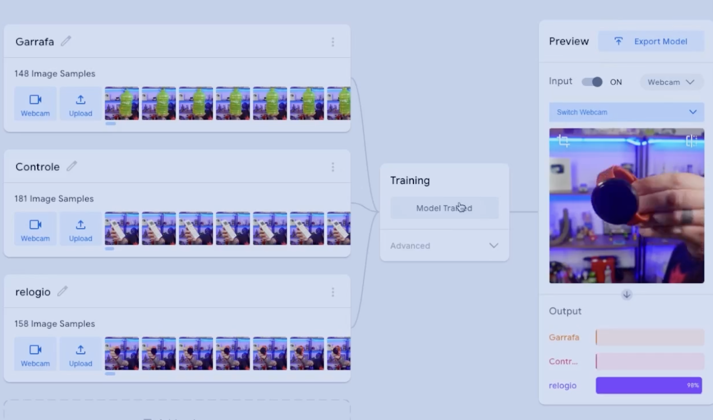


### Redes Neurais & Tensores

TensorFlow tem esse nome por trabalhar com **tensores**!

> Tensor = Vetores/Listas **compostas por números**!

Exemplo de um objeto

```json
{
  pessoas: [
    {
      nome: "Erick",
      idade: 30,
      corPreferida: "azul",
      cidade: "São Paulo"
    },
    {
      nome: "Ana",
      idade: 25,
      corPreferida: "vermelho",
      cidade: "Rio"
    },
  ]
}
```

Após transformar o objeto em Tensor, temos que transformar os dados no **range de 0 e 1**

* **one-hot encoding:** Transf. os atributos em colunas, e associamos o número 1 ao o que dá "match"
  * *Preferência de cor / cidade não existe range! então fica com 0 e 1 - não há 'meia cor preferida'*


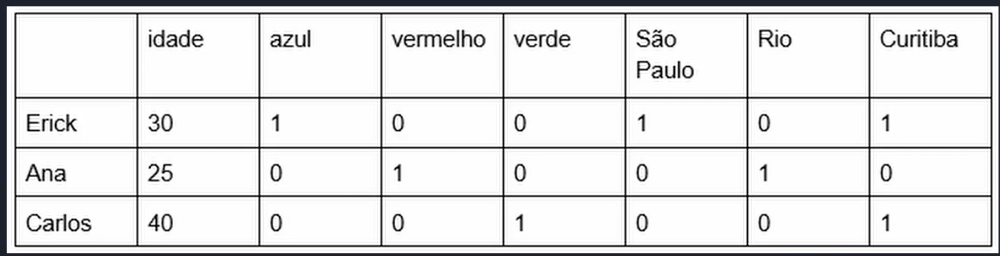

```json
// Primeira transformação teríamos (problema com a idade):
const tensorPessoa = [
  [30, 1, 0, 0, 1, 0, 0],
  [25, 0, 1, 0, 0, 1, 0],
  [40, 0, 0, 1, 0, 0, 1],
]
```

**Normalização**: se notarmos bem, a idade está fora do padrão 0 e 1, para isso precisamos iniciar o processo de **normalização do dado**

```json
// idade_normalizada = (idade - idade_min) / (idade_max - idade_min)
// ex: idade_normalizada = (30 - 25) / (40 - 25) = 0.33
// Após converter a idade em rangeteríamos então
const tensorPessoa = [
  [0.33, 1, 0, 0, 1, 0, 0],
  [0, 0, 1, 0, 0, 1, 0],
  [1, 0, 0, 1, 0, 0, 1],
]
```


Rede neural irá funcionar baseado nessa estrutura:

* **Inputs**: Entrada dos dados, nesse exemplo, idade/cor/localização
* **Hidden Layer**: aqui nós vamos ter os **neurônios**, e onde é feito o cálculo das probabilidades dado um input e os exemplos que o modelo possuí.
  * Quanto mais exemplos, melhor o aprendizado!
* **Output**: Resultado final dado o treinamento e input

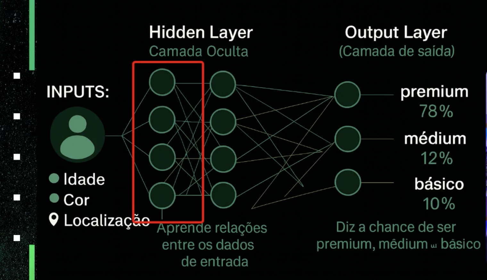


## Treinando Rede Neural (simples)

Treinar uma rede neural nada mais é do que encher ela de exemplos de onde vc quer chegar!

Se queremos Categorizar as pessoas, iremos treinar a rede neural fornecendo exemplos do **PORQUÊ aquela pessoa pertence ao grupo X**, e então **os neurônios (mini-calculadoras)** irão calcular a probabilidade de uma nova pessoa entregar na categoria!


> "Quanto mais dados e mais diversidade, melhor!"

```json
const categorias = [ "premium","médium","básico"]
const pessoas = {
  pessoas: [
    {
      nome: "Erick",
      idade: 30,
      corPreferida: "azul",
      cidade: "São Paulo",
      categoria: "premium
    },
    {
      nome: "Ana",
      idade: 25,
      corPreferida: "vermelho",
      cidade: "Rio",
      categoria: "médium",
    },
    {
      nome: "Carlos",
      idade: 40,
      corPreferida: "verde",
      cidade: "Curitiba",
      categoria: "básic",
    },
  ]
}
```

No exemplo acima a rede neural irá calcular a categoria baseada em:

* Cor preferida
* Cidade
* Idade


**@tensorflow/tfjs-node** - É a lib utilizada para treinarmos uma rede neural

```javascript
import tf from '@tensorflow/tfjs-node';

const tensorPessoasNormalizado = [
    [0.33, 1, 0, 0, 1, 0, 0], // Erick
    [0, 0, 1, 0, 0, 1, 0],    // Ana
    [1, 0, 0, 1, 0, 0, 1]     // Carlos
]

const labelsNomes = ["premium", "medium", "basic"]; // Ordem dos labels
const tensorLabels = [
    [1, 0, 0], // premium - Erick
    [0, 1, 0], // medium - Ana
    [0, 0, 1]  // basic - Carlos
];

// Criamos tensores de entrada (xs) e saída (ys) para treinar o modelo
const inputXs = tf.tensor2d(tensorPessoasNormalizado)
const outputYs = tf.tensor2d(tensorLabels)

inputXs.print();
outputYs.print();
```


## Sistema de Recomendação

Dado um cenário mais real, teríamos um sistema com diversas informações, **onde temos que dar PESO** para IA entender oq recomendar!

Supondo que temos:

* Usuário
  * Idade
  * Compras
    * Categoria
    * Preço
    * Cor

Podemos querer dar mais **peso a categoria de compras do usuário**, e recomendar produtos da mesma categoria!

```json
[
    {
        "id": 1,
        "name": "Ana Lima",
        "age": 25,
        "purchases": [
            {
                "id": 1,
                "name": "Fones de Ouvido Sem Fio",
                "category": "eletrônicos",
                "price": 129.99,
                "color": "preto"
            },
            {
                "id": 2,
                "name": "Relógio Inteligente",
                "category": "eletrônicos",
                "price": 199.99,
                "color": "prata"
            }
        ]
    },
```


### Normalizando os valores

Dados que se baseiam em ranges:

* Age
* Price

Dados/colunas:

* Categoria
* Cor


Para cada tipo de dado, precisamos **normalizar** de uma forma diferente!

#### Lidar com Ranges (idade/preço)

Para range, iremos usar uma função abaixo

```javascript
const newAge = user.age;
const ageRange =  (newAge - minAge) / (maxAge - minAge)
```

Dado que estamos recebendo de um banco de dados, iremos fazer de forma dinâmica esse `newAge`

```javascript
async function normalizeData(catalog, users) {
  
}
```


## Algoritmos Genéticos

Algoritmos genéticos pode se basear na **teoria de Darwin**

> “As melhores soluções sobrevivem e evoluem ao longo do tempo.”

Um algoritmo genético segue alguns passos:

* Simula a evolução atraves de tentativas
* Soluções aleatórias (algo geralmente q o humano n imaginaria)
* Combina as soluções
* Aplica "mutações"
* Repete o processo até encontrar a melhor solução


Exemplo:

Algoritmo cria diversos tipos de modelo de roda que com uma mesma velocidade, tenta ir mais longe, variando as 'mutações' até encontrar o modelo ideal.

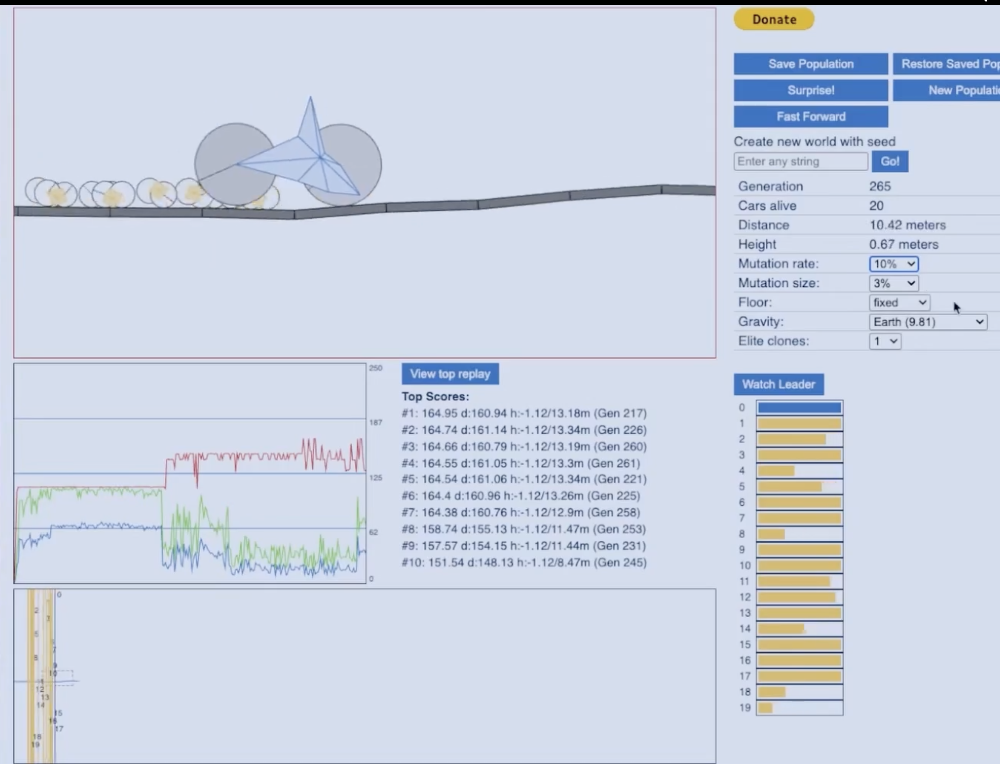


**Vantagens**:

* Funciona bem para problemas complexos
* Não precisa saber a formula perfeita
* Explora bem diversas soluções
* Encontra soluções inimagináveis


**Desvantagem:**

* É lerdo
* Não garente uma solução perfeita
* Mutação pode convergir para uma solução ruim


### Rede Neural vs AG

| Rede Neural                     | Algoritmo Genético            |
| ------------------------------- | ----------------------------- |
| Aprende por gradiente           | Aprende por evolução          |
| Ajusta pesos diretamente        | Testa populações              |
| Usa derivadas                   | Não usa derivadas             |
| Precisa de função diferenciável | Não precisa                   |
| Mais rápido para ML clássico    | Bom para otimização complexa  |
| Backpropagation                 | Seleção + crossover + mutação |

**Rede Neural**

> Aprende ajustando matematicamente os pesos para minimizar o erro.

**Algoritmo Genético**

> Evolui soluções ao longo de gerações usando seleção natural simulada.


## LLMs

Large Language Models (LLM):

* Tokenização
* Embeddings
* Transformers
* Attention
* Sampling

Isso compõe um LLM super conhecido como o **chatGPT** (**G**enerative **P**re-trained **T**ransformer)

* Generative -> pq gera texto
* Pre-trained -> Já aprendeu com diversos outros textos
* **Transfomer -> É a parte da rede neural que torna isso tudo possível** 

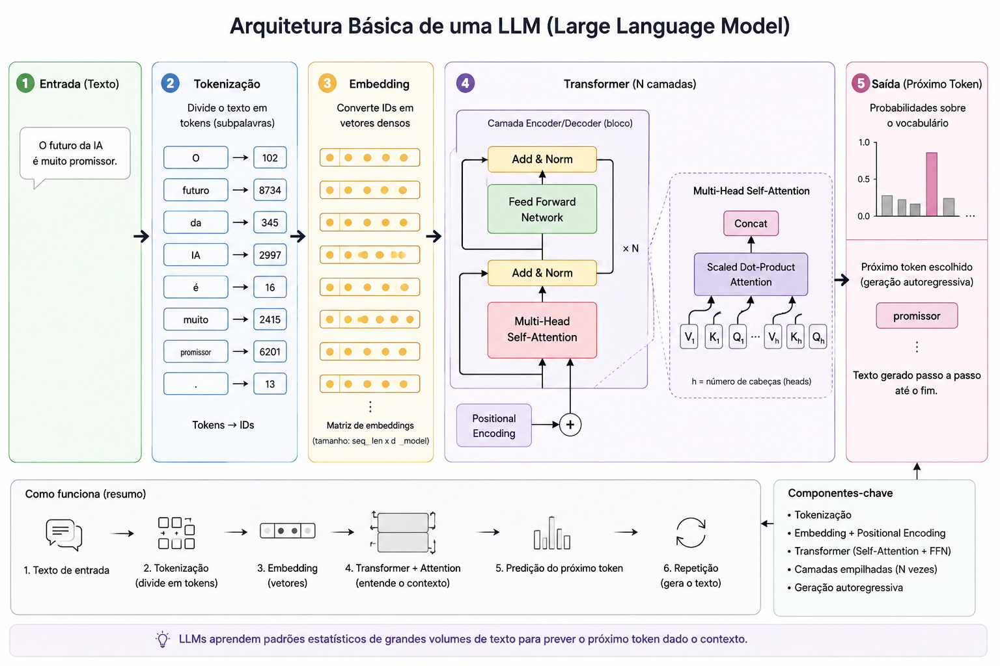

* **Tokenização**
  * LLM não entende texto, ele entende números!
  * Uma Letra = 1 ou + token
  * É a forma que a LLM separa os textos, como IDs

```
["O", "futuro", "da", "IA", "é", "incrível"]

dependendo vira

["in", "crí", "vel"]

e então

"O"         -> 15 (depende do tamanho do texto)
"futuro"    -> 9281
"IA"        -> 442
"incrível"  -> 7129
```


* **Embedding**
  * Nada melhor que vetores para um modelo!
  * Cada token irá ser transformado em **vetor de número**, chamado ***embedding***
  * Palavras com contexto semelhante ficam com vetores números próximos
    * Exemplo: Carro / Veículo, ficaram próximos, mas carro / banana, distantes

```
[99] = carro
[9999] = veículo

irá se tornar em vetor

[1, 2] // são palavras próximas

rei  ≈ rainha
gato ≈ cachorro
Brasil ≈ Argentina
```


* **Transformer/Attention**
  * É aqui que mora a **revolução da IA**!
  * Com o uso do **self-attention**, é possível dar **peso** para os vetores baseado no contexto!
  * LLM olha todos os tokens ao mesmo tempo e **decide** quais são os importantes
  * LLM usa **vários attention (multi-head attention)** ao mesmo tempo, para fazer em paralelo as relações semânticas

```
"A Renata contou para a Karina que ela foi promovida."

// Modelo precisa entender quem é ELA, e o attention ajuda o modelo a entender isso!

2 exemplo:

"banco"

// para o modelo, banco pode ser onde se senta ou uma instituição, então o attention utiliza do contexto para lidar com isso!
```


* **Predição**
  * LLM prevê qual a **MAIOR** probabilidade do próximo token.
  * Na frase "O Céu é..." a LLM possui em banco diversas frases:
    * O modelo pode atribuir:
      ● azul: 55%
      ● nublado: 18%
      ● claro: 10%
      ● bonito: 7%
  * Predições se baseam em 3 parâmetros:
    * **Temperature**: quanto maior a temperatura, maior a 'viagem' que a LLM irá ter. Baixa temperatura é muito usada em códigos, pq a resposta precisa ser precisa
    * **Top-K**: São os top tokens que serão selecionados, por exemplo, top 3 tokens mais prováveis
    * **Top-P**: É quando definimos o grau de probabilidade, como quero somente tokens 90% de certeza


* **Sampling**
  * A IA não gera todo o texto de uma vez, ELA GERA TOKEN A TOKEN
  * A cada novo token gerado, a IA irá analisar toda a frase novamente para prever a próxima palavra!
  * Quanto > Texto = Maior Custo

```
O Céu é...

// azul: 55%

O Céu é azul

// claro: 60%

O Céu é azul coar
```


* **Hallucination / ambiguidade**
  * LLM não sabe o que é verdade ou mentira, somente cálcula probabilidade de tokens!
  * Importante permitir que o modelo responda "não sei", caso contrário ele pode gerar respostas que soem convincentes!
  * Sempre dar contexto, como fontes!


Final:

```
Texto
↓
Tokens
↓
Embeddings
↓
Transformer
↓
Attention
↓
Contexto
↓
Próximo token
↓
Repete
```


### Modelos em Browsers

Modelos como do DeepSeak/Gema, possuem mais de 4GB! não tem como esperar o browser carregar todo o modelo quando o usuário logar na página!


**Solução?** embutir no próprio modelos de IA! Google já está inserindo diretamente no browser modelos na máquina dos clientes! Bem vindo a **Web 4.0 - IA Navegador**

Funções já disponíveis no chrome:

* Tradução de texto.
* Identificação de idioma.
* Resumo de conteúdo.
* Prompt para interação com LLMs


Como utilizar?

* Habilitar `chrome://flags/` 
* Busque por 'gemini' e set `enabled multilingual`


**Multimodal**: Significa q a IA pode além de texto, receber áudios e imagens!

> O futuro da IA na web é local, privado, multimodal e acessível


## Prompts

* Um prompt mal feito = resposta mal feita.
* IA prevê a próxima palavra com base no contexto que foi recebido.
* IA tenta 'adivinhar' oq você quer
* IA não pensa como um humano!


Para evitar às **alucinações**, podemos seguir 10 steps:

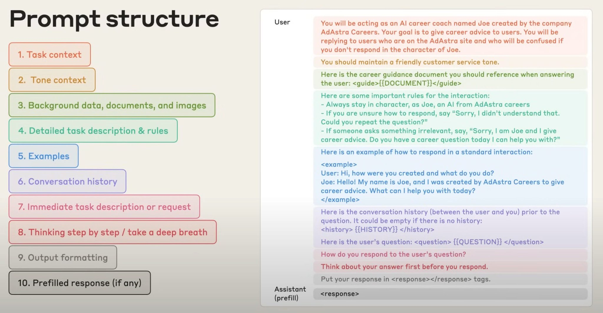


1. **Contexto da tarefa**: falamos basicamente quem é o agente
2. **Tom de voz**: não é estética! formal? Empático? Didático?
3. **Dados/fonte da verdade:** uma referência onde ele pode olhar (documento/regras/tabelas) -> aqui evitamos q a IA busque na internet
4. **Contrato operacional**: definimos o comportamento! Se não entender, peça para repetir! se precisar de mais informação peça! **AQUI EVITAMOS AS ALUCINAÇÕES!**
5. **Exemplos**: mostre entradas e exemplo de saída
6. **Histórico:** se aplica mais se o app precisa ler histórico do q ja foi dito
7. **Pedido/request**: Aqui falamos oq queremos!
8. **Incentivo ao raciocínio**: desnecessário em muitos casos, mas aqui pedimos para o modelo revalidar antes de por como resposta final
9. **Output**: qual o idioma de retorno/caracteres/json/tabela?
10. **Restrições**: limite de caracter/oq fazer se o dado n estiver disponível


Exemplo:

```
# Contexto da tarefa

Você é um Senior Java Engineer especializado em Java 21, Spring Boot, arquitetura de microsserviços e code review.

# Tom de voz

Seja técnico, objetivo e didático. Explique problemas de forma clara e apresente soluções práticas.

# Dados / Fonte da verdade

Considere como fonte da verdade:

* Código enviado pelo usuário
* Regras de negócio descritas na tarefa
* Padrões da aplicação já existentes

Não utilize conhecimento externo ou faça suposições sobre requisitos não informados.

# Contrato operacional

* Analise apenas as informações fornecidas.
* Caso algum requisito esteja ambíguo, solicite esclarecimentos antes de concluir.
* Caso faltem informações relevantes, informe exatamente quais dados são necessários.
* Não invente regras de negócio.
* Não assuma comportamentos não documentados.

# Exemplos

Entrada:

"Revise este Service do Spring Boot"

Saída:

* Problemas encontrados
* Impacto
* Sugestão de correção
* Exemplo de implementação

# Histórico

Considere mensagens anteriores desta conversa como contexto complementar.

# Pedido

Revise o código enviado e identifique:

* Bugs potenciais
* Problemas de arquitetura
* Violações de boas práticas Java/Spring
* Problemas de performance
* Riscos de segurança
* Falhas de validação

# Validação interna

Antes de responder:

1. Verifique se cada crítica possui evidência no código.
2. Verifique se a sugestão proposta resolve o problema identificado.
3. Elimine observações baseadas apenas em suposições.

# Formato da resposta

Para cada item encontrado:

* Severidade (Alta, Média ou Baixa)
* Arquivo/Linha
* Problema
* Justificativa
* Sugestão

Responder em português.

# Restrições

* Não revisar código que não foi alterado.
* Não criar requisitos inexistentes.
* Se nenhuma falha relevante for encontrada, informe explicitamente.
* Não extrapolar além do conteúdo fornecido.
```


### JSON prompt

Uma forma de deixar ainda mais claro para IA oq deve ser feito é **através de JSONs**!

OpenIA/Anthropic seguem uma estrutura:

1. **Quem você é** (Role)
2. **O que você deve fazer** (Task/instructions)
3. **Com quais dados** (Context)
4. **O que você não pode fazer** (Constraints)
5. **Exemplos do comportamento esperado** (Examples)
6. **Como responder** (Output)

```json
{
  "role": {},
  "instructions": {},
  "context": {},
  "constraints": {},
  "examples": {},
  "output": {}
}
```

A idéia é sempre ajudar o modelo **a seguir dados estruturados, e reduzir a ambiguidade/alucinações**.

```json
"constraints": {
    "do_not_invent": true,
    "if_missing_data": "Say you don't know",
	  "allowed_assumptions": [],
    "do_not_make_assumptions": true,
    "if_no_issues_found": "Explicitly state that no relevant issues were found"
  }
```

* JSON Prompt pode ser muito usado quando queremos que uma LLM converse com outra!


Comparação:

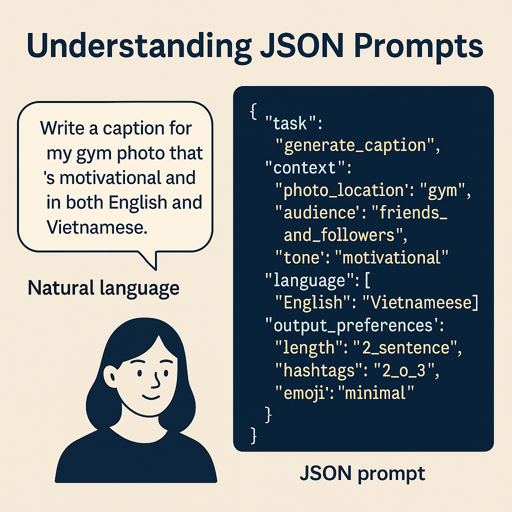


### TOON

TOON (Token Oriented Object Notation) surgiu com o objetivo de reduzir o custo em tokens, simplificando a estrutura sintática do JSON. Ele remove aspas, chaves e outros símbolos, deixando apenas a estrutura essencial.

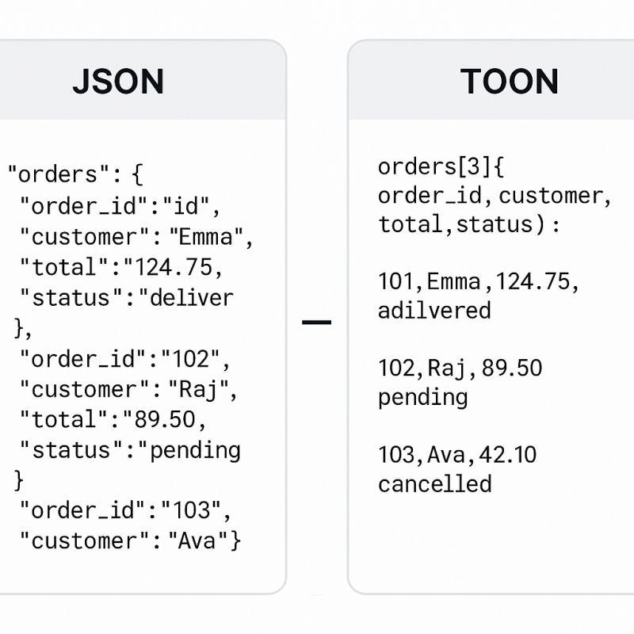

Muitas vezes no JSON nós temos que repetir as chaves, oq faz com que muitos tokens sejam gastos!


JSON:

```json
"links": [
  {
    "name":"Test",
    "url":"https://test.com"
  },
  {
    "name":"Test2",
    "url":"https://test2.com"
  }
]
```

TOON

```toml
links[2]{name, url}

Test,https://test.com

Test2,https://test2.com
```


## Agentes de IA

Diferente de uma LLM, o agente de IA além de pensar, ele também **executa tarefas!**

Se perguntarmos *Qual a capital da França?*

```
LLM:
Usuário
   │
   ▼
  LLM
   │
   ▼
Resposta


Agente:
Usuário
   │
   ▼
 Agente IA
   │
   ├── Consulta banco de dados
   ├── Pesquisa na internet
   ├── Chama APIs
   ├── Executa código
   └── Usa memória
   │
   ▼
Resposta
```

Um agente pode chamar uma LLM para consultar um dado, mas também terá autonomia para executar ações!

| Característica                      | LLM      | Agente |
| ----------------------------------- | -------- | ------ |
| Gera texto                          | ✅        | ✅      |
| Raciocina                           | ✅        | ✅      |
| Usa ferramentas                     | ❌        | ✅      |
| Executa ações                       | ❌        | ✅      |
| Consulta sistemas externos          | ❌        | ✅      |
| Mantém fluxo multi-etapas           | Limitado | ✅      |
| Toma decisões sobre próximos passos | ❌        | ✅      |


A idéia do agente é ter criar um **TIME DE AGENTES**, onde cada agente terá uma função pré determinada:

1. **Planner**: planeja, não edita
2. **Implementer**: edita código
3. **Reviewer**: lê diff e aponta riscos
4. **QA**: valida
5. **Docs Agents**: escreve os readme
6. **Ops agent**: consulta logs e sugere mitigações


***Spec Driven Development***: para evitar alucinações (parecido com os prompts para LLM)

- **Contexto**: stack, ambiente, dependências.
- **Requisitos**: o que deve estar presente.
- **Não-requisitos**: o que deve ser evitado.
- **Critérios de aceite**: como saber se está pronto.
- **Contrato**: formato da API, shape da resposta.
- **Plano de testes**: como validar a funcionalidade


**Resumo:** agentes são prompts pré definidor, salvos em arquivos, que serão executados posteriormente.


## MCP

***Model Context Protocol (MCP)*** - criado pela **Anthropic** como um protocolo. Funciona basicamente como um **meio de integração entre sistemas**!

Imagine que do VSCode a gente possa pedir para a LLM acessar um banco, acessar o git, e então abrir um jira? Isso é feito através de MCPs, uma ponte entre a LLM e outras aplicações!

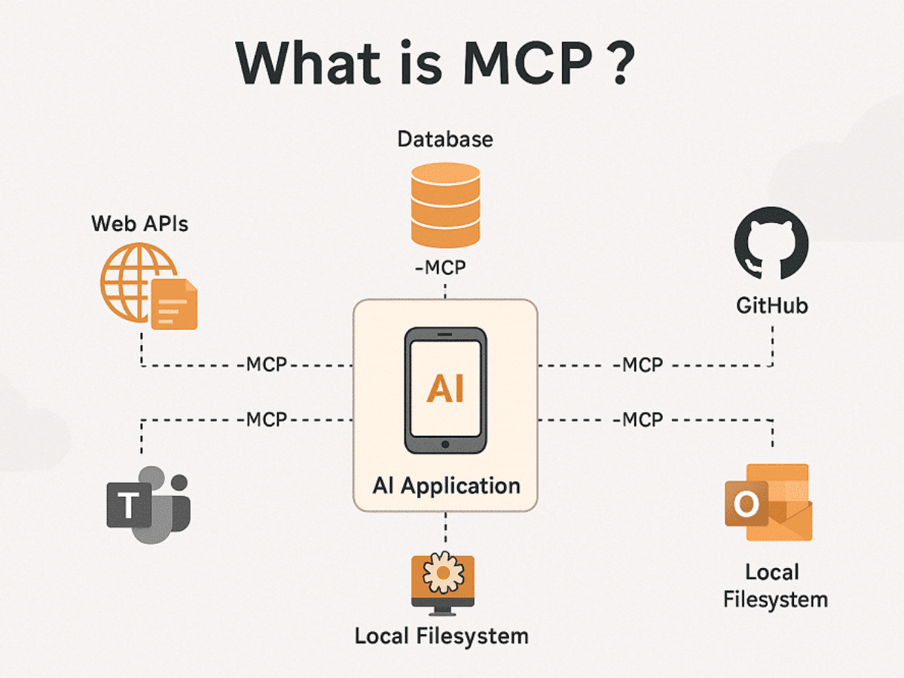


**O que um servidor MCP precisa?**

1. Tools/Actions:
   1. Ações que a LLM pode tomar, como "get talks", "get posts"
   2. Não pense como uma única API, em tools, o 'get talk' pode chamar diversas APIs para retornar um valor final!
2. Resources
   1. É ussado como um contexto para LLM. Através dele a LLM consegue entender que é esse o MCP q ela deve chamar por exemplo...
3. Prompts
   1. Templates prontos q ajudam a LLM usar o MCP

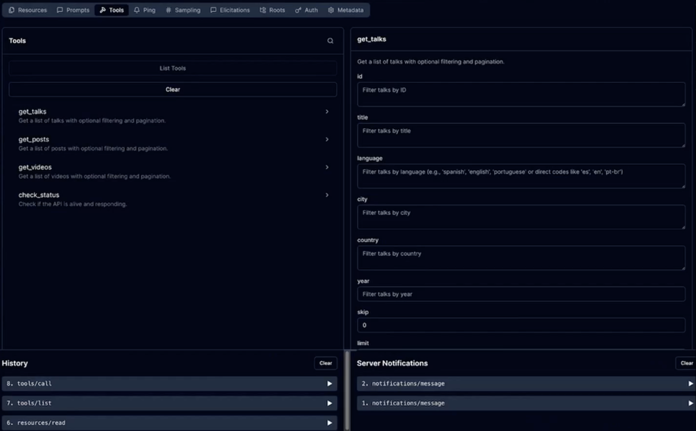

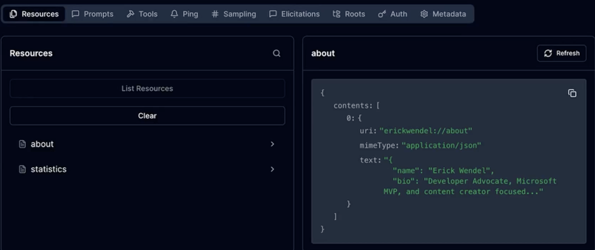


**Como funciona?**

1. A LLM irá esperar um prompt do usuário
2. LLM irá buscar na lista de MCPs qual o contexto que mais se adequa ao oq o usuário quer
3. LLM olha os actions/tools disponíveis do MCP, consulta os resources, e prompts

Imagine que foi pedido

> *Busque a quantidade de vendas do mês*

A LLM não sabe qual a tabela tem as vendas, ela irá chamar o MCP, que irá então trazer todas as tabelas, LLM irá ler, e interpretar qual tabela possui vendas.


### Playwright

E se fosse possível pedir para LLM acessar um MCP que então **gera testes automatizado ou preenche formulários?**


1. `@mcp playwright` no VSCode


# Avaliação


# Avaliação

## Questão 1

**O que é RAG (Retrieval-Augmented Generation)?**

- A) Uma técnica que elimina a necessidade de embeddings usando apenas busca por palavra-chave.
- B) Um padrão em que o sistema busca informação externa relevante e injeta trechos no contexto antes da LLM responder.
- C) Um método de aumentar a criatividade do texto ajustando temperature, Top-K e Top-P.
- D) Um ajuste nos pesos do modelo para ele “aprender” um domínio novo permanentemente.
- E) Um protocolo para executar ações no ambiente (rodar testes, abrir PR, fazer deploy).

---

## Questão 2

**No contexto do TensorFlow.js, o que é um tensor?**

- A) Um método de escolher a categoria final pelo maior valor (argmax).
- B) Um tipo de banco de dados otimizado para machine learning.
- C) Uma lista/matriz de números usada como base para algoritmos aprenderem padrões.
- D) Uma técnica de geração de texto usada por LLMs (sampling).
- E) Um objeto JavaScript com propriedades (ex.: `{ idade, cor, localizacao }`).

---

## Questão 3

**Quando você transforma "cor = azul/vermelho/verde" em colunas com 0 e 1 (ex.: `[1,0,0]`), isso é:**

- A) Normalização, pois coloca todos os valores entre 0 e 1.
- B) Backpropagation, pois ajusta pesos com base no erro.
- C) Regularização, pois evita overfitting automaticamente.
- D) Decoding, pois escolhe a saída mais provável.
- E) One-hot encoding (categorização), pois representa categorias discretas com 0/1.

---

## Questão 4

**No aprendizado por reforço (reinforcement learning), o algoritmo aprende principalmente por:**

- A) Converter imagens em texto e treinar um Transformer para prever tokens.
- B) Ordenar tokens por probabilidade com Top-K e Top-P.
- C) Misturar soluções em uma população usando cruzamento e mutação.
- D) Tentativa e erro, recebendo recompensas e punições conforme o resultado.
- E) Repetir exemplos rotulados (entrada/saída) até "decorar" o padrão.

---

## Questão 5

**O que é self-attention em Transformers?**

- A) Um mecanismo em que cada token atribui pesos a outros tokens da mesma sequência.
- B) Uma técnica para ordenar embeddings sem usar informação de posição.
- C) Uma regra que sempre escolhe o token de maior probabilidade (greedy).
- D) Um truque para reduzir o número de tokens e caber em 4k tokens.
- E) Um processo que converte texto em tokens e remove stopwords.

---

## Questão 6

**Você indexou uma transcrição em chunks no Neo4j e quer que, para cada pergunta, o banco retorne apenas os trechos mais relevantes, sem trazer "muita coisa". Qual ajuste conversa mais diretamente com isso?**

- A) Aumentar a temperatura para deixar a busca mais criativa.
- B) Ajustar a querie para o mais próximo da pergunta do usuário.
- C) Ajustar o top-K para retornar menos resultados por consulta.
- D) Remover o índice vetorial para reduzir o custo computacional.
- E) Diminuir o número de tokens do prompt da LLM.

---

## Questão 7

**Na aula, MCP (Model Context Protocol) é apresentado como:**

- A) Um modelo de linguagem treinado para programar em várias linguagens.
- B) Um padrão para plugar ferramentas e dados em clientes de IA compatíveis.
- C) Um banco vetorial para guardar embeddings e fazer busca por similaridade.
- D) Um método de buscar chunks e inserir no prompt antes de responder (RAG).
- E) Uma técnica de treinar o modelo com exemplos do domínio (fine-tuning).

---

## Questão 8

**Segundo a aula, por que o Neo4j pode ser usado como vector database?**

- A) Porque ele já vem com uma LLM embutida para gerar respostas.
- B) Porque ele armazena chunks como nós, embeddings como propriedades e permite índice/consulta vetorial.
- C) Porque ele exige cloud e chave de API para funcionar corretamente.
- D) Porque ele converte automaticamente PDFs em chunks sem nenhum código.
- E) Porque ele substitui embeddings por busca de palavra-chave otimizada.

---

## Questão 9

**Analise as duas afirmações:**

**I.** "Embeddings colocam tokens num espaço numérico com semântica aproximada."

**II.** "O Transformer transforma esses vetores em representações contextualizadas, reduzindo ambiguidades."

Qual alternativa está mais correta?

- A) I é falsa e II é verdadeira: só o Transformer gera vetores numéricos.
- B) I e II são falsas: a semântica depende apenas do decoding (Top-P/Top-K).
- C) I é verdadeira e II é falsa: ambiguidade é resolvida pela tokenização.
- D) I e II são verdadeiras: embeddings são base; Transformer contextualiza.
- E) I é verdadeira e II é falsa: embeddings já carregam o contexto completo.

---

## Questão 10

**Considere a frase:**

> "A Maria contou para a Ana que ela foi promovida."

**Qual componente do Transformer é diretamente usado para aplicar pesos e decidir se "ela" tende a se referir mais a "Maria" ou "Ana", a partir do contexto?**

- A) Top-K, pois limita as palavras possíveis para "ela" no texto.
- B) Tokenização, pois define quem é o sujeito pela separação em tokens.
- C) Self-attention, pois pesa tokens relevantes para resolver a referência.
- D) Temperature, pois aumenta a chance de escolher "Maria" como resposta.
- E) Embeddings posicionais, pois sozinho determina a quem "ela" aponta.
