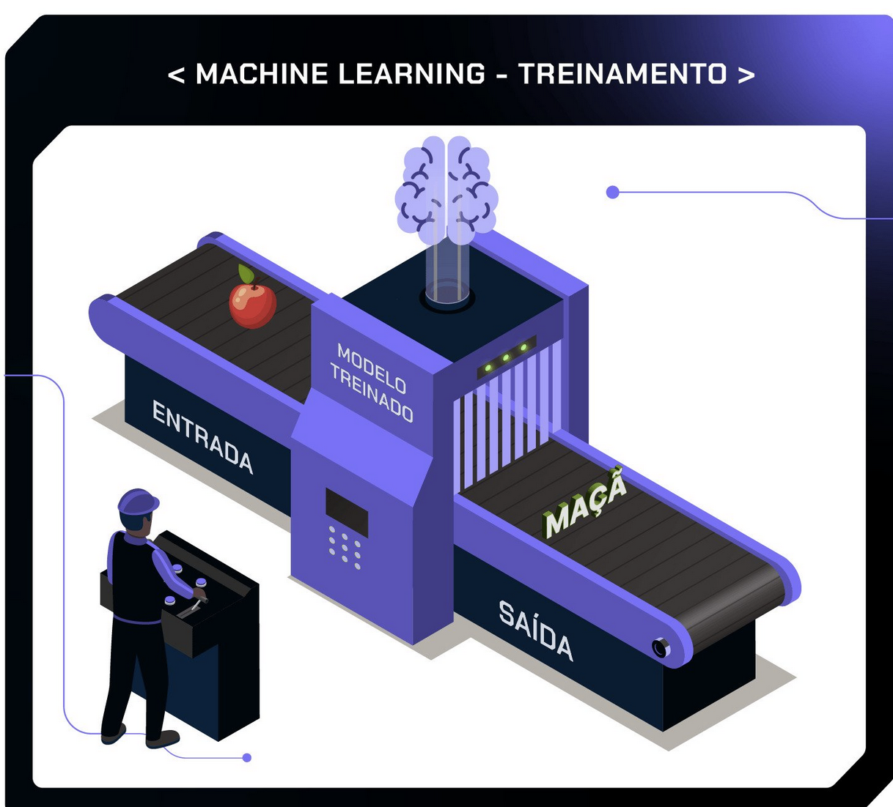

# Inteligência Artificial

**Aumento de Produtividade/Eficiência** é oq molda o uso e investimento em IA. De simples tarefas, a tarefas mais complexas, a IA está e estará presente cada vez mais no dia a dia de todos.

## O que é?

É um ramo da ciência da computação que desenvolve sistema que capazes de realizar **algo que um ser humano faria**. Essas tarefas incluem:

* Raciocínio;
* Aprendizado;
* Compreensão natural da linguagem;
* Resolução de problemas complexos;

Se iníciou em 1950 (Alan Turing), mas só nas últimas décadas tem evoluído mais, principalmente devido a grande quantidade de 'dados' (que ajudam a ensinar os ***modelos***).


No que pode ser usada:

* Chatbots;
* Assitente virutal (siri/google assistant/alexa) - PLN (Processamento de linguagem natural);
* Veículos Autônomos;
* Visão computacional;


## Machine Learning vs IA

Machine Learning é uma **subárea** da IA, focada em criar algorítmos e técnica que possam **aprender a partir dos dados**, sem serem explicitamente programados

> Na maior parte dos casos, quando ouvimos falar de  IA, estamos falando de **algoritmos de Machine Learning**.


## Como funciona?

A idéia é que **através de um treinamento**, seja construído um **modelo**, que irá ser capaz de ler uma **entrada** e responder (**saída**).



Existem outros tipos de aplicações que:

* **não possuem uma saída**, mas identificam **padrões**.
* **aprendem por reforço**, através de interações, o algorítmo aprende a tomar decisões recebendo feedback como recompensa/punição


## Exemplos de IA

* **GPTs**: Modelo de linguagem **generativa**, que entendem e respondem com linguagem 'natural'.
* **Midjourney**: assim como DALL-E, é um **criador de imagens** do Bing a partir de um texto.
* **AI Studio**: Amazon/Microsoft/Google disputam criação de um ambiente para implantação de modelos de AI.
* **Codewhisperer**: é um recomendador de código (Copilot).


## Vantagens e Desvantagens

Vantagens:

* Aumento da produtividade;
* Previsão de dados/acontecimentos;
* Personalização de produtos/recomendações;


Desvantagens:

* Possibilidade de desemprego;
* Viés de discriminação (produz aquilo que ela aprende);
* Dependência tecnológica;


# LLMs

**L**arge **L**anguage **M**odels (LLMs) = Modelos de Linguagem de Grande Porte, **é o centro da IA**, capaz de:

* Processar
* Compreender
* Gerar texto em uma linguagem 'natural'


Exemplos como, **ChatGPT/Copilot/Gemini** (modelos que exigem **pagamento** pela API) são exemplos mais famosos dessas LLMs, mas que geram algumas questões, principalmente **quando se trata de segurança**:

> - Como podemos **confiar** em decisões automatizadas de modelos proprietários **se não temos acesso ao seu funcionamento interno**?
> - Quais são os **impactos de vieses que não podem ser corrigidos** por quem utiliza a tecnologia?
> - Como **garantir a segurança dos dados** pessoais e empresariais ao utilizar essas LLMs?
> - **Quem fica de fora** dessa tecnologia considerando os **custos** necessários para sua utilização?


Para resolver essas questões, temos **as LLMs Open Source**, que permitem que devs, utilizem desses modelos para criar suas próprias soluções!


LLMs conhecidos:

* [BLOOM](https://bigscience.huggingface.co/) - Iniciativa do Hugging Faces - modelo multilínguagem!
* [Mistral](https://mistral.ai/) - Geração de texto, matemática, código
* Falcon - leve e rápido 
* LLaMA - Desenvolvido pela META
* Gemma - Desenvolvido pelo Google


## Hugging Face

É uma **plataforma** (https://huggingface.co/), como o GitHub, onde é permitido compartilhar seu próprio projeto e modelos! Existem cerca de 850mil modelos já criados e compartilhados na plataforma.

> Treinar um LLM pode demandar muito tempo e recurso, o ideal é tentar reaproveitar um modelo já treinado para sua atividade!


### Models

Na aba **Models**, temos acesso aos modelos compartilhados na ferramenta. Quando acessamos um modelo, podemos ver:

* Descrição do modelo, explicando o objetivo do modelo, informações sobre a pesquisa, documentação, entre outros.
* Arquivos e versões no repositório Github.
* Comentários da comunidade com dúvidas ou reportando problemas, por exemplo.
* API de inferência: uma interface para interagir com o modelo.


Exemplo - [Gemma2](https://huggingface.co/google/gemma-2-2b-it) (LLM criado com base no Gemini)


> **Dica**: o nome dos modelos costuma ter valores como `124M`, `2B`, `70B`. Esses valores são referentes à *quantidade de parâmetros com que o modelo foi treinado*.

A letra `M` é para milhões, e `B` para bilhões. Modelos com menos parâmetros são mais leves e mais  rápidos, enquanto modelos com mais parâmetros performam melhor em  tarefas mais complexas.


### Datasets

É utilizado geralmente para o *fine-tuning* do **model** já escolhido = utilizar o dataset para melhorar o resultado do modelo


### Spaces

É onde o trabalho utilizando Machine Learning é postado em si, **como um app**! Nos Spaces podemos interagir com aplicações criadas pelos usuários.

É possível escolher **um SDK (kit de dev de software)** como o **Gradio** ou ***Streamlit***.


### Transformers

É uma **biblioteca** do Hugging Faces que permite o uso dos modelos, exemplo:

```python
# Use a pipeline as a high-level helper
from transformers import pipeline

pipe = pipeline("text-generation", model="google/gemma-3-270m")

# Load model directly
from transformers import AutoTokenizer, AutoModelForCausalLM

tokenizer = AutoTokenizer.from_pretrained("google/gemma-3-270m")
model = AutoModelForCausalLM.from_pretrained("google/gemma-3-270m")
```

**Pipeline** = Fluxo de Trabalho, é o que irá realizar o trabalho/tarefa - O fluxo das etapas funcionam como:

1. **Pré-processamento**: o input é convertido em *tokens*, que são pedacinhos de palavras que mantêm seu significado original.
2. **Uso do modelo**: o modelo entra em ação. Os tokens são convertidos em *embeddings*, uma representação matemática dos tokens, que permite que a tarefa seja  executada de acordo com a arquitetura e treinamento do modelo.
3. **Pós-processamento**: acontece a decodificação e a saída do modelo é transformada em uma resposta compreensível.

Através do Transformers podemos utilizar alguns **frameworks, como [Pytorch](https://www.alura.com.br/artigos/primeiros-passos-com-pytorch) e [Tensorflow](https://www.alura.com.br/formacao-deep-learning-tensorflow-keras)** - utilizados no **treinamento de modelos**.


#### Prática com Transformers

Com o uso da bíblioteca, podemos brincar com diversos 'pipelines'

Utilizando [Google Colab](https://colab.research.google.com), iremos instalar o `transformers` 

```shell
pip install transformers
```

e depois importa-lo!

```shell
from transformers import pipeline
```


* **Analisador de Sentimentos**

```python
analyst = pipeline("sentiment-analysis")
analyst(['ESTOU SUPER FELIZ', 'ESTOU IRRITADO'])

# retornou
[{'label': 'POSITIVE', 'score': 0.938443124294281},
 {'label': 'NEGATIVE', 'score': 0.9958277344703674}]
```


* **Gerador de textos**

```python
gerador_de_textos = pipeline("text-generation")
gerador_de_textos('Eu amo chocolate')

# retornou
[{'generated_text': 'Eu amo chocolate\n\nCoconut-based chocolate\n\nCoconut-based chocolate, from Peanut Butter, is a traditional, rich-firm chocolate.'}]

# ou seja, ele não entende português por default, mas podemos usar um modelo que entenda!
gerador_de_texto = pipeline('text-generation', model="nicholasKluge/Aira-2-portuguese-124M")
gerador_de_texto('Tenho pimentões e berinjelas na geladeira. Vou')

# retornou
[{'generated_text': 'Tenho pimentões e berinjelas na geladeira. Vou me ajudar a encontrar um bom restaurante perto de mim.Claro! Ficarei feliz em ajudá-lo a encontrar um bom restaurante perto de você. Para melhor atendê-los, precisarei saber sua localização atual ou o nome da cidade onde você está localizado. Você poderia me fornecer essa informação?'}]
```


# Chatbot com RAG

Tools / Techs:

* [LlamaIndex](https://docs.llamaindex.ai/en/stable/) -> Lib
* [Gradio](https://www.gradio.app/) -> SDK para executar o modelo
* [Langflow](https://docs.langflow.org/)
* Chroma DB -> Banco vetorial
* [Hugging Face](https://huggingface.co/docs/hub/en/index) -> É o GitHub, contém biblioteca transformers + para Embedding
* [Vercel](https://vercel.com/docs)

* Executar Python: [Google Colab](https://colab.research.google.com/)


RAG (**Retrieval Augmented Generation** - *Geração Aumentada via Recuperação*), funciona em etapas:

1. Recuperação = faz a pergunta, e **recuperação essa info** e vamos em uma base de conhecimento
2. Geração = resposta


## Carregando PDF

Existem algumas formas de popular uma base de conhecimento

* csv
* pdf
* csv + pdf em uma folder


Exemplo PDF com perguntas e respostas - usando **modelo FAQ **:

* P: Quero saber mais detalhes sobre o Geisha.
  * R: Este café premium possui doçura máxima (5/5), corpo encorpado (5/5) e acidez moderada-alta (4/5), com amargor baixo (1/5). Seu perfil sensorial tem aroma floral e é marcado por notas de jasmim e mamão papaya. O processo é fermentado, cultivado em altitude de 1.150m, com torra clara.

* P: Quero saber mais detalhes sobre o Yirgacheffe.
  * R: Este café premium possui doçura máxima (5/5) e corpo médio-alto (4/5), destacando-se pela alta acidez (5/5) e amargor baixo (1/5). Seu perfil sensorial inclui notas de mel de laranjeira, chá de capim-limão e maçã fuji. A acidez é vibrante, com corpo sedoso e finalização doce frutada. O processo é fermentado, cultivado em altitude de 1.300m, com torra clara.


Mas **como popular** o conteúdo e criar uma base de dados? Com [Google Colab](https://colab.research.google.com/) podemos:

1. Criar uma folder 'documentos' e importar o PDF para dentro dela.
2. Através da lib `llama-index` podemos importar o PDF, para isso precisamos instala-la com `pip` (`-q` é para n exibir muitos dados)

```bash
!pip install -q llama-index
```

3. Importar a biblioteca `SimpleDirectoryReader` do `llama-index.core`

```python
from llama_index.core import SimpleDirectoryReader
```

4. Criar uma constante que terá o caminho para folder criado no step 1

```python
documentos = SimpleDirectoryReader(input_dir='Documentos')
```

* Podemos listar os files que estão na const `documentos` com `documentos.input_files` - irá printar algo assim:

```python
[PosixPath('/content/Documentos/seu.pdf')]
```

5. Criar uma constante que carregará o file com `documentos.load_data()`

```python
docs = documentos.load_data()
```

* Podemos verificar o conteúdo do file apenas logando `docs`
* Checar o tamanho/páginas com `len(docs)`
* Checar infos do pdf com `print(docs[0].get_metadata_str())`
* Conteúdo da página com `docs[0].__dict__`

6. Dividir em **chunks** o file, para que fique mais eficiente a busca dos dados, usando a lib `SentenceSplitter` (também do llama-index)

```python
from llama_index.core.node_parser import SentenceSplitter
```

7. Criar uma constante que receberá o SentenceSplitter com o **tamanho do chunk** q será usado (o tamanho **deve** ser testado, para que respostas n fiquem pela metade)

```python
node_parser = SentenceSplitter(chunk_size=1200)
```

* `chunk_overlap` -> permite ajustar que um chunk sobreponha o outro

8. Criar outra variável que de fato terá o `docs` dessa vez em `chunks`

```python
nodes  = node_parser.get_nodes_from_documents(docs, show_progress=True)
```

* `nodes` agora funcionará igual `docs`


## Hugging Faces

O texto em si precisa ser convertido em **vetores numéricos** (para que seja otimizado para buscas) usando um processo chamado **embedding**, utilizando `hugging-faces`. 

* Por padrão, o ***LlamaIndex*** utiliza a *OpenAI* para fazer esse processo de embedding, mas isso exigiria uma **chave da OpenAI**, gerando custos...


1. Instalar o `hugging-faces`

```python
!pip install -q llama-index-embeddings-huggingface
```

2. Utilizar da lib `HuggingFaceEmbedding` (do `llama-index-embeddings-huggingface`)

```python
from llama_index.embeddings.huggingface import HuggingFaceEmbedding
```

3. Criar uma classe que irá auxiliar na conversão do hugging faces + chroma DB

```python
# Classe personalizada para adaptar a assinatura esperada pelo Chroma
class ChromaEmbeddingWrapper:
    def __init__(self, model_name): # Inicializa o modelo de embeddings do Hugging Face com o nome especificado
        self.model = HuggingFaceEmbedding(model_name=model_name)

    def __call__(self, input): # Converte a entrada para um formato compatível com o HuggingFaceEmbedding
        return self.model.embed(input)
```

4. Definir um modelo PT-BR para o embedding `intfloat/multilingual-e5-large`

```python
# Definindo o modelo de embedding usado pelo chroma
embed_model_chroma = ChromaEmbeddingWrapper(model_name='intfloat/multilingual-e5-large')
```


Até esse momento o embedding está preparado!


## Chroma DB

O Banco vetorial chroma DB precisa receber o dado **embedded** criado pelo `hugging-faces`


1. Instalar a lib `llama-index-vector-stores-chroma`

```python
# Instalando o pacote para integrar o Chroma como um armazenamento de vetores no LlamaIndex
!pip install -q llama-index-vector-stores-chroma
```

2. Instanciar o banco e criar a collection

```python
# Importando o ChromaDB
import chromadb

# Criando um cliente persistente do ChromaDB, armazenando os dados no diretório './chroma_db'
db = chromadb.PersistentClient(path='./chroma_db')

# Atribuindo o cliente a uma variável para uso posterior
chroma_client = db

# Definindo o nome da coleção que será criada
collection_name = 'documentos_serenatto'

# Tenta obter uma coleção existente ou criar uma nova, caso não exista
try:
  chroma_collection = chroma_client.get_or_create_collection(
      name = collection_name,
      embedding_function = embed_model_chroma
  )

# Captura e exibe qualquer erro que ocorra durante a criação ou carregamento da coleção
except Exception as e:
  print(f'Erro ao carregar ou criar coleção: {e}')
```

