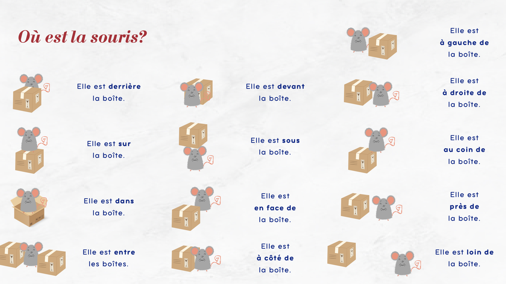
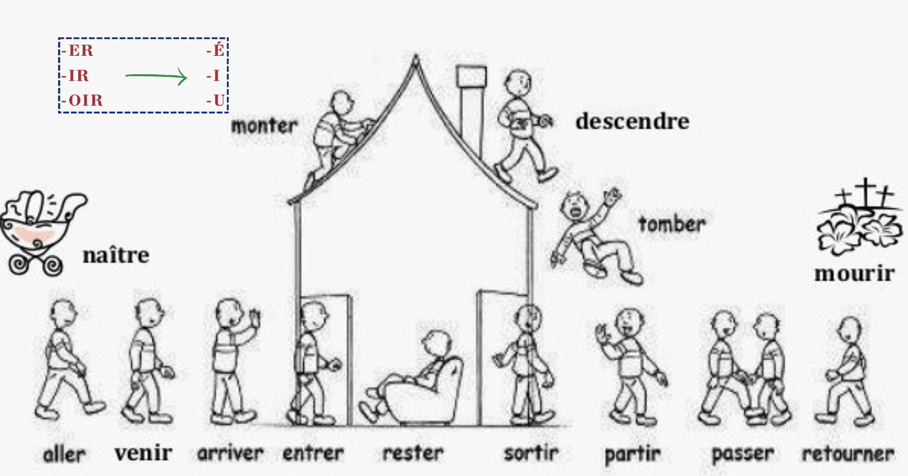

# README

## Remarques (observações)

* La plupart [maioria] des mots ne prononcent pas la cosonnne finale;
* No francés, todo substantivo no plural precisa do **des**
  * Vous avez des bagages? (você tem malas?)
  * Vous avez **(precisa do des)** bagages?


## Les chiffres :1234:

* 0 → Zéro (zéro)
* 1 → Un (hã) / Une
* 2 → Deux (dã)
* 3 → Trois (trrrúa)
* 4 → Quatre (catrre)
* 5 → Cinq (sanq)
* 6 → Six (sis)
* 7 → Sept (set)
* 8 → huit (uit)
* 9 → neuf (nuf)
* 10 → Dix (dis) 

### Les nombres

"Les chiffres" deviant "Les nombres" après (depois) le nombre dix

| Chiffre I             | Chiffre II                     | Chiffre III                   |
| --------------------- | ------------------------------ | ----------------------------- |
| 11 -> onze            | **20 -> vingt (van)**          | **50 -> Cinquente (sancant)** |
| 12 -> douze (duze)    | 21 -> vingt et un (vante un)   | 51 -> Cinquente et un         |
| 13 -> Treize          | 22 -> vingt-deux (van du)      | 52 -> Cinquente-Deux          |
| 14 -> Quatorze        | **30 -> Trente (trent)**       | **60 -> Soixante (suasante)** |
| 15 -> Quinze (canz)   | 31 -> Trente et un             | 61 -> Soixante et un          |
| **16 -> Seize (séz)** | 32 -> Trente-deux              | 62 -> Soixante-Deux           |
| **17 -> Dix-sept**    | **40 -> Quarante (carrante)**  |                               |
| 18 -> Dix-huit        | 41 -> Quarante et un           |                               |
| 19 -> Dix-neuf        | 42 -> Quarante-Deux (carrandu) |                               |

| Chiffre IV                                | Chiffre V                                          |
| ----------------------------------------- | -------------------------------------------------- |
| **70 -> Soixante-Dix** (suasant dis)      | **100 -> cent** (sã)                               |
| 71 -> Soixante et Onze                    | 138 -> cent trente-huit                            |
| 72 -> Soixante-Douze                      | 178 -> cent soixante-dix-huit                      |
| 77 -> Soixante-dix-sept                   | 199 -> cent quatre-vingt-dix-neuf                  |
| 78 -> Soixante-dix-huit                   | **200 -> deux cent** (du sã)                       |
| **80 -> Quatre-vingts** (catrevan)        | 273 -> deux cent soixante-treize                   |
| 81 -> Quatre-vingt-un (catrevan un)       | **1000 -> mille (mill)**                           |
| **90 -> Quatre-vingt-dix (catrevan dis)** | 1445 -> mille quatre cent quarante-cinq            |
| 91 -> Quatre-vingt-onze                   | 2022 -> deux mille vingt-deux                      |
| 92 -> Quatre-vingt-douze                  | 9999 -> neuf mille neuf cent quatre-vingt-dix-neuf |
| 97 -> Quatre-vingt-dix-sept               | **1.000.000 -> Un million**                        |
| 99 -> Quatre-vingt-dix-neuf               | **1.000.000.000 -> Un milliard**                   |


### Les nombres ordinaux

Le nombres ordinaux utilise le 'nombre' + 'ième'
*(Os números ordinários usam o 'número' + 'ième')*

* 1ª - Premier (première) → Je vais (vé) dans le premier arrondissement (Eu vou para o 1ª distrito)
* 2º - Deuxième (duziéme)
* 3º - Troisième
* 4º - Quatrième
* 5ª - Cinquième
* 6º - Sixième
* 7º - Septième
* 8º - Huitième → Nous habitons dans le huitième arrondissement.
* 9º - Neu***<u>v</u>***ième
* 10º - Dixième
* 11º - Onzième
* 12º - Douzième
* 13º - Treizième
* 14º - Quatorzième
* 15º - Quinzième
* 16º - Seizième
* 17º - Dix-septième
* 18º - Dix-huitième
* 19º - Dix-nouvième
* 20º - vingtième


## Les voyelles :a: :b:

* A (a)
* E (boca de O e tentar falar É, oe)
* I (i)
* O (o)
* U (boca de U e tentar falar I, com biquinho)
* y (igrrrequi)

### L'Alphabet (lalfabé)

les lettres de l'alphabet avec des sons différents du portugais sont:

* E (Boca de O e tentar fala É)
* H (axe)
* J (gi)
* L (ela)
* M (ema)
* N (ena)
* Q (Cu com biquinho)
* R (rrrr)
* U (u com biquinho)
* W (dublo v)
* X (ixis)
* Y (igrrequi)
* Z (zeda)

## Pronoms

### Les Sujets *(suge)*

Les pronoms sujets sont utilisés avec des verbes

* Je
* Tu (você, com amigos, família, intimos)
  * Para usar o `tu` normalmente se pede:
    * Je peux vous tutoyer? (podemos usar o Tu)
    * On peut se tutoyer? (podemos usar o Tu / informal)
* Il/Elle/On (ele/ela/a gente)
* Nous
* Vous (vocês/você formal)
* Ils/Elles

### Les toniques

Usado geralmente depois ou antes de uma preposição (avec, aussi); 

Usado para fazer diferença entre um e outro; → *Moi, J'aime le Brésil. Toi, J'adore le Portugal* - *Lui, il parle très bien fraçais. Elle, elle parle très bien portugais et anglais*

* Moi → Primeira pessoa
  * Moi Aussi
  * Vous aussi?
* Toi → Segunda pessoa
  * Je parle <u>avec</u> toi
* Lui / Elle → terceira pessoa
* Nous
* Vous 
* Eux ('o' com biquinho) / Elles


### Possessifs

| Français                | Anglais                  | Portugais                         |
| ----------------------- | ------------------------ | --------------------------------- |
| Le mien / La mienne     | Mine                     | O meu / A minha                   |
| Les miens / Les miennes | Mine (pluriel)           | Os meus / As minhas               |
| Le tien / La tienne     | Yours                    | O teu / A tua                     |
| Les tiens / Les tiennes | Yours (pluriel)          | Os teus / As tuas                 |
| Le sien / La sienne     | His / Hers / Its         | O dele / A dele / O dela / A dela |
| Les nôtres              | Ours (pluriel)           | Os nossos / As nossas             |
| Le vôtre / La vôtre     | Yours (formal ou plural) | O vosso / A vossa                 |
| Les vôtres              | Yours (pluriel)          | Os vossos / As vossas             |
| Le leur / La leur       | Theirs                   | O deles / A delas                 |
| Les leurs               | Theirs (pluriel)         | Os deles / As delas               |


Nous utilisons les pronoms possessifs pour **substituer un substantif**:

* **Avec les substantif:** Mes chiens courent dans le parc. Mais où sont ***tes chiens***?
* **Avec le pronoms possessif:** Mes chiens courent dans le parc. Mais où sont **les tiens**? (*Where is yours?*)


* Peux-tu me passer ton crayon? J'ai perdu **mon crayon**
* Peux-tu me passer ton crayon? J'ai perdu **le mien**


**Examples:**

* Ce livre est **le mien** (This book is **mine**)
* Cette valise est la mienne
* Ces ordinateurs sont **les miens**!
* Ce piano est **le tien**, profitez-en! (enjoy it)
* Cette voiture est **la tienne** (this car is yours)
* Ma voiture n'est plus la mienne, c'est **la sienne**!
* Je ne détiens plus le record de mon jeu, mon frère est meilleur que moi, le record? c'est **le sien**...
* Notre conversation n'est plus comme avant, mais notre amour? **le nôtre** est toujours fort
* Cette maison est **la leur**, mais cette-ici est **la nôtre**!
* J'aime bien **leur** idée, mais j'aime beaucoup **le nôtre**...
* Tu as **tes problèmes**, et nous avons **les nôtres**
* C'est **le leur!**
* Ces enfants sont **les leurs**


### Pronoms 'en' et 'y'

**Y**:

* vai substituir um **lugar** que peça preposição  `à` 
* n'y = (***ni***)
* não pode ser usado para pessoas

> Exemples:
>
> * Tu vas **à Paris**?
>   * Oui, j'y (*ji*) vais parce que je l'aime beaucoup
> * Qui t'emmène en **cours**? (*quem te leva par aula?* - cours é um lugar)
>   * C'est ma soeur qui **m'y** (mi) emmène
> * Demains je vais **chez le coiffeur** (*cabeleleiro*)
>   * D'accord, **j'y** vais tout les mois
> * As-tu déjà **réfléchi à** ta thèse?
>   * Oui, **j'y** pense depuis longtemps


**EN:**

* quando pede preposition `de/du`
* j'en ai (je né) -> J'en ai mangé un
* il y a -> Il y **en** a 
* não pode ser usado para pessoas

> Exemples:
>
> * Veux-tu prendre **du** sucre?
>   * Oui, **j'en** veux bien
> * Je voudrais avoir une **voiture**, si vous saviez comme **j'en** rêve une
> * Tu as trop **de BDs** dans ta chambre, ton frère **n'en** a pas autant (*bastante*)
> * est-ce qu'il y a beaucoup **d'estudiants** dans la classe?
>   * Oui, il **y en** a 50


## Prepositions/Articles

### Localização Plural

**pluriel noun** + **sont dans** + **emplacement**

* Les valises sont dans la voiture; → *As malas estão na viatura*
* Les blusons sont dans l'armoire → *As blusas estão no armário*
* Les lettres sont dans le tiroir [tirrua] → *As cartas estão na gaveta*
* Les vases sont dans les boîtes → *Os vasos estão nas caixas*
* Les fleurs sont dans le salon → *As flores estão na sala*


### Localização Singular

**noun** (*Substitantivo*) **singulier** (*singular [sangulie]*) + **est dans** + **emplacement** (*lugar*)

* Le fleur est dans le salon → *A flor está na sala*
* La lettre est dans le tiroir → *A carta está na gaveta*


### Les articles partitifs

Les articles partitifs sont utilisés pour les mots que nes peuvent pas être comptés (contadas). Quantidade

**TOUT LES SUBSTANTIVOS PRECISAM DE UM ARTIGO!**

Pour example les:

* Lait
* Eau
* Confiture

| Français                        | Quand utilisé      | Example                                                      |
| ------------------------------- | ------------------ | ------------------------------------------------------------ |
| De Le = Du (do en portugais)    | Masculin singulier | Je veux du lait / Je vien du Brésil                          |
| De la / De l' (da en portugais) | Feminin singulier  | J'aime ~~de la~~ les confitures Française / il veut de l'eau |
| Des (dos/das)                   | Pluriel            | Nous pouvons manger des céréales?                            |

***Aimer, Adorer, détester = article défini (les)**: J'aime les confitures


### À / Au / Aux / En / De


**à** / **Au** (*à + le*) -> Pour introduire:

* Je suis **à** la piscine (*localisation*)
* Vous allez **au** cinéma (*destination*)
* Le métro est **à** cent mètres (*distance*)
* Le ticket est **à** 1 euro (*prix*)
* L'exposition est **à** 11 heures (*heures*)
* Cette maison est **à** elle (appartenance à un **pronom personnel**)
* Je vais **à** Cheval (moyen de transport que nous n'entrons pas)
* J'adore le jus d'ananas à la menthe (ingredient)


* Villes (**cidades**) / masculinas/femininas -> **à** 
  * Je vais à Paris
  * Il habite à Lyon
  * Elle travaille à Sao Paulo
  * Est-ce que tu es à Marseille?
* **Fait attention!** Se formos falar de 'origem' ou de uma 'cidade' usamos **de**
  * Je commande un t-shirt **de** New York
  * Cet étudient **de** Berlin est amusant


**De**:

* C'est le livre rouge de Jung; (l'appartenance)


* Pays Féminin (geralmente terminados em **-e**) -> **En**
  * Je vais **en France**
  * Elle habite **en Italie**


* Pays Masculin (**não** terminados em **-e**) -> **Au**

  * Je vais **au Brésil**

  * Elle habite **au Japon**


* Pays pluriel -> **Aux**

  * Je vais **aux Étaits-Unis**

  * Elle vit **aux Pays-Bas**

### De lieu



| Francês    | Português        |
| ---------- | ---------------- |
| à          | a / em           |
| dans       | dentro de        |
| sur        | sobre            |
| sous       | sob / embaixo de |
| devant     | na frente de     |
| derrière   | atrás de         |
| entre      | entre            |
| près de    | perto de         |
| loin de    | longe de         |
| à côté de  | ao lado de       |
| en face de | em frente a      |


### Chez/Hors de

**Chez,** Indica um lugar/casa, como:

* **Chez boucher**: açougue

  * *Nous allons chez le boucher, je vais cuisiner de la viande*

    (*Nós vamos ao açougue, vou cozinhar carne*)

* **Chez coiffeur**: cabeleireiro

  * *Je suis chez le coiffeur*

    (*estou no cabeleireiro*)


**hors de**, exterior de algo

* est-ce que tu es **hors de la maison**? (*você está fora de casa?*)
* Nous ne voulons pas aller **hors de France** cet été (*não quero ir para fora da França nesse versão*)


## Adverbes

### De lieu


| Français   | Português       | Exemplo (FR)                           |
| ---------- | --------------- | -------------------------------------- |
| ici        | aqui            | Je suis **ici**, viens me voir !       |
| là         | aí / lá         | Le livre est **là**, sur la table.     |
| Là-bas     | lá longe        | Il est parti **là-bas**, en Australie. |
| en haut    | em cima         | Le chat est **en haut** de l’armoire.  |
| en bas     | embaixo         | Les chaussures sont **en bas**.        |
| à gauche   | à esquerda      | Tourne **à gauche** au feu.            |
| à droite   | à direita       | Le bureau est **à droite**.            |
| dedans     | dentro          | Il est **dedans**, ne crie pas !       |
| dehors     | fora            | Les enfants jouent **dehors**.         |
| partout    | em todo lugar   | Il y a du sable **partout** !          |
| nulle part | em lugar nenhum | Je ne le trouve **nulle part**...      |


### De Quantité/intensité


| Français  | Portugais             | Exemple (FR)                          |
| --------- | --------------------- | ------------------------------------- |
| beaucoup  | muito                 | Elle mange **beaucoup** de fruits.    |
| trop      | demais                | Il parle **trop** fort.               |
| assez     | suficiente / bastante | Tu as **assez** dormi ?               |
| peu       | pouco                 | J’ai **peu** de temps aujourd’hui.    |
| davantage | mais                  | Il faudrait travailler **davantage**. |
| autant    | tanto / igualmente    | Il mange **autant** que moi.          |
| tellement | tanto / tanto assim   | C’est **tellement** beau ici !        |
| moins     | menos                 | Je cours **moins** qu’avant.          |


## Climat *(Clima)* :sunny:

* Froid *(frrruá)* → Frio → Il fait *(fé)* froid; [faz/está frio]
* Très *(trê)* froid → Mt frio → Il fait très froid; [faz muito frio]
* Gèle → geando → Il gèle; [está geando]
* Chaud (xo) → calor → Il fait chaud; [faz/está calor]
* Très chaud → mt calor → Il fait très chaud;
* Pleut *(plu)* → chove → Il pleut [está chovendo]
* Neige *(nége)* → nevando → Il neige [está nevando]
* Beau (bo) → clima agradavel → il fait beau [clima está bom]
* mauvais (move) → clima ruim → il fait mauvais [clima está ruim]

## Les titres de civilité

* Madame → Senhora
* Mesdames → Senhoras
* Monsieur → Senhor
* Messieurs → Senhores
* Mademoiselle → Senhorita
* Mesdemoiselles → Senhoritas

## Les mots de politesse

* s'il vous plâit / s'il te plâit (informal) → por favor
* Merci → Obrigado
* Merci beaucoup (bocu) → muito obrigado!
* De rien (rian) → de nada
* Je vous en prie / Je t'en (ton) prie → de nada
* Pardon → Desculpa
* Je suis désolé (desole) → sinto muito
* Excusez-moi  / excuse-moi (informal) → me desculpe

## Les Nationalités :brazil: :fr:

| Les pays (pai → países) |       Masculin       |          Féminin           |
| :---------------------: | :------------------: | :------------------------: |
|         France          |  Français (France)   |    Française (francesa)    |
|    Brésil (Brrrésil)    | Brésilien (bresiliã) | Brésilienne (Brrésilienna) |
|   Portugal (Portugal)   |      Portugais       |         Portugaise         |
|       Angleterre        |       Anglais        |         Anglaises          |
|    Espagne (Espanha)    |       Espagnol       |         Espagnole          |
|          Japon          |       Japonais       |         Japonaise          |
|        Amérique         |      Américain       |         Américaine         |


## Adjectifs

### Possessif

| Pronoms   | Masculin (Meu/Seu/Dele)                                    | Féminin (Minha/Sua/Dela)                             | Pluriel (minhas/meus - seus - Deles)                       |
| --------- | ---------------------------------------------------------- | ---------------------------------------------------- | ---------------------------------------------------------- |
| Je        | ***Mon (meu)***<br />Mon anglais / Mon voisin              | ***Ma (minha)***<br />Ma ceinture / Ma valise        | ***Mes (meus/minhas)***<br />Mes chaussettes               |
| Tu        | ***Ton (Teu/seu)***<br /> Ton siège                        | ***Ta (tua/sua)***<br />Ta ceinture / Ta valise      | ***Tes (seus/suas)***<br />Tes tee-shirts                  |
| Il / Elle | ***Son (o x Dele)***<br /> Son ordinator                   | ***Sa (o X Dela)***<br />Sa ceinture                 | ***Ses (o X Deles/Delas)***<br />Ses voisins               |
| Nous      | **Notre (Nosso)** <br />Nous avons notre livre de français | **Nortre (Nossa)**<br />Notre fille est discrète     | **Nos (nossos)**<br />Nous avons nos livre**s** d'allemand |
| Vous      | **Votre (de vocês)**<br />Où est votre voiture?            | **Votre (de vocês)**<br />Vous avez votre passeport? | **Vos (Xs de vocês)**<br />Vous prenez vos valise**s**?    |
| Ils/Elles | **Leur (deles)**<br />Ils vont voyager avec leur famille   | **Leur (delas)**                                     | **Leurs**<br />Ils vont voyager avec leurs familes         |

Les pronoms féminin (Ma, Ta, Sa) devant (antes) les mots avec H/voyelle, deviant (viram) masculin

* Ma agence → Mon agence
* Ta arrivée → Ton arrivée

*Les pronoms sont referentes ao substantivo! Mesmo que queiramos dizer:*

* A camisa dele

Temos que verificar se Camisa é feminino ou masculino

* A camisa (*féminin*) dele = *Sa chemise*
* O telefone (*masculin*) dela = *Son téléphone*

### Irréguliers

Certain adjectifs changent selon le genre:

* Eau -> El -> Elle
* eux -> iel - ielle
* Ou -> Ol -> Olle

| Masculin                                       | Masculin commeçant par voyelle ou 'h' | Féminin                      |
| ---------------------------------------------- | ------------------------------------- | ---------------------------- |
| B**eau** (*bo*) - Un Beau mec                  | B**el** -> *Un bel **h**omme*         | B**elle** -> Une belle femme |
| Vieux (*viõ - velho*)  Un vieux livre          | Vieil (viei) -> Un Vieil **h**omme    | Vieille -> Vieille femme     |
| Fou (*fu* - *louco*)  Il est fou d'amour       | Fol (fol) -> Un fol amour             | Folle -> Rob est folle       |
| Nouveau  (*nuvo*) Le nouveau cirque (*cirqui*) | Nouvel -> Un nouvel ami               | Nouvelle                     |
| Mou (*mu - macio*) C'est lit est mou           | Mol -> Un mol orreillier              | Molle                        |


### Les Adjectif et les pronoms indéfinis

| **Adjectif indéfini** | Acompanha um substantivo    | “algum aluno”, “toda menina” |
| --------------------- | --------------------------- | ---------------------------- |
| **Pronom indéfini**   | Substitui o **substantivo** | “alguém”, “ninguém”, “tudo”  |


**Adjectif Indéfini**

| Français              | Português              | Exemple                                            |
| --------------------- | ---------------------- | -------------------------------------------------- |
| **chaque**            | cada                   | **Chaque jour** je bois du café.                   |
| **plusieurs**         | vários                 | **Plusieurs personnes** sont absentes.             |
| **quelques**          | alguns/algumas         | **Quelques élèves** sont en retard.                |
| **tout(e)(s)**        | todo(a)(s)             | **Toute la classe** est là.                        |
| **aucun(e)**          | nenhum(a)              | **Aucune solution** ne fonctionne.                 |
| **certain(e)s**       | certos(as)             | **Certaines idées** sont originales.               |
| **un autre, l'autre** | um outro(a)/o outro(a) | Je pense que non, je préfère **un autre** saveurs. |


**Pronoms indéfinis**

| Français         | Português  | Exemple                            |
| ---------------- | ---------- | ---------------------------------- |
| **quelqu’un**    | alguém     | **Quelqu’un** a frappé à la porte. |
| **personne**     | ninguém    | **Personne** ne m’écoute.          |
| **rien**         | nada       | Je n’ai **rien** à dire.           |
| **tout**         | tudo       | **Tout** est possible.             |
| **chacun(e)**    | cada um(a) | **Chacun** a son opinion.          |
| **aucun(e)**     | nenhum(a)  | **Aucun** n’est venu.              |
| **quelques-uns** | alguns     | **Quelques-uns** ont déjà mangé.   |
| **la plupart**   | a maioria  | **La plupart** sont partis.        |
| **Le même**      | o mesmo    |                                    |
| **D'autre**      | de outro   |                                    |


**Certains vs Quelques**

* **Quelques** é mais genérico, traduzido por '*alguns/algumas*'
  * Quelques élèves sont en retard.
* **Certains** é um grupo dentro do grupo, traduzido por '*certos*'
  * **Certains** amis sont restés tard


**à fin d'exercer:**

1 - **chaque** étudiant aura une liste de livres et prendra **chacun** d'eux pour faire des résumés.

2 - **quelqu'un** a mon chargeur? Je le laisse toujours dans **quelque** lieu et maintenant c'est parti.

3 - Avez-vous aimé ce vin, madame?

- Je veux en essayer **un autre**, s'il vous plaît.

- Et maintenant?

- Je pense que non, je préfère **l'autre** saveurs...

4 - **Quelques** chiens ont mangé mon déjeuner et n'ont laissé **rien** pour moi!

5 - **Certains** membres ne veulent pas contribuer à la fête de clôture de l'entreprise et si **personne** ne change d'attitude,**rien** ne sera fait.

6 - Vous devez vous brosser **chacune** de vos dents ou il deviendra édenté.

7 - Vous les hommes êtes **les** **mêmes**, J'en ai déjà marre.


#### Tout, tous, Toute, Toutes

il s'accorde en genre et en nombre!

* **Tout:** 
  * S'il est suivi d'un adjectif féminin qui commence par une consonne ou un h aspire

| Palavra | Gênero | Número | Exemplo                                                      |
| ------- | ------ | ------ | ------------------------------------------------------------ |
| tout    | masc.  | sing.  | **tout le pain** (todo o pão)<br />Ces chiennes sont **tout i**ntelligent |
| tous    | masc.  | pl.    | **tous les garçons** (todos os meninos)                      |
| toute   | fem.   | sing.  | **toute la nuit** (toda a noite)                             |
| toutes  | fem.   | pl.    | **toutes les filles** (todas as meninas)                     |


**à find d'exercer:**

1. Ce plan (mapa) indique **tous** <u>les arrêts</u> d'autobus (pontos de ônibus) de la ville.

2. Je n'ai vraiment plus du **tout** **e**nvie de continuer ! (Eu realmente não quero mais continuar)
   1. "Du tout" = **de jeito nenhum**.

3. D'accord, je te laisse terminer tes devoirs **tout** seul.
   1. **Tout** = adverbe ici → "completamente sozinho".

4. Il travaille beaucoup plus que nous **tous**.

5. Je suis fatiguée de **toutes** ces histoires.

6. Paul est aimé de ~~**tout**~~ **tous**.
   1. "Tous" = todas as pessoas.

7. Quand il est allé à Paris, il a dormi pendant **tout** le voyage.

8. Elle a entré **tous** les données (os dados) dans le programme.

9. C'est un journal qui est publié **tous** les jours.

10. La personne à côté de qui je dors ronfle un **tout** petit peu.
    1. "Un tout petit peu" = "um tiquinho só".

11. J'ai retrouvé l'agenda dans lequel je note **tout** ce que je fais.
    1. "**Tout ce que**" = tudo o que.

12. C'est pas mal du **tout**, mais il faudrait quand même que je fasse mieux la prochaine fois.
    1. "Du tout" = nada mal!


## Les jeurs de la semaine

* Segunda: Lundi
* Terça: Mardi
* Quarta: Mercredi
* Quinta: Jeudi
* Sexta: Vendredi
* Sábado: Samedi
* Domingo: Dimanche


**Le** est utiliser comme `às` de la langue portugaise:

* Je chante au théâtre **le** jeudi


* Aujourd'hui -> Hoje
* Demain -> Amanhã
* Hier -> Ontem
* Après-demain -> Depois de amanhã
* Jeur -> Dia
  * Il travail le jeur (ele trabalha de dia)

* Semaine -> Semana
* Mois -> Mês
* Année -> Ano


* Le Matin -> manhã
* L'après-midi
* Le soir/nuit -> noite
  * **Le soir**, ils chantent pour tout le mond
  * est-ce que vous visitez le monument **lundi matin** ((segunda de manhã))


## Comment poser un question :question:

En français, nous avons trois façons (*maneira*) de poser (*fazer*) une question:

* En ajoutant (*adicionando*) un `?`
  * Tu prends un thé
  * Tu prends un thé?
  * Où tu vas?
  * Ils veulent quoi? -> *le 'quoi' va à la fin de la phrase*
* En ajoutant `est-ce que` - est utiliser pour réponse 'oui' ou 'non' - C'est comment 'May I' en anglais
  * Est-ce que tu prends un thé?
  * Où est-ce que tu vas?
  * Quoi -> **Qu'est-ce qu**'ils veulent? (*o que eles querem*)
* En inversant (*invertendo*) le pronom - moins courant (*menos comum*) et plus formel:
  * Prends-tu un thé?
  * Où vas-tu?
  * Comment voyage-vous?
  * Que veulent-ils?

### Quel / Quelle / Lesquelles

Le terme '*quel*' varie en '*quelle*' selon le genre du substantif, **mais la prononciation est la même!**
*(O 'quel' varia para 'quelle' conforme o gênero do substantivo, **Porém, a pronuncia é a mesma!**)*

Ex.: 

* **Quel** est votre **vol** (le vol - masculin)?
* **Quelle** est votre destination (la destination - féminin)?

de même (mesmo) pour le pluriel:

* **Quels** sont les horaires disponibles?
* **Quelles** sont les musiques que vous écoutez?
* **Quelles** sont mes recettes?


Contrairement (*contraremã*) à quel ou quelle qui nécessitent un nom, **lesquelles**/**lequel** peut être utilisé seul.

(Contrário do 'quel' ou 'quelle' que necessita um substantivo, 'lesquelles/lequel' pode ser utilizado sozinho)

* Quelle rose tu as? *(Quais rosas você tem?)*
* Tu as roses, **lesquelles**? (*você tem rosas, quais?*)
* Lequel? (*qual?*)
* Lequel est votre chien? (*qual é seu cachorro?*)

### Combien

Le combien est utilisé pour interroger la quantité:

* **Combien** (*combiã)*? (quanto)
  * C'est combien?

* **Combien** sont-ils (*combiã sont-il*) ? (quantos são?)
* **Combien** ça coûte (*combiã sa cute*)? (quanto custa)
* Il y a combien de personnes?

### Qui

Qui = Quem

* Qui est riche?

### Pourquoi & Parce que

### Est-ce que

**est-ce que** = em geral indica uma pergunta para **sim e não**

* est-ce que tu manges? (*você come?*)
* est-ce que nous allons à Paris? (Nós vamos para Paris?)

Quando acompanhado por:

*  **quel** se torna **qu'est-ce que**
   * Qu'est-ce que veux? (*O que você quer?*)
*  uma vogal, como no pronome **elle**, se torna **est-ce qu'elle**
   *  est-ce qu'elle à invité? (ela é convidada?)

*  **quand**:
   * Quand est-ce que nous allons à Paris? (*Quando vamos para Paris?*)
*  **qui:**
   *  Qui est-ce qu'elle à invité? *(quem ela convidou?)*
   *  est-ce qu'il mange? (*ele come?*)


## il y a / there is

Assim como no inglês temos o ***there is*** no francês temos o ***il y a*** (em português, seria o nosso ***têm***).

* Dans la chambre, **Il y a** grande fenêtre. *(No quarto, tem uma grande janela)*
* Dans l'hôtel, il y a 45 chambres. *(No hôtel, tem 45 quartos)*
* Il y a un serveur dans le restaurant? *(tem um garçon no restaurante?)*

No plural: Il y a -> Il y a também

Negação: Il y a -> Il n'y (ni) a pas


### Les commons questions

* Como era...
* Como foi...
* O que você fez....
* Você consegue...


## La négation en France

Forma básica: <u>**ne** + verb + **pas**</u>

* Je mets mes vêtements dans le placard
  * Je **ne** mets **pas** mes vêtement dans le placard
* Je vais en France en Decémbre
  * Je **ne** vais **pas** en France en Decémbre


Quand le verb **commence avec le voyelle**: <u>**n'** + verb + **pas**</u>

* Je aime être près de la fenêtre
  * Je **n'**aime **pas** être près de la fenêtre

## Le Pluriel

* Un/Une -> Des
* Le/La -> Les
* +s (regra geral)
  * La chambre -> Les chambre**s**
  * Un petit lit -> Deux petit**s** lit**s**
  * Une information -> Des information**s**
* -s,-x,-z (si terminé avec s,x,z rien (*nada*) change)
  * Un françai**s** préci**s** -> Des françai**s** préci**s**
  * Un couloir lumineux -> Des couloir**s** lumineu**x**
  * Un nez pointu (nariz pontudo) -> Des ne**z** pointu**s**
* -ail (*ai*), -al, -eau -> **aux**
  * Un journal -> Des journ**aux**
  * Un drapeau (bandeira) -> Des drape**aux** 
  * Un travail (trabalho) -> Des trav**aux**
  * Un homme sentimental -> Des hommes sentiment**aux**
* -ou, -ea, -eau -> **x**
  * genou (joelho) -> des genou**x**
  * bijou (joia) -> Des bijou**x**
  * Cheveu (*xevo - cabelo*) -> Cheveux
* -eu -> eu**x**
  * Un lieu (lugar) -> Des lieux
    * Exception -> Bleue , pneu ->  bleues, pneus


## Future proche :rocket:

Le future proche, ou "Future Próximo", en France:

```
Sujet + Aller conjugué au présent + infinitif du verbe
```


Par example:

* **Je** + **vais** (vé) + **prendre** + une douche
* **Tu** + **vas** + **rester** + à l'hôtel?
* Lundi, **il** + **va** + **voir** un filme avec ses amis.
* **Nous** + **allons** + **monter** dans l'avion (*nós vamos subir no avião*)
* Pendent le voyage, **vous** + **allez** + **parler** anglais ou français?
* **Ils** + **vont** + **aller** au cinéma


## Les directions

* Devant -> Em frente / na frente
* À côté -> Ao lado
* Sous -> Embaixo
* Sur -> Em cima

## C'est!

C'est (C' = Ce) est utilisé avec un substantif

* C'est la Tout Eiffel!
* C'est bien.

C'est est aussi utilisé avec les **pronoms tonitique**:

* C'est **toi** qui décides.
* C'est **moi** qui parle en premier
* C'est eux (*ce ton*), là-bas dans la voiture, les voisins de ma mère (*são eles, ali no carro, os vizinhos da minha mãe*)

La negation - **Ce + n'est + pas** \\ **Ce + ne + sont + pas**:

* Ce n'est pas ma valise!
* Ce ne sont pas mes bagages

La interrogation:

* C'est qui?
  * C'est mon ami Stéphanie
* C'est quoi?
  * C'est la Tour Eiffel
* C'est quand?
  * C'est aujourd'hui
  * C'est demain
* C'est où?
  * C'est à Paris

La interrogation avec 'est-ce que':

* Qui est-ce que c'est?
* Qu'est-ce que c'est?
* Quan<u>d e</u>st-ce que c'est? (*quantests que cest*)
* Où est-ce que c'est?

`c'est`(c) é utilizado para identificar uma pessoa

Example:

* C'est Igor; → Ce igor
* C'est Renata;
* C'est Tiago;

`ce sont` (su som) é utilizado para identificar **pessoas**;

Example:

* Ce sont Igor et Renata; → Su som Igor e Renata
* Ce sont Ellen et Tiago;
* Ce sont Stéphanie et Victor;


### Il est vs C'est

(page 74)

**Il est** - não tem artigo depois, é usado quando vem seguido de um:

* adjetivo (*il est fatigué*)
* profissão (*elle est enfirmiére*)
* nacionalidade (*il est française*)
* horário/marca temporal/tempo (*il est tard*)
* Se começar no início da frase não é genérico


**C'est **, quando vem seguido de:

- Um **substantivo com artigo** (un, une, le, la, etc.) (*c'est un stylo*)
- Um **nome próprio** (*C'est Igor*)
- Uma **ideia geral**, ou para dar **ênfase** (*c'est incroyable* / *c'est ennueyeux*)

* data/dia


## Faim/Soif/Sommeil/Chaud/Peur

* Avoir **faim** = Etsta com fome
  * J'ai faim! vous avez quelque chose pour manger?
  * Ils ont faim, mais ils ont dèjá mangé!
  * Elle n'a pas faim
  * Est-ce que tu as faim?
* Avoir **Soif** = Estar com sede
  * J'ai soif, est-ce que vous avez de l'eau?
  * Il n'a pas soif...
  * Est-ce que tu a soif?
* Avoir **Sommeil** = Sono
  * Je suis dans l'avion, j'ai sommeil...
  * Est-ce que tu as sommeil?
* Avoir **Chaud** = Sentir calor/Estar com calor
  * Je cherche mon chapeau, j'ai chaud!
  * Est-ce que tu as chaud?
  * Oscar a chaud, il commande une glace...
* Avoir **Froid** = Sentir Frio
  * Igor et Tiago ont froid, pouvez-vous prendre un bluson pour eux?
  * Est-ce que tu as froid?
* Avoir **Peur** = ter medo
  * est-ce que tu as peur?
  * Nous n'avons pas peur!
  * Elle n'ons pas peur
* **Avoir Peur + De** = tem medo de
  * Mon fils a peur de l'eau
  * Je n'ai pas peur de gagne!


## Faire la/à

Nous pouvons utiliser le verbe 'faire' (fazer) pour indique des actions

* **Faire la cuisine** ((cozinhar))
  * J'aime beaucoup faire la cuisine (*eu amo cozinhar*)
  * Stéphane a fait la cuisine hier (*Stéphane cozinhou ontem*)
  * Ils ne **font** pas **la cuisine**, ils veulent commander la déjeuner (*eles não cozinham, eles vão pedir o almoço*)
* **Faire la vaisselle** (( veséla -> lavar louça))
  * est-ce que tu peux faire la vaisselle aujourd'hui?

* **Faire à manger** ((fazer para comer rápido e fácil))
  * Je fais à manger pour ma mère (*eu cozinho para minha mãe*)
  * Nathalie ne **fait** pas souvent **à manger** (*nathalie não cozinha com frequência*)
  * Qu'est-ce que tu veux **faire à manger?** (*o que você quer cozinhar*)
* **Faire son/ton lit** (arrumar a cama)
  * Est-ce que tu dèjá fais ton lit?
* **Faire le ménage**
  * Ma fille n'aime pas **les tâches ménagères** mais elel fait son lit tout les matins
* **Faire un voyage** ((viajar))
  * En juin nous voulons faire un voyage


## Qui/Que/Dont


## Ditocomias

### Pour/Par

* Pour:

  * Objetivo/Causa: 
    * *Je faire du yoga **pour** me relaxer*
  * Destino/destinatário: (**JAMAIS utiliser 'pour' après le verbe aller**)
    *  *J'ai acheté un cadeau **pour** toi* 
    *  *Je voyagerais **pour** l'Afrique*
  * Duração:
    * *Je voyagerais **pour** deux mois*
    * *Je pars en Europe **pour** dix jours*

  

* Par:

  * Razão/Motivo:

    * *Tu as crevé son pneu **par** vengence*

      *(você furou o pneu por vingança)*

  * Meio/Através de:

    * Il sort **par** la porte

      *(sai pela porta)*

  * Frequência:

    * Il faut s'exercer trois fois **par** semaine

      (Exercicite 3x por semana)

### Porquoi/Parce que

C'est la meilleure manière de comprendre:

* Porquoi = why
* Parce que = because


### Comment / Comme

La meilleure manière de comprendre:

* Comment = How
  * **Comment** avez vous fait?
  * **Comment** ça va?
* Comme = As, Like
  * Il chante **comme** un profissionnel
  * Elle est gentile, **comme** sa mère


### Rendre

La conjugaison:

* Je rends
* Tu rends
* Il rend
* nous rendons
* Vous rendez
* Ils rendent

Utilisation:

* Rendre é um verbo coringa, que se adapta a várias utilizações:
  * Tornar-se
    * Rend malade (fica doente)
    * Ce filme me rende heureux (esse filme me deixa feliz)
  * Devolver
    * Je rendu sa voiture (eu devolvi seu carro)
  * Prestar
    * J'ai rendu un grand service (eu prestei um grande serviço)
  * Desistir/Entregar
    * Il se rend à la police (se entregou a polícia)

**Rendre Visite**

* Visiter = c'est utiliser pour parler d'un lieu (un musée, une ville, un pays)
* Rendre Visite = pour parle de gens suivi (Seguido) de la preposition 'à'


### Mener et Porter

* Mener = utiliser pour parle de gens
* Porter = utiliser pour des choses (êtres inanimés)


**Mener**

* **Mener**:
  * Conduzir/Dirigir/Levar
    * Il mène son équipe à la victoire
    * Ce chemin mène à la plage
    * Il a mené la réunion
* **Emener**:
  * Transportar - irá FICAR com a pessoa no lugar
    * Je vais t'emmener à l'hôpital
    * Nous avons emmené les enfant au parc
* **Amener**:
  * Transportar - NÃO irá FICAR com a pessoa no lugar
    * peux-tu amener une bouteille de vin pour le dîner?
* **Ramener:**
  * Transportar/levar NOVAMENTE mas não vai ficar com a pessoa
    * Peux-tu me ramener au café?


**Porter**

* **Porter**:
  * Vestir
    * Il porte un sac à dos
    * Je porte un manteau en hiver
    * Je porte des lunettes/Je porte un montre
* **Apporter**:
  * Carregar algo de um ponto ao outro:
    * J'apporte un gâteau à la fête
    * Peux-tu m'apporter un verre d'eau?
* **Emporter**:
  * "Take to go" / pegar e sair do lugar
    * J’emporte mon parapluie parce qu’il va pleuvoir.
    * Elle a emporté son ordinateur en voyage
* **Remporter:**
  * Gagner/récupérer
    * Il a remporté la médaille d’or!
    * Ils ont reporté le match (gíria / eles carregaram a partida)
    * N'oubliez pas de remporter votre disque


Les exercices:

Completez:

1. Quand tu pars en voyage, n’oublie pas d’**emporte** une valise légère pour faciliter tes déplacements.
2. Après avoir gagné le match, ils espèrent **remporter** le trophée à la maison cette année.
3. Il faut **emener** les invités à table avant que le dîner ne refroidisse. :warning:
4. Peux-tu **apporter** cette pile de livres dans la chambre d’à côté, s’il te plaît ? :warning:
5. Elle a décidé de **emmener** son frère à l’aéroport très tôt ce matin.
6. Le serveur va **apporter** votre commande à votre table dans quelques minutes.
7. Ils ont dû **emporter** leurs affaires (*they belongs*) avant de quitter précipitamment le bureau.
8. Après l’école, je vais **remener** ma petite sœur à la maison.


### Lieu/Place/Endroit

Expressions:

* **Quelque part** = somewhere
* **Nulle part** = anywhere
* **Partout** = everywhere


* **Lieu** = lugar
  * Lieu de naissance, lieu de résidence. lieu de travail
    * Lieu saint / lugar sagrado
    * Donner lieu pour elle! / dar o lugar para ela
  * **au lieu de** = "em vez de"/ao invés
    * Je vai prendres un douché **au lieu de** dormir
* **Place** = place (an anglais)/siège
  * Ces livres ne sont pas à la bonne **place**.
  * Mettez-vous à ma **place.**
  * **à la place de** = no lugar de
    * Mettez a table à la place de la chaise

* **Endroit** = como um canto/aquele lugar/mais genérico

  * Comment s'appelle ***l'endroit*** où les gens vont lorsqu'ils sont malades?

  * **Truc** = Troço/negócio/Stuff

    * Comment s'appelle le ***truc*** que nous utilison pour faire le lien?

      (como se chama o negócio que nós usamos para fazer ilgação )


### Certains vs Quelques

* **Quelques** é mais genérico, traduzido por '*alguns/algumas*'
  * Quelques élèves sont en retard.
* **Certains** é um grupo dentro do grupo, traduzido por '*certos*'
  * **Certains** amis sont restés tard


### Merci de vs Merci Pour

* Merci:
  * suivi (*followed*) d'um nom, nous pouvons utiliser 'de' ou 'pour'
  * suivi d'um verb à l'infinitif -> 'de'


Exercices - trouvez la bonne réponse ou la corriger si elle est fausse:

1. Merci pour <u>avoir</u> fait preuve d’attention durant notre intervention.
   1. Merci d'avoir fait...
   2. Merci pour votre attention...
2. Notre enfant est un peu différent des autres, merci pour <u>être</u> compréhensif.
   1. Merci d'être compréhensif
   2. Merci pour votre compréhension
3. «Merci pour vos messages de soutien (*support*)» , a publié cet influenceur dans la tourmente.
4. L’animatrice du groupe de parole a clos la séance en disant : « Merci de ce moment de partage.
5. Merci pour m’envoyer votre retour d’expérience dès que possible.
   1. Merci d'envoyer 
6. Merci pour <u>avoir</u> pris le temps de lire mon manuscrit jusqu’à la fin.
   1. Merci d'avoir fait...
7. Je pourrai suivre la réunion uniquement en visio, merci de votre compréhension.
8. Merci pour votre retour rapide, c’est très appréciable !
9. Merci pour m’avoir envoyé des messages de soutien pendant mon hospitalisation.
   1. Merci de m'avoir
10. Merci pour votre attention, vous êtes un public formidable !


### à nouveau vs de nouveau

Les deus expressions veulent dire '**encore une fois**':

*  **à nouveau**:
  * Signifique qu'on **refait une action**, mais d'une manière différente .
    * *Il a refait le gâteau **à nouveau**, mais avec moins de sucre.*
*  **de nouveau**
  * Signifie qu’une action se **répète exactement comme avant**.
    * *Il a oublié ses clés **de nouveau**.*


## Le Passé composé

Le passé composé se compose de: **avoir/etrê + participe passé de verbe**

Avoir (pour tout les verbes)

* J**'ai** regard**é** un filme

  (I watched a movie)

* Nous **avons** écri**t** (*irregulier*) une chanson

  (I wrote a music)


Le general règle par les verbes au passé:

* -er -> é
  * Manger -> Mangé
  * Regarder -> Regardé
  * Danser -> Dansé
  * Voyager -> voyagé
* -ir -> i
  * Finir -> Fini
  * Choisir -> Choisi
  * Fournir (fornecer) -> fourni
* oiur -> u

Mais quelque verbes sont **irreguliers**:

* Avoir -> eu
  * J'ai eu (eu tive)
  * Nous avons eu (nós tivemos)
  * Ils ont eu peur (eles tiveram medo)
* Etrê -> été
  * J'ai été (eu fui/tenho sido)
* Faire -> Fait
  * Avez-vous fait cela? 
* Prendre -> Pris
* Mettre -> mis
* Vouloir -> voulu
* Voir (ve) -> Vu
  * J'ai vu
  * Il a vu
* Écrire -> Écrit
  * J'ai écrit
* Lire (ler) -> Lu
* Savoir -> Su


Etrê (pour exceptions)

* Je **suis** n**é** en 1996

  (I was born in 1996)

* nous **sommes** all**és** à l'hôptal

  (we went to the hospital)




| **Verbe**           | **Passé composé (français)**                                 | **Traduction (anglais)**                                  |
| ------------------- | ------------------------------------------------------------ | --------------------------------------------------------- |
| Aller               | Je **suis** allé au cinéma<br />Je suis allée au cinéma (féminin) | I went to the cinema                                      |
| Venir  / imparfait  | Elle **est** ven**ue** chez nous hier<br />Il est ven**u** chez moi | She came to my house<br />He came to my house             |
| Arriver             | Nous **sommes** arrivé**s** en retard<br />Je suis arriv**é** en avance au travail | We arrived late<br />I arrived early at work              |
| Partir / imparfait  | Ils sont part**is** tôt<br />Je suis part**i** de ce pays    | They left early<br />I left that country                  |
| Entrer              | Tu es entré dans la salle<br />Elle est entr**ée** et a volé mon cœur | You entered the room<br />She entered and stole my hearty |
| Sortir (sair)       | Je suis sort**i(e)** avec mes amis                           | I went out with my friends                                |
| Monter (subir)      | Il est mont**é** au troisième étage                          | He went up to the third floor                             |
| Descendre           | Nous sommes descend**us** de l'arbre                         | We went down from the tree                                |
| Naître (nascer)     | Elle **est née** en 1995.<br />Elle **est née** la semaine dernière | She was born in 1995.                                     |
| Mourir (morrer)     | Mon grand-père **est mort** l’année dernière.                | My grandfather died last year.                            |
| Retourner (voltar)  | Vous **êtes retourné(e)(s)** à Paris ?                       | Did you return to Paris?                                  |
| Rester (ficar)      | Je **suis resté(e)** à la maison.<br />Tu es resté ici toute la journée? | I stayed at home.                                         |
| Tomber (cair)       | Elle **est tombée** dans l’escalier.                         | She fell down the stairs.                                 |
| Revenir (voltar)    | Ils **sont revenus** hier soir.                              | They came back last night.                                |
| Devenir (tornar-se) | Il **est devenu** médecin.                                   | He became a doctor.                                       |
| Passer (passar)     | Nous **sommes passés** par le parc.                          | We passed through the park.                               |


**Règles importantes :**

1. **Accord du participe passé**
   - Le participe passé **s'accorde** en genre et en nombre avec le sujet.
   - Exemples :
     - Elle **est allée** à l’école. (ajoute **-e** pour féminin)
     - Nous **sommes partis** tôt. (ajoute **-s** pour pluriel)
     - <u>La pomme</u> que j'ai mang**ée** était bonne (ajout -e pour le COD precede le verbe avoir)
     - <u>Les fleurs</u> que j'ai cueilli**es** sont belles.


### Verbes pronominaux

C'est example des verbes pronominaux:

* Réveiller
  * On se réveille**s**
* Laver
  * Je me suis lavé
* Marier
  * Je me marie en décembre
* Évanouir (desmaiar)
* Prendre
  * Je me prends au sérieux
* Souvenir (lembrar)
  * Ils se souvients de tout
* Baigner
  * Tu te baigne tous les matins


Pour utiliser les verbes pronominaux au passé composé, nous utilisont le verbe **être** au présent

Exemples :

- Je **me suis réveillé(e)** à 7h. → (I woke up at 7 AM.)
- Je **me suis** réveillé(e) (*au passé composé*)
- Tu **t'es** réveillé(e)
- Il **s'est** réveillé / Elle s'est réveillée / On s'est réveillé(e)**s**
- Nous **nous sommes** réveillé(e)s
- Vous **vous êtes** réveillé(e)s
- Ils **se sont** réveillé(e)s
- Elles **se sont lavées**. → (They washed themselves.)


**Faite attention!**

Les verbes pronominaux sont útilises avec "etrê" pour nous parles de nous-même

* Elle **s'est** réveillé**e** -> Elle **a** réveillé **sa fille**
* Elle s’est blessé (*machucar*) la main -> Elle t'a blessé la main
  * Se podemos perguntar "qual mão?" significa q devemos usar o "etrê"


**Pour pratiqué**

I) Passez les phrases au passé composé

1 - Il se blesse sur le mur;

 * *Il s'est blessé sur le mur;*

2 - Elle se baigne;

* *Elle s'est baignée* 

3 - Ils se trompent (*enganaram*) avec la marchandise;

* *Ils se sont trompés avec la marchandise*

4 - Vous vous souvenez;

* *Vous vous êtes souvenu(e)s*

5 - Tu te prends au sérieux

* *Tu t'es pris(e) au sérieux*


### Passé Simple

n'est pas utilisé quotidiennement

* Je regard**ai** un filme


### Passé imparfait

**L'imparfait** est souvent traduit en anglais par **"was/were + V-ing"** (*was raining, was playing*) ou **"used to"** (*used to play*). 

* Negation: Ce n'était pas difficile (it was not hard)
* Affirmation: C'était très difficile (it was very hard)


| **Français (Imparfait)**                                 | **Anglais (Past Continuous / Used to)**                 | **Pourquoi ?**                                    |
| -------------------------------------------------------- | ------------------------------------------------------- | ------------------------------------------------- |
| *Ce n'était pas difficile.*                              | *It wasn’t difficult.*                                  | Description d'une situation dans le passé.        |
| *Quand j'étais enfant, je jouais dehors tous les jours.* | *When I was a child, I used to play outside every day.* | Habitude passée.                                  |
| *Il pleuvait quand je suis sorti.*                       | *It was raining when I went out.*                       | Action en cours interrompue par une autre action. |


# La conjugaison


## Régulier (1º grupo)

Les verbes réguliers utilisent le même (mesmo) schéma (padrão):

* Je → xx**E**
* Tu → xx**ES**
* Il/Elle/On → xx**E**
* Nous →  xx**ONS**
* Vous → xx**EZ**
* Ils/Elles → xx**ENT**

### Parler (Falar) / Aimer (amar) / Adorer (adora)

* Je → Parl**e** / Aim**e** / Ador**e**
* Tu → Parl**es** / Aim**es** / Ador**es** 
* Il/Elle/On → Parl**e** / Aim**e** / Ador**e**
* Nous → Parl**ons** / Aim**ons** / Ador**ons**
* Vous → Parl**ez** / Aim**ez** / Ador**ez**
* Ils/Elles → Parl**ent** / Aim**ent** / Ador**ent**


- Déplacer -> Mover
  - *Nous voulons déplancer l'armoire en face de sofa*
- Déménager -> Mudar-se
  - *Marie déménage en face de chez moi*
- Ranger -> Arrumar
  - *Je range la cuisine (estou arrumando a cozinha)*
- Nager -> Nadar
- Plonger -> Mergulhar
- Appuyer -> Apertar/Apoiar


### Fait attentions!

Quelque verbes changent la voyelle au Present:

| Verbe               | Je          | Tu           | Il/Elle/On | Nous      | Vous        | Ils          |
| ------------------- | ----------- | ------------ | ---------- | --------- | ----------- | ------------ |
| Acheter (*comprar*) | Ach**è**te  | Ach**è**tes  | Ach**è**te | Achetons  | Achetez     | Ach**è**tent |
| Préférer            | Préf**è**re | Préf**è**res | Préfère    | Préférons | Préférez    | Préfèrent    |
| Peler (descascar)   | Pèle        | Pèles        | P**è**le   | Pelons    | Pelez       | Pèlent       |
| Peser               | Pèse        | Pèses        | P**è**se   | Pesons    | Pesez       | Pèsent       |
| Lever               | L**è**ve    | Lèves        | Lève       | Levons    | Levez       | Lèvent       |
| Épeler (soletrar)   | J'épèle     | épèles       | épèle      | Épelons   | épel**iez** | Épèlent      |


**Acheter:**

* Je n'achète jamais de robe (*eu nunca compro um vestido*)
* Qu'est-ce que tu achètes ici?
* Il achète un livre pour son ami


Les verbes terminados en -**y**- viram -**i**- 

| Verbe   | Je                    | Tu          | Il/Elle/On | Nous         | Vous        | Ils           |
| ------- | --------------------- | ----------- | ---------- | ------------ | ----------- | ------------- |
| Envoyer | J'envo**ie** (jenvoa) | Envo**i**es | Envo**i**e | Envo**yons** | Envo**yez** | Envo**i**ent  |
| Payer   | Paie/Paye             | Paies/payes | Paie/Paye  | Payons       | Payez       | Paient/Payent |
| Essayer | J'essaie              | Essaies     | Essaie     | Essayons     | Essayez     | Essayent      |


## Régulier (2º grupo)

Les verbes du deuxième groupe au présent (verbes en -ir)

| Verbe                  | Je                  | Tu           | Il/Elle/On          | Nous                       | Vous                     | Ils              |
| ---------------------- | ------------------- | ------------ | ------------------- | -------------------------- | ------------------------ | ---------------- |
| **Chois**ir (escolher) | Chois**is** (xuazi) | Chois**is**  | Chois**it** (xuazi) | Chois**issons **(xuazisom) | Chois**issez** (xuazice) | Chois**issent**  |
| **Fin**ir (terminar)   | Fin**is**           | Fin**is**    | Fin**it**           | Fin**issons**              | Fin**issez**             | Fin**issent**    |
| **Grand**ir (crescer)  | Grand**is**         | Grand**is**  | Grand**it**         | Grand**issons**            | Grand**issez**           | Grand**issent**  |
| **Gross**ir (engordar) | Granss**is**        | Granss**is** | Granss**it**        | Granss**issons**           | Granss**issez**          | Granss**issent** |
| **Sal**ir (sujar)      | Sal**is**           | Sal**is**    | Sal**it**           | Sal**issons**              | Sal**issez**             | Sal**issent**    |


## Irrégulier

### Être (ser)

* Je → Suis (sui)
* Tu → es
* Il/elle/on → est
* Nous → Sommes
* Vous → êtes
* Ils/elles → sont

### Mettre (colocar)

* Je Mets *(mé)*
* Tu Mets *(mé)*
* il/elle/on Met *(mé)*
* Nous Mettons (metõ)
* Vous Mettez *(mete)*
* ils/elles Mettent (met)

### Avoir (ter)

* J'ai (jé)
* Tu as (a)
* Il/Elle/On a
* Nous avons (nousavon)
* Vous avez (vousave)
* Ils/Elle ont (illson, ellason)

### Aller (ir)

* Je → Vais (v**é**)
* Tu → Vas (v**á**)
* Il / Elle / On → va
* Nous → allons
* Vous → allez
* Ils / Elles → vont


### Voir (ver)

* Je vois (vua)
* Tu vois (vua)
* Il voit (vua)
* Nous voyons
* Vous voyez
* Ils voient (vue)


### Vouloir (querer)

* Je veux (vu)
* Tu veux (vu)
* Il / Elle / On veut (vu)
* nous voulons (vulon)
* Vous voulez (vule)
* Ils / Elles veulent (vul)


### Pouvoir (poder -> ser capaz)

Cuidado com a pronúncia de **Peux** -> é Po com boca de O - **Tu pus (pu) (*você está fedido*)**

* Je peux (po boca de O) -> eu posso
* Tu peux
* Il / Elle / On peut (po)
* Nous pouvons (povon)
* Vous pouvez (pove)
* Ils / Elles peuvent (pov)


### Prendre (tomar/pegar)

* **Je prends** (prãn) un jus pour moi
* **Tu prends** (prãn) le journal
* **Il prend** (prãn) un café avec son amie
* **Nous prenons** (prenon)
* **Vous prenez** (prene)
* **Ils prennent** (pren)


Les verbs: **Apprendre, Comprendre et surprendre** suivent la même conjugaison

* J'apprends ma leçon de français
* Tu apprends l'anglais dans quelle école?
* Il comprend l'espagnol mais il ne parle pas
* Elles ne comprend pas la phrase


### Faire (fazer)

* Je fais (fé) de la natation
* Tu fais (fé) un thé pour ton papa?
* Il fait (fé) / on fait
* Nous faisons (fozon)
* Vous faites (féte)
* Ils font (fon

