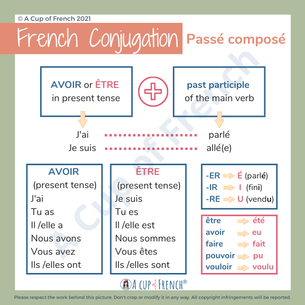

# Français avec Mateus

* **Professeur**: Mateus Carioca
* Il est formée en 'Letras' (federal fortaleza)

* Séries:
  * Lupin: https://www.netflix.com/br/title/80994082?s=i&trkid=258593161&vlang=pt&clip=81731827
  * Dix pour cent: https://www.netflix.com/br/title/80133335?s=i&trkid=258593161&vlang=pt&clip=81381754
  * Flagrantes de família: https://www.netflix.com/br/title/81010818?s=i&trkid=260453186&vlang=pt
* Playlist: https://open.spotify.com/playlist/1IrfqDoG5XACohoS6YMz8J?si=lgTdyQUpTsuGfDcjyaKJKQ&pi=eBd9hZEwSmugq

# Vocabulaire

* Enseignant -> ensinador/professor
* facteur -> carteiro
* bavard -> fala muito/tagarelar
* Aux Gens - "Para Pessoas"
* Demander - Poser une questions
* Actuellement - Actuel
* Joli - C'est une personne agréable à voir
* Joyeux (jooiu / feliz) - Qui aime manifester sa joie (joa / felicidade)
* Curieux - qui cherche à connaître ce qui ne le regarde pas
* Ben - 'well'
* Alors - 'so'
* Voilà - 'that's it' 
* Sage - Wiser
* Patarger - Sharing
* Arrêté - Stop
* Encore - ainda
* quelle temperatura?
* il fait combien de quel? (quantos são)
* est-ce que je peux = may I
  * Est-ce que.= perguntas sim ou não

* mec - 'Un beau mec' (um cara bonito)
* Vieux -> Velho
* Fou -> Louco
* Mou -> Macio
* Oreillier (oreiiie) -> Travesseiro
* Boire (buar) -> Bebida
* Peureux -> Medo
* boulangerie (bulongeri) = padaria
* bureaux = escritórios
* Arbres = arvore
* fleuris = florida
* Devoirs -> Dever
* Rougir -> Corado/Envergonhado
  * *Sami annonce en rougissant qu'il a mangé tout les chocolates*
* Crier -> Gritar
* Lever -> Erguer/Levantar
* Frapper -> Bateu
* Porter -> Levar
* Glisser -> Escorregou
* L'escalier -> As escada
* Remplir (rampli) -> Preencher
  * Vous vous êtes trompés en ramplissant votre cheque

* Trompés -> Enganado
* Sortir -> Sair
* larmes -> Lágrima
* Laisse-moi tranquilla -> Deixe-me em paz
* Interdite -> proibidas 
* Après -> Após/Depois
* Avant -> Antes
* Droit -> Direito
* à Droite -> Direita
* à Gauche (goche) -> Esquerda
* Malade -> Doente
* d'ailleurs (daieur) -> Alias
* trouver -> Encontrar
* Voix (vue) -> Voz
* Besoir -> Must be
* Entretien -> reparo
* trottoir -> Calçada
* tortue -> :turtle:
* Beaux-parents -> Sogros
  * Beaux -> Step / in-law
  * Belle-saeur  / Beau-frère -> Cunhada/cunhada
  * Belle-mère / Beau-Père -> Madrasta/sogra Padrasto/sogro
* Petit-filles -> netas
  * Petits-enfants -> Netos/Netas
  * Petit-fils -> Neto
  * Petite-fille -> Neta
* chez le coiffeur -> cabeleleiro

## (6) Six Février

* Não pronunciamos a consoante final
  * Finir = terminarété = passado etrês
  * Chat = tirar o H vira cat
    * Toucher = Touch = toucer = toucar = tocar
  * Amigo = Amico = Amici = Ami (C para o G)
  * Pater = amassar / pâte = massa
    * PÂTE - PASTE = pasta em português
    * Fête = festa
  * croissant = meia lua

* Transacionar o E para o A = feminino
  * Mer = Mar
  * Rose = Rosa
  * Terre = TERRA

* Pear = Phear = Fear = Medo
* Pere = Vater = Fater

* a,e,i,u = ãn
* gn = nh
  * file migno = minho
  * Mignifique = m
* Fille = fiiie = fia no português

* comment = how
* Comme = as , like

* Qu = Cá = quand = cand 
* Quitter = é de abandonar "quit a partida
* Laisser = leave 

## (13) Treize Février

**Exercices à faire à la maison**

* Me Apresentar - ver vídeo https://www.youtube.com/watch?v=0MVzS2L_Hmw&t=259s
  * J'ai aimer la "question" - 'est-ce que vous pourriez vous décrire en trois mots, s'il vous plaît'
    * Moi, Je dirais que je suis Curieux, que je suis souriant, et que je suis amical, voilà ...
      * Être Amical, c'est être une personne que on peut facilement parler
      * Être souriant, c'est quand une personne sourit pour toutes les choses
  * 'est- ce que vous pourriez expliquer le mot 'solidare'?
  * 'comment je pourrais dire?'
* Página 12 - à Fins d'exercer:

  1. Mon chat (être) **est** noir avec des taches blanches (blonche) , il (s’appeler) **s'appelle** Bartolomeu.

  2. Mon **o**ncle (avoir) **a** dansé (*passé compose?*) sur toutes les chansons (*xanson* - *músicas*) de la fête pour convaincre ma tante (*tia*).
  3. Mes sœurs (être) **sont** à (*no*) l'étranger (*exterior*) depuis (*depu*i - há) cinq jours.
  4. La maîtresse (*professor ensino infantil*) (être) **est** contente des notes des élèves (*eléve* - *alunos*) de ma classe, nous avons bien travaillé (*nous avons travaillé bien estaria certo?*).
  5. Les élèves (avoir) **ont** la rhume (*resfriados*). Ils vont rester chez (*na casa de*) eux (*deles - pronom tonique*) une semaine.

  6. Paul et toi (avoir) **avez** bu tout le lait (*leite*) après le travail? Vous devriez penser aux (o) autres (*otre*)!
  7. Beaucoup d'enfants (être) **sont** agités. Ils ont besoin de temps pour se calmer après la récréation.
  8. Le troisième Star Wars (être) **est** sorti en 2005 (deux mille cinq) et (i) est mon prefére.
  9. Ma tante (être) **est** dentiste, elle exerce le métier depuis 20 ans.

Comment Je me présente:

> Salut, Je suis Igor, j'ai vingt-huit ans, je suis a développeur
>
> ​	et pour etrês sincère, il n'est pas facile d'écrire le mot 'développeur'.
>
> Je suis marié avec Stéphanie/ ou marié à Stéphanie, nous sommes marié pour trois ans.
>
> Ma mère s'appelle Renata, elle a quarante-six ans, oui, Elle est nouvelle, J'ai seize ans de plus qu'elle.
>
> Mon père s'appelle Jeferson, (c'est très difficile de prononcer son nom)  a fêté anniversaire cette semaine, il a cinquente-deux ans

Conjugaison de le verb etrês:

* Je suis
* Tu es
* Il/Elle/on est
* Nous sommes
* Vous êtes
* Ils/Elle sont

De le verb avoir:

* J'ai
* Tu as
* Il/Elle a
* Nous avons
* Vous avez
* Ils ont

**Les Adjectifs irréguliers**

| Masculin                                       | Masculin commeçant par voyelle ou 'h' | Féminin                  |
| ---------------------------------------------- | ------------------------------------- | ------------------------ |
| Beau (*bo*) - Un Beau mec                      | Bel -> *Un bel **h**omme*             | Belle -> Une belle femme |
| Vieux (*viõ - velho*)  Un vieux livre          | Vieil (viei) -> Un Vieil **h**omme    | Vieille -> Vieille femme |
| Fou (*fu* - *louco*)  Il est fou d'amour       | Fol (fol) -> Un fol amour             | Folle -> Rob est folle   |
| Nouveau  (*nuvo*) Le nouveau cirque (*cirqui*) | Nouvel -> Un nouvel ami               | Nouvelle                 |
| Mou (*mu - macio*) C'est lit est mou           | Mol -> Un mol orreillier              | Molle                    |

**Pluriel**

* -eu = -x
  * Cheveu (cabelo) - Cheveux

* -al = -eux
  * Cheval (cavelo) - Chevaux

**Saluer**

* Saluer (saldar) = salve (u virou v)

* Tu vas aux états-units -> Aux parce que `États-Units` est au pluriel

preposition á = deslocamento 

preposition de = quantidade

C'est faux = é falso

* C'est = that's

* c'est chaud = é quente = that's hot

**Les pronoms relative simples**

qui = n muda antes da vocal = para pessoas

que

D'ou = de onde

dont (don) = da qual 

​	la ville dont je suis originais

dont precisa da preposition de (d'une)

Prnoms rlative composto

du laquelle = da qual

auquel 

## (20) Vingt Février - Jeudi

**Questions pour póse à professeur**

* "J'ai quelques doutes" -> Eu tenho algumas perguntas/ j'ai me doutes
* 'j'ai quelques exercices"

Je ne comprends (comprrrãn) pas bien les pronoms relatifs et les préposition 'de'

* Je detesté les pronoms relatifs!
  * qui = pessoa
  * que = coisa/objeto
  * dont = das quais/ cujo/ de quem
  * oú = em que/tempo/lugar/ quand
* Quand je dois utiliser 'par' ou 'avec'?
  * Par x pour = por uma
* Quand je dois utiliser 'de' ou 'de la'?
  * De la rue/ mais 
  * Par example: J'allais (jéle) dire 'Je vien de la France' , mais ce n'est pas correct
  * Je comprends que "Je vien du Brésil" est correct, parce que Brésil est masculin, mais France est féminin, alors, pourquoi je dois direr "de France'? Est-ce parce que c'est un pays?
* J'ai aimé les comparaisons des sons en français et en portugais!
* Que tu fait c'est semaine?
  * J'ai commencé mon cours de guitare (guitar) la même semaine que notre cours de français, donc je étudi 
* En français, n'avons nous pas de 'gerundio'?

### Le Gérondif

Page 282 - gerundio eles usam quando acontece duas coisas ao mesmo tempo, em geral usa o presente

Quand nous voulons utiliser le gérondif -> (***en + participe présent -ant***)

* Victor parle pendant qu'il dort -> Victor parle **en dormant**
* J'ai bu un café pendant que je t'attendais -> J'ai bu un café **en t'attendant**

Par examples:

* Lev**er** -> En levant
* Roug**ir** -> En rougissant
* Di**re** -> En Disant

Gérondif irrégulier:

* Avoir -> En ayant
* Être -> En étant
* Savoir -> En sachant

### Le présent progressif

Je **suis en train de** travail = estou trabalhando

* **être + en train de** = é usado para quando eu estou fazendo naquele momento
  * Je suis en train de cuisines pendant je parle avec toi

* não pode usar para algo habitual que acontece sempre
  * Je suis en train de manger tous les jours au restaurant; :x:

### Adjectifs démonstratifs

|           | Masculin                                                     | Féminin             |
| --------- | ------------------------------------------------------------ | ------------------- |
| Singulier | Ce / Cet (Esse/Aquele) Cet (*c'est utiliser avec un voyelle*) - Cet ordinateur est cassé Ce = *Ce garçon mange une pomme* | Cette (Essa/Aquela) |
| Pluriel   | Ces (Esses/Aqueles)                                          | Ces                 |

Cette + voyelle = vira cett voyealle	

* Cette âme (cettame)

## (27) Vingt-sept Février

Devoirs - les pages 284 (Deux cents quatre vingts quatre) / 287 (deux cents quatre vingts sept)

I) Completez avec le gérondif:

1. Sami annonce **<u>en rougissant</u>** (rougir) qu'il a mangé tout le chocolat.

2. Elle crie **en levant** (lever) les bras au ciel.
3. Elle fait toujours le ménage **en chantant** (chanter).
4. Nadia frappe à la porte **en entrant** (entrer) dans le bureau du directeur.

5. **En allant** (aller) au collège, je porterai le pain au four.

6. Samir a glissé **en descendant** (descendre) l'escalier.
7. Le professeur distribue les cahiers **en disant** (dire) à ses élèves: 'Vous avez bien travaillé.

8. Vous vous êtes trompés **en remplissant** (remplir) votre chèque.

9. Tu écoutes la radio **en** **faisant** (faire) tes devoirs?

10. **En s'exclamant** (s'exclamer), Alice fait la grimace.

II) Completez avec le présent progressif

1. Ce boy-scout **est en train de faire** du stop au bord de la route (faire)

2. Nous **sommes en train d'écrire** un poème pour notre professeur. (écrire)

3. Vous **êtes en train de résoudre** un problème difficile. (résoudre)
4. Je vois que ma mère **est en train de <u>se</u> préparer** pour sortir. (se préparer)
5. Nadège **est en train de faire** le ménage avant de préparer le repas. (faire)
6. Je **suis en train de lire** un roman passionnant! (lire)
7. Tu **es en train de jardiner** et de planter des navets pour cet hiver. (jardiner)

8. Les spectateurs, visiblement conquis, **sont en train de rire** aux larmes. (rire)

9. Laurent **est en train de télephoner** à ses parents. (téléphoner)
10. Ta sœur **est en train de dormir**, laisse-la tranquille ! (dormir)

### Les Liaisons

Les liaisons sont en généralement fait avec le consonne et la voyelle:

* Le**s a**mies -> Lezami
* Troi**s h**ommes -> Truazomme

Point d'attention:

* Ils sont -> Il son
* Ils ont -> il**z**on

Si le mot fini par un 'D', donc nous le prononçons comme un '**t**'

* Ce Gran**d** espace -> Ce grand**t**espace

La liaison des mots qui se terminent par S ou par X se fait en [z]:

* il y a di**x** ans -> Il y a di**z**ans

Terminent par F la liaison en [V]:

* Il a neuf[9] ans -> Il a neu**v**an

### Les liaisons interdites

**Après la consonne qui sur le 'r'**

* Le no**r**d est -> Le nord é (ne prononce pas 'Le nordé')
* Elle Court**#**assvez vite

**Après le mot 'et'**

* Elsa et#Édouard

## (6) Six Mars

"Nous paramos à la page Vingt-Six"

Je ne savais pas -> imperfeito

Je + avoir + savais -> passe composé

**Question pour prefesseur**

* Je suis **à l**'aéroport -> no/na

* je suis **dans l**'aéroport -> Dentro do 
  * Il fait froid dehors (fora), entres **dedans** -> entra para dentro (dans quelque chose)

****

### Les adjectifs démonstratifs

| **Français**                  | **Anglais**      |
| ----------------------------- | ---------------- |
| Ce Cet (avec voyelle) / Cette | This/That/It's   |
| Ces/Ces                       | These/Those/It's |

* Ce garçon mange une pomme;
* Cet ordinateur est cassé;
* Cette fille aime danser;
* C'est triste qu'elle soit malade.

### Les Pronoms Démonstratifs

| **Français**        | **Anglais** | Portagais               |
| ------------------- | ----------- | ----------------------- |
| Celui/Celle         | The one     | Aquele/Esse/Aquela/essa |
| Ceux/Celles         | The ones    | Aqueles/Esses           |
| Celui-ci / celle-ci | This one    | Aquele/Aquela           |
| Celui-là / celle-lá | That one    | Aquele ali/ Aquela ali  |
| Ceux-ci / Celles-ci | These ones  | Aqueles                 |
| Ceux-là / Ceux-là   | Those ones  | Aqueles ali             |

* Quelles fleures vous préfèrez? **Celles** à droit sont parfaites
* Tu veux celui-ci ou celui-là?
* Je préfère ceux-ci...
* Ceux qui sont lá (*aqueles que estão lá*)

Exercices:

* De tout les styles de musique, **ceux** que je préfère sont le rap et la danse;
* Oh! Regarde **ces** chiots. As-tu vu **celui-ci** comme il est beau...
* Je ne dors pas très bien en ce moment. **C'**est vraiment un problème pour moi
* j'ai fait mes devoirs mais je n'ai pas très bien compris **celui-ci ni celui-la** d'ailleurs
* La gymnastique est obligatoire. à l'école. Je ne trouve pas **cela** amusant

****

### Adjectifs possessifs

**Mon** -> quand commance avec la voyalle/ou masculin

**Son/sa** -> é para o 'ele/ela' - Faites attention

* J'adore mes beaux-parents, **leur** fille est increiabl

  * Leurs Filles -> vai afetar o 'mes', pq nesse caso não podemos ter +1 sogro
  * Leurs -> Mais geral

* Os filhos deles são chatos

  LEUR: 1.Conj. plural

  LEURS: N*conj. plurais

* Mon - Mien = my - mine

* Seus óculos são pretos e os meus óculos são pratas
  * Seus óculos são pretos e os meus pratas
  * **Tes** lunettes sont noires et **les miennes** sont argentées

### Les pronoms possessifs

| Français              | Anglais  |
| --------------------- | -------- |
| Le mien/ La Mienne    | mine     |
| Les miens/Les miennes | Mine     |
| Le tien/La Tienne     | Yours    |
| Les tiens/Les Tiennes | Yours    |
| Le sien/ La Sienne    | His/Hers |
| Les siens/Les Siennes | His/Hers |
| Le nôtre/La nôtre     | Ours     |
| Les nôtres            | Ours     |
| Le vôtre/La vôtre     | Yours    |
| Le leur/La Leur       | Theirs   |

**Pour pratiqué**

Examples:

* Ce livre est **le mien** (This book is **mine**)
* Cette valise est la mienne
* Ces ordinateurs sont **les miens**!
* Ce piano est **le tien**, profitez-en! (enjoy it)
* Cette voiture est **la tienne** (this car is yours)
* Ma voiture n'est plus la mienne, c'est **la sienne**!
* Je ne détiens plus le record de mon jeu, mon frère est meilleur que moi, le record? c'est **le sien**...
* Notre conversation n'est plus comme avant, mais notre amour? **le nôtre** est toujours fort
* Cette maison est **la leur**, mais cette-ici est **la nôtre**!
* J'aime bien **leur** idée, mais j'aime beaucoup **le nôtre**...
* Tu as **tes problèmes**, et nous avons **les nôtres**
* C'est **le leur!**
* Ces enfants sont **les leurs**

des mienne (de les) -> dos meus

1. Je dois aller acheter mes **livres** ce matin, veux-**tu** que je prenne **les tiens** en même temps ? Il y en a deux je crois !
(tes livres)

2. J’ai mes idées sur la question, vous avez **les vôtres** !

3. Il y aura deux chambres dans le nouvel appartement, Pierre et Mathieu vous aurez chacun **la vôtre** .
(chaque enfant aura sa propre chambre)

4. Cette paire de **ciseaux** est à Emilie. Marc, peux-**tu** me dire ce que tu as fait de **la tienne** , celle que tu as achetée hier ?
(tutoiement : ta paire de ciseaux)

5. Ce qui est bien avec nos amis, c’est que **nous** connaissons leurs **goûts** et qu’ils connaissent **les nôtres** .
(nous => nos goûts)

6. J’ai mes **billets** de train en poche, j’espère que **les enfants** ont **les leurs** sur eux !
(leurs billets)

7. Mon **baladeur** est tombé en panne. **Laurent** m’a prêté **le sien** , c’est vraiment sympathique de sa part.
(son baladeur)

8. Comment va ta **femme** ? **Moi**, **la mienne** est encore à son cours d’anglais, elle va rentrer bientôt.
(ma femme)

9. J’ai oublié mon **stylo**, puis-je **vous** emprunter le vôtre ?
(votre stylo)

10. Ce soir, c’est **notre** anniversaire, cette **fête** sera **la nôtre** ! Depuis le temps que l'on en rêvait.
(notre fête)

## (16) Seize Mars

**La voix passive et le passé composé**

* **Passé composé** = I have + verb in the past

Par example:

* **Au Présent**: J'étudie le français tout les jours
* **Au Passé Composé**:  J'ai étudié le français tout les jours
* **An anglais:** "I'**ve** studi**ed** French..."

### La voix Passive

La voix passive et comme utiliser 'foi + le verb'

* Présent: **Sujet + verbe être + le Verbe + Par**

* Passé: être (été) + verbe principal au **participe passé	**

​		Par exemple en passé:

* Le chien **a mordu** mon fils (passé composé)
* Mon fils **a été mordu** **par** le chien

À fins d'exercer:

1 - La poussière recouvre tout le canapé

* Tout le canapé **est recouvré par** la poussière

2 - Picasso a peint le Vieux Guitariste Aveugle.

* Le Vieux Guitarista Aveugle **a été peint par Picasso**

3 - J'ai corrigé les tests

* Les tests **ont été corrigés par** moi :question:

4 - On a ouvert la porte.

* La porte **a été ouverte** 

5 - Nous avons inauguré la maison sur le lac.

* La maison sur le lac **a été inaugurée par** nous (verbo feminino)

6 - Tu as oublié les déchets sur la plage.

* Les déchets **ont été oubliés** sur la plage **par** toi

7 - Vous avez bu tout le lait!

* Tout le lait **a été bu par **vous!

8 - Tu as répondu au téléphone?

* Le téléphone **a-t-il été répondu par **toi :question:

9 - Mon fils a déjà écrit la lettre au Père Noël

* La lettre au Père Noel **a déjà été écrite par **mon fils.

### Par ou Pour?

(page 210 deux mile dix)

* Pour:

  * Objetivo/Causa: 
    * *Je faire du yoga **pour** me relaxer*
  * Destino/destinatário: (**JAMAIS utiliser 'pour' après le verbe aller**)
    *  *J'ai acheté un cadeau **pour** toi* 
    * *Je voyagerais **pour** l'Afrique*
  * Duração:
    * *Je voyagerais **pour** deux mois*
    * *Je pars en Europe **pour** dix jours*

  

* Par:

  * Razão/Motivo:

    * *Tu as crevé son pneu **par** vengence*

      *(você furou o pneu por vingança)*

  * Meio/Através de:

    * Il sort **par** la porte

      *(sai pela porta)*

  * Frequência:

    * Il faut s'exercer trois fois **par** semaine

      (Exercicite 3x por semana)

Les exercices:

* Je voyagerai **pour (destien)** l'Afrique **par (razão)** connaître la culture de son peuple.
* **Pour** échaper du feu j'ai sortir **par** la fênetre
* Je serais absent **pour (duration)** deux semaine
* Il faut s'exercer, au moins, trois foi **par (frequência)** semaine

### Le Passé composé

Le passé composé se compose de: **avoir/etrê + participe passé de verbe**

Avoir (pour tout les verbes)

* J**'ai** regard**é** un filme

  (I watched a movie)

* Nous **avons** écri**t** (*irregulier*) une chanson

  (I wrote a music)

Le general règle par les verbes au passé:

* -er -> é
  * Manger -> Mangé
  * Regarder -> Regardé
  * Danser -> Dansé
  * Voyager -> voyagé
* -ir -> i
  * Finir -> Fini
  * Choisir -> Choisi
  * Fournir (fornecer) -> fourni
* oiur -> u

Mais quelque verbes sont **irreguliers**:

* Avoir -> eu
  * J'ai eu (eu tive)
  * Nous avons eu (nós tivemos)
  * Ils ont eu peur (eles tiveram medo)
* Etrê -> été
  * J'ai été (eu fui/tenho sido)
* Faire -> Fait
  * Avez-vous fait cela? 
* Prendre -> Pris
* Mettre -> mis
* Vouloir -> voulu
* Voir (ve) -> Vu
  * J'ai vu
  * Il a vu
* Écrire -> Écrit
  * J'ai écrit
* Lire (ler) -> Lu
* Savoir -> Su

Etrê (pour exceptions)

* Je **suis** n**é** en 1996

  (I was born in 1996)

* nous **sommes** all**és** à l'hôptal

  (we went to the hospital)

| **Verbe**           | **Passé composé (français)**                                 | **Traduction (anglais)**                                  |
| ------------------- | ------------------------------------------------------------ | --------------------------------------------------------- |
| Aller               | Je **suis** allé au cinéma Je suis allée au cinéma (féminin) | I went to the cinema                                      |
| Venir  / imparfait  | Elle **est** ven**ue** chez nous hier Il est ven**u** chez moi | She came to my house He came to my house             |
| Arriver             | Nous **sommes** arrivé**s** en retard Je suis arriv**é** en avance au travail | We arrived late I arrived early at work              |
| Partir / imparfait  | Ils sont part**is** tôt Je suis part**i** de ce pays    | They left early I left that country                  |
| Entrer              | Tu es entré dans la salle Elle est entr**ée** et a volé mon cœur | You entered the room She entered and stole my hearty |
| Sortir (sair)       | Je suis sort**i(e)** avec mes amis                           | I went out with my friends                                |
| Monter (subir)      | Il est mont**é** au troisième étage                          | He went up to the third floor                             |
| Descendre           | Nous sommes descend**us** de l'arbre                         | We went down from the tree                                |
| Naître (nascer)     | Elle **est née** en 1995. Elle **est née** la semaine dernière | She was born in 1995.                                     |
| Mourir (morrer)     | Mon grand-père **est mort** l’année dernière.                | My grandfather died last year.                            |
| Retourner (voltar)  | Vous **êtes retourné(e)(s)** à Paris ?                       | Did you return to Paris?                                  |
| Rester (ficar)      | Je **suis resté(e)** à la maison. Tu es resté ici toute la journée? | I stayed at home.                                         |
| Tomber (cair)       | Elle **est tombée** dans l’escalier.                         | She fell down the stairs.                                 |
| Revenir (voltar)    | Ils **sont revenus** hier soir.                              | They came back last night.                                |
| Devenir (tornar-se) | Il **est devenu** médecin.                                   | He became a doctor.                                       |
| Passer (passar)     | Nous **sommes passés** par le parc.                          | We passed through the park.                               |

**Règles importantes :**

1. **Accord du participe passé**
   - Le participe passé **s'accorde** en genre et en nombre avec le sujet.
   - Exemples :
     - Elle **est allée** à l’école. (ajoute **-e** pour féminin)
     - Nous **sommes partis** tôt. (ajoute **-s** pour pluriel)
     - <u>La pomme</u> que j'ai mang**ée** était bonne (ajout -e pour le COD precede le verbe avoir)
     - <u>Les fleurs</u> que j'ai cueilli**es** sont belles.

### Verbes pronominaux

C'est example des verbes pronominaux:

* Réveiller
  * On se réveille**s**
* Laver
  * Je me suis lavé
* Marier
  * Je me marie en décembre
* Évanouir (desmaiar)
* Prendre
  * Je me prends au sérieux
* Souvenir (lembrar)
  * Ils se souvients de tout
* Baigner
  * Tu te baigne tous les matins

Pour utiliser les verbes pronominaux au passé composé, nous utilisont le verbe **être** au présent

Exemples :

- Je **me suis réveillé(e)** à 7h. → (I woke up at 7 AM.)
- Je **me suis** réveillé(e) (*au passé composé*)
- Tu **t'es** réveillé(e)
- Il **s'est** réveillé / Elle s'est réveillée / On s'est réveillé(e)**s**
- Nous **nous sommes** réveillé(e)s
- Vous **vous êtes** réveillé(e)s
- Ils **se sont** réveillé(e)s
- Elles **se sont lavées**. → (They washed themselves.)

**Faite attention!**

Les verbes pronominaux sont útilises avec "etrê" pour nous parles de nous-même

* Elle **s'est** réveillé**e** -> Elle **a** réveillé **sa fille**
* Elle s’est blessé (*machucar*) la main -> Elle t'a blessé la main
  * Se podemos perguntar "qual mão?" significa q devemos usar o "etrê"

### Passé Simple

n'est pas utilisé quotidiennement

* Je regard**ai** un filme

### Passé imparfait

**L'imparfait** est souvent traduit en anglais par **"was/were + V-ing"** (*was raining, was playing*) ou **"used to"** (*used to play*). 

* Negation: Ce n'était pas difficile (it was not hard)
* Affirmation: C'était très difficile (it was very hard)

| **Français (Imparfait)**                                 | **Anglais (Past Continuous / Used to)**                 | **Pourquoi ?**                                    |
| -------------------------------------------------------- | ------------------------------------------------------- | ------------------------------------------------- |
| *Ce n'était pas difficile.*                              | *It wasn’t difficult.*                                  | Description d'une situation dans le passé.        |
| *Quand j'étais enfant, je jouais dehors tous les jours.* | *When I was a child, I used to play outside every day.* | Habitude passée.                                  |
| *Il pleuvait quand je suis sorti.*                       | *It was raining when I went out.*                       | Action en cours interrompue par une autre action. |

Pour étudier:

* **adverbes de fréquence**
  * Tourjours -> Sempre
  * Jamais -> Nunca
  * Souvent -> Frequentemente/muitas vezes
  * Parfois -> às vezes
  * Rarement -> Raramente
  * Plupart -> - La plupart du temp -> Maioria das vezes
  * à nouveau -> de novo?
  * encore -> de novo?
  * Pendant -> Durante/enquanto (usado para o passado)

* Au lieu du -> Ao invés de

Les exercices:

* 224

* 226 e 227

## (27) Vingt-six Mars

**Pour pratiqué**

Page 224:

I) Passez les phrases au passé composé et au futur proche:

1 - Il se blesse sur le mur;

	* Il s'est blessé sur le mur;

2 - Elle se baigne;

* Elle s'est baignée 

3 - Ils se trompent (*enganaram*) avec la marchandise;

* Ils se sont trompés avec la marchandise

4 - Vous vous souvenez;

* Vous vous êtes souvenu(e)s

5 - Tu te prends au sérieux

* Tu t'es pris(e) au sérieux

Page 226:

### Rendre

La conjugaison:

* Je rends
* Tu rends
* Il rend
* nous rendons
* Vous rendez
* Ils rendent

Utilisation:

* Rendre é um verbo coringa, que se adapta a várias utilizações:
  * Tornar-se
    * Rend malade (fica doente)
    * Ce filme me rende heureux (esse filme me deixa feliz)
  * Devolver
    * Je rendu sa voiture (eu devolvi seu carro)
  * Prestar
    * J'ai rendu un grand service (eu prestei um grande serviço)
  * Desistir/Entregar
    * Il se rend à la police (se entregou a polícia)

**Rendre Visite**

* Visiter = c'est utiliser pour parler d'un lieu (un musée, une ville, un pays)
* Rendre Visite = pour parle de gens suivi (Seguido) de la preposition 'à'

### Mener et Porter

* Mener = utiliser pour parle de gens
* Porter = utiliser pour des choses (êtres inanimés)

**Mener**

* **Mener**:
  * Conduzir/Dirigir/Levar
    * Il mène son équipe à la victoire
    * Ce chemin mène à la plage
    * Il a mené la réunion
* **Emener**:
  * Transportar - irá FICAR com a pessoa no lugar
    * Je vais t'emmener à l'hôpital
    * Nous avons emmené les enfant au parc
* **Amener**:
  * Transportar - NÃO irá FICAR com a pessoa no lugar
    * peux-tu amener une bouteille de vin pour le dîner?
* **Ramener:**
  * Transportar/levar NOVAMENTE mas não vai ficar com a pessoa
    * Peux-tu me ramener au café?

**Porter**

* **Porter**:
  * Vestir
    * Il porte un sac à dos
    * Je porte un manteau en hiver
    * Je porte des lunettes/Je porte un montre
* **Apporter**:
  * Carregar algo de um ponto ao outro:
    * J'apporte un gâteau à la fête
    * Peux-tu m'apporter un verre d'eau?
* **Emporter**:
  * "Take to go" / pegar e sair do lugar
    * J’emporte mon parapluie parce qu’il va pleuvoir.
    * Elle a emporté son ordinateur en voyage
    * pouvez-vous emporter/prendre un bluson? :warning: 
* **Remporter:**
  * Gagner/récupérer
    * Il a remporté la médaille d’or!
    * Ils ont reporté le match (gíria / eles carregaram a partida)
    * N'oubliez pas de remporter votre disque

Les exercices:

Completez:

1. Quand tu pars en voyage, n’oublie pas d’**emporte** une valise légère pour faciliter tes déplacements.
2. Après avoir gagné le match, ils espèrent **remporter** le trophée à la maison cette année.
3. Il faut **emener** les invités à table avant que le dîner ne refroidisse. :warning:
4. Peux-tu **apporter** cette pile de livres dans la chambre d’à côté, s’il te plaît ? :warning:
5. Elle a décidé de **emmener** son frère à l’aéroport très tôt ce matin.
6. Le serveur va **apporter** votre commande à votre table dans quelques minutes.
7. Ils ont dû **emporter** leurs affaires (*they belongs*) avant de quitter précipitamment le bureau.
8. Après l’école, je vais **remener** ma petite sœur à la maison.

### Lieu/Place/Endroit

Expressions:

* **Quelque part** = somewhere
* **Nulle part** = anywhere
* **Partout** = everywhere

* **Lieu** = lugar
  * Lieu de naissance, lieu de résidence. lieu de travail
    * Lieu saint / lugar sagrado
    * Donner lieu pour elle! / dar o lugar para ela
  * **au lieu de** = "em vez de"/ao invés
    * Je vai prendres un douché **au lieu de** dormir
* **Place** = place (an anglais)/siège
  * Ces livres ne sont pas à la bonne **place**.
  * Mettez-vous à ma **place.**
  * **à la place de** = no lugar de
    * Mettez a table à la place de la chaise

* **Endroit** = como um canto/aquele lugar/mais genérico

  * Comment s'appelle ***l'endroit*** où les gens vont lorsqu'ils sont malades?

  * **Truc** = Troço/negócio/Stuff

    * Comment s'appelle le ***truc*** que nous utilison pour faire le lien?

      (como se chama o negócio que nós usamos para fazer ilgação )

Je suis en colère, mes amis ont dit qu'ils viendraient travailler. Je suis allé déjeuner seul, et désolé pour le bruit, je n'ai pas trouvé de salle de réunion.

### Il est vs C'est

(page 74)

**Il est** - não tem artigo depois, é usado quando vem seguido de um:

* adjetivo (*il est fatigué*)
* profissão (*elle est enfirmiére*)
* nacionalidade (*il est française*)
* horário/marca temporal/tempo (*il est tard*)
* Se começar no início da frase não é genérico

**C'est **, quando vem seguido de:

- Um **substantivo com artigo** (un, une, le, la, etc.) (*c'est un stylo*)
- Um **nome próprio** (*C'est Igor*)
- Uma **ideia geral**, ou para dar **ênfase** (*c'est incroyable* / *c'est ennueyeux*)

* data/dia

Stromae - quand c'est

* mais oui on se connait bien
* t'as même voulu (queria) t'faire ma mère
* ta commancé par ses seins (*seios*)
* Et puis du poumon à mon père
* Tu t'en souviens? (*você se lembra?*)
* Cancer, cancer
* et tu aimes let petits enfants
* il c'est demain 
* reter de fair
* Ciagarrete 
* Cancer, tes enfants 
* on tu de vacance
* Cancer, Cancer
* qu'il le prochant

## (10) Dix Avril

> * J’ai une nouvelle : je vais me faire opérer de l'oreille en juin. Je pense qu'elle est trop ouverte. Je dois me reposer pendant trois semaines.
>
> * Je ne sais pas si nous pourrons faire les leçons...

### Pronoms 'en' et 'y'

**Y**:

* vai substituir um **lugar** que peça preposição  `à` 
* n'y = (***ni***)
* não pode ser usado para pessoas

> Exemples:
>
> * Tu vas **à Paris**?
>   * Oui, j'y (*ji*) vais parce que je l'aime beaucoup
> * Qui t'emmène en **cours**? (*quem te leva par aula?* - cours é um lugar)
>   * C'est ma soeur qui **m'y** (mi) emmène
> * Demains je vais **chez le coiffeur** (*cabeleleiro*)
>   * D'accord, **j'y** vais tout les mois
> * As-tu déjà **réfléchi à** ta thèse?
>   * Oui, **j'y** pense depuis longtemps

Phrases commons:

* j'y suis habitué -> to acostumado
* j'y vais -> to indo lá
* On y va? -> vamos?
* Je n'y crois pas -> eu n acredito nisso
* Je n'y comprend rien -> n entendo nd disso

**EN:**

* quando pede preposition `de/du`
* j'en ai (je né) -> J'en ai mangé un
* il y a -> Il y **en** a 
* não pode ser usado para pessoas

> Exemples:
>
> * Veux-tu prendre **du** sucre?
>   * Oui, **j'en** veux bien
> * Je voudrais avoir une **voiture**, si vous saviez comme **j'en** rêve une
> * Tu as trop **de BDs** dans ta chambre, ton frère **n'en** a pas autant (*bastante*)
> * est-ce qu'il y a beaucoup **d'estudiants** dans la classe?
>   * Oui, il **y en** a 50

Phrases commons:

* Je m'en charge - Eu me encarrego
* J'en ai marre - To farto disso
* Il s'en fout - ele ta pouco se F***
* t'en veux encore? - você quer mais disso?
* Il s'en est sorti - ele se saiu dessa

## (17) Dix-sept Avril

### Les Adjectif et les pronoms indéfinis

| **Adjectif indéfini** | Acompanha um substantivo    | “algum aluno”, “toda menina” |
| --------------------- | --------------------------- | ---------------------------- |
| **Pronom indéfini**   | Substitui o **substantivo** | “alguém”, “ninguém”, “tudo”  |

**Adjectif Indéfini**

| Français              | Português              | Exemple                                            |
| --------------------- | ---------------------- | -------------------------------------------------- |
| **chaque**            | cada                   | **Chaque jour** je bois du café.                   |
| **plusieurs**         | vários                 | **Plusieurs personnes** sont absentes.             |
| **quelques**          | alguns/algumas         | **Quelques élèves** sont en retard.                |
| **tout(e)(s)**        | todo(a)(s)             | **Toute la classe** est là.                        |
| **aucun(e)**          | nenhum(a)              | **Aucune solution** ne fonctionne.                 |
| **certain(e)s**       | certos(as)             | **Certaines idées** sont originales.               |
| **un autre, l'autre** | um outro(a)/o outro(a) | Je pense que non, je préfère **un autre** saveurs. |

**Pronoms indéfinis**

| Français         | Português  | Exemple                            |
| ---------------- | ---------- | ---------------------------------- |
| **quelqu’un**    | alguém     | **Quelqu’un** a frappé à la porte. |
| **personne**     | ninguém    | **Personne** ne m’écoute.          |
| **rien**         | nada       | Je n’ai **rien** à dire.           |
| **tout**         | tudo       | **Tout** est possible.             |
| **chacun(e)**    | cada um(a) | **Chacun** a son opinion.          |
| **aucun(e)**     | nenhum(a)  | **Aucun** n’est venu.              |
| **quelques-uns** | alguns     | **Quelques-uns** ont déjà mangé.   |
| **la plupart**   | a maioria  | **La plupart** sont partis.        |
| **Le même**      | o mesmo    |                                    |
| **D'autre**      | de outro   |                                    |

#### Certains vs Quelques

* **Quelques** é mais genérico, traduzido por '*alguns/algumas*'
  * Quelques élèves sont en retard.
* **Certains** é um grupo dentro do grupo, traduzido por '*certos*'
  * **Certains** amis sont restés tard

**à fin d'exercer:**

1 - **chaque** étudiant aura une liste de livres et prendra **chacun** d'eux pour faire des résumés.

2 - **quelqu'un** a mon chargeur? Je le laisse toujours dans **quelque** lieu et maintenant c'est parti.

3 - Avez-vous aimé ce vin, madame?

- Je veux en essayer **un autre**, s'il vous plaît.

- Et maintenant?

- Je pense que non, je préfère **l'autre** saveurs...

4 - **Quelques** chiens ont mangé mon déjeuner et n'ont laissé **rien** pour moi!

5 - **Certains** membres ne veulent pas contribuer à la fête de clôture de l'entreprise et si **personne** ne change d'attitude,**rien** ne sera fait.

6 - Vous devez vous brosser **chacune** de vos dents ou il deviendra édenté.

7 - Vous les hommes êtes **les** **mêmes**, J'en ai déjà marre.

#### Tout, tous, Toute, Toutes

il s'accorde en genre et en nombre!

* **Tout:** 
  * S'il est suivi d'un adjectif féminin qui commence par une consonne ou un h aspire

| Palavra | Gênero | Número | Exemplo                                                      |
| ------- | ------ | ------ | ------------------------------------------------------------ |
| tout    | masc.  | sing.  | **tout le pain** (todo o pão) Ces chiennes sont **tout i**ntelligent |
| tous    | masc.  | pl.    | **tous les garçons** (todos os meninos)                      |
| toute   | fem.   | sing.  | **toute la nuit** (toda a noite)                             |
| toutes  | fem.   | pl.    | **toutes les filles** (todas as meninas)                     |

**à find d'exercer:**

1. Ce plan (mapa) indique **tous** <u>les arrêts</u> d'autobus (pontos de ônibus) de la ville.

2. Je n'ai vraiment plus du **tout** **e**nvie de continuer ! (Eu realmente não quero mais continuar)
   1. "Du tout" = **de jeito nenhum**.

3. D'accord, je te laisse terminer tes devoirs **tout** seul.
   1. **Tout** = adverbe ici → "completamente sozinho".

4. Il travaille beaucoup plus que nous **tous**.

5. Je suis fatiguée de **toutes** ces histoires.

6. Paul est aimé de ~~**tout**~~ **tous**.
   1. "Tous" = todas as pessoas.

7. Quand il est allé à Paris, il a dormi pendant **tout** le voyage.

8. Elle a entré **tous** les données (os dados) dans le programme.

9. C'est un journal qui est publié **tous** les jours.

10. La personne à côté de qui je dors ronfle un **tout** petit peu.
    1. "Un tout petit peu" = "um tiquinho só".

11. J'ai retrouvé l'agenda dans lequel je note **tout** ce que je fais.
    1. "**Tout ce que**" = tudo o que.

12. C'est pas mal du **tout**, mais il faudrait quand même que je fasse mieux la prochaine fois.
    1. "Du tout" = nada mal!

## (24) Vingt-Quatre d'Avril

### Merci de vs Merci Pour

### à nouveau vs de nouveau

​	

### à vs de

