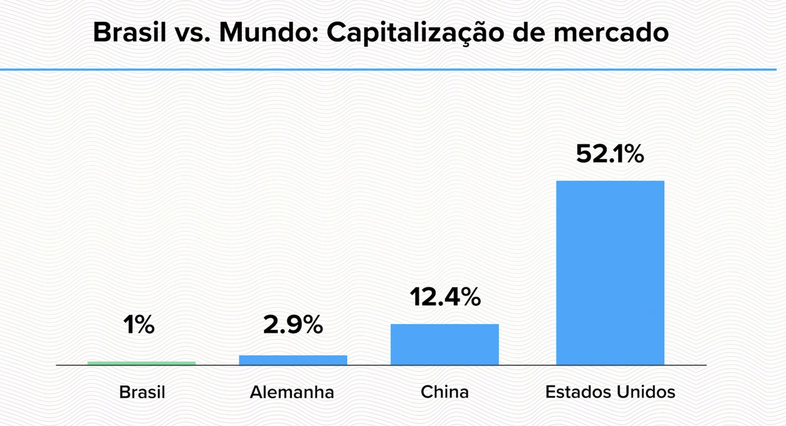
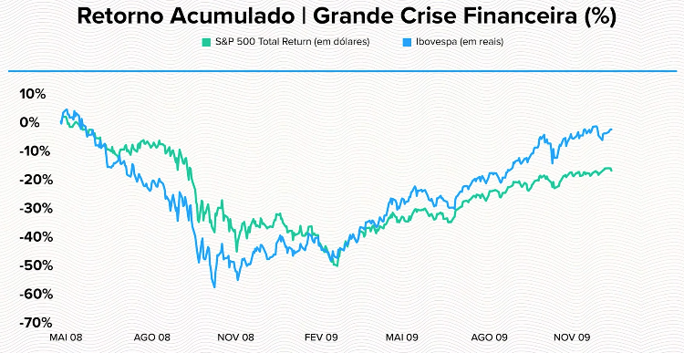
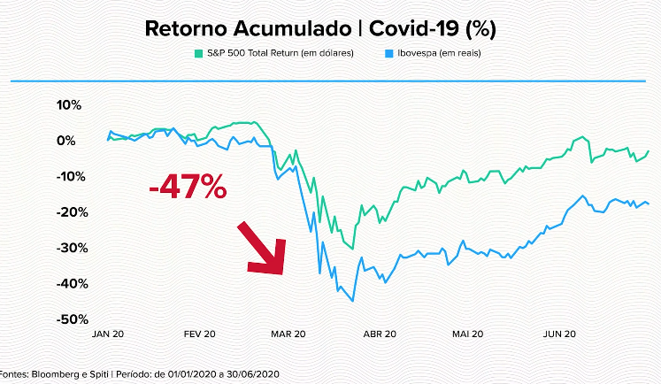
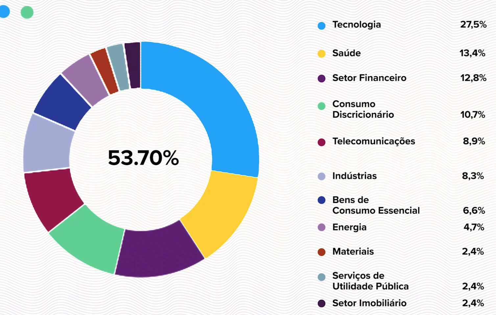
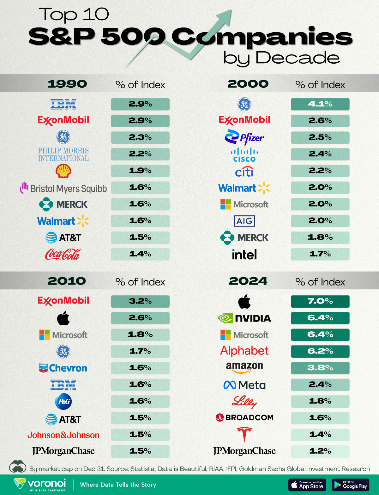
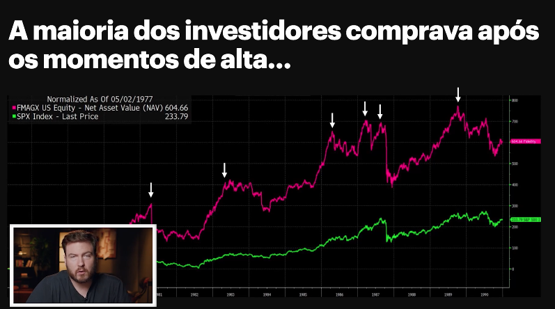
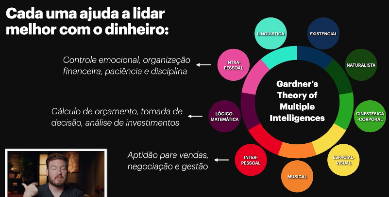
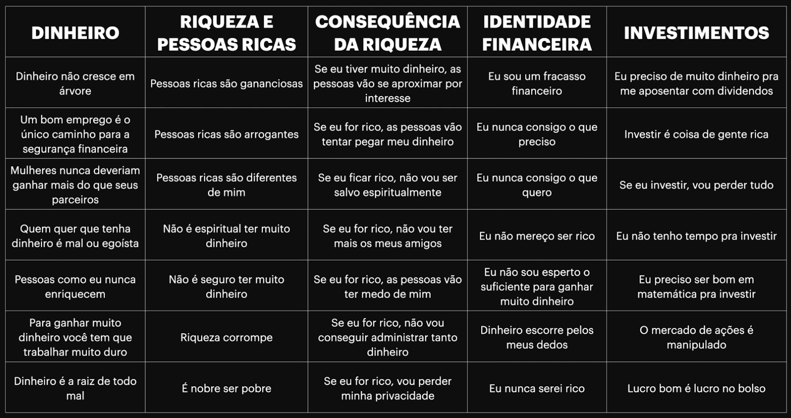

# Investimento

O guia abaixo se trata de um estudo feito por mim (Igor), no intuito de aprender sobre investimentos.

# Taxas

Nov/2024:

* **[SELIC](https://www.bcb.gov.br/controleinflacao/historicotaxasjuros)**: 10,75% (Set/2024)
* **[IPCA](https://www.ibge.gov.br/explica/inflacao.php)**:  4,42% (Set/2024)
* **[CDI](https://investidor10.com.br/indices/cdi/#:~:text=Qual%20valor%20do%20CDI%20hoje,com%20a%20infla%C3%A7%C3%A3o%20do%20pa%C3%ADs.)**: 11,05%
  * Acumulado 2024: 8,99% (até Oct)
  * Acumulado 2024: 13,04%

# Cursos/Pessoas

* [Leonardo Baldochi](https://ibm-learning.udemy.com/user/leonardo-baldochi/) - Aprenda a Investir Seu dinheiro (Udemy)
* Bruno Perini - Criador do site Você Mais Rico e do curso [Viver De Renda](https://pc.cursoviverderenda.com/vr0028/index/?pmp=LAN-LEX-YTB-X-BVMR-20240801-ORG-VR0010-VR-CAPTACAO&utm_source=YOUTUBE&utm_campaign=VR0010&utm_medium=BASEVOCEMAISRICO&utm_content=ORGANICO&utm_term=LAN-LEX-YTB-X-BVMR-20240801-ORG-VR0010-VR-CAPTACAO&src=LAN-LEX-YTB-X-BVMR-20240801-ORG-VR0010-VR-CAPTACAO&sck=LAN-LEX-YTB-X-BVMR-20240801-ORG-VR0010-VR-CAPTACAO)
* Charles - [Economista Sincero](https://www.youtube.com/@economistasincero) - Comunidade Evolução
* [Os Economistas Podcast](https://www.youtube.com/@oseconomistas)
* Professor Mira - analista CNPI

Helpful Sites:

* [Investidor 10](https://investidor10.com.br/) - Site para acompanhar o crescimento de ações

# FAQ

* É falado sobre a busca pelo Milhão, porém, quando este investimento é realmente utilizado? Exemplo, em 20 anos cheguei em 1 milhão, mas entendo que uma hora vou querer utiliza-lo, como fazer?
  * Renda passiva?
* Qual plataforma me permite fazer investimentos de diversos tipos? Ex. Ações, renda fixa e etc
  * BTG: Ações, Renda Fixa, FII (Fundo Imobiliário)
  * Cripto: Bitfox
  * Avenue: Ação Internacional
  * Kinvo: Quando ficamos comprando/vendendo ações, precisamos the DARF
* Quais os tipos de investimento?
  * Renda Fixa
    * Tesouro direto
    * CDB (Certificado de Depósito Bancário)
    * LCI/LCA (Letras de Crédito Imobiliário / Agronegócio)
    * LC (Letras de Câmbio)
    * Debêntures (Dívidas de empresas)
    * Fundos de renda fixa (Um gestor irá investir nos tipos acima)
    * CRI e CRA (Certificados de Recebíveis Imobiliários e do Agronegócio)
    * Poupança
  * Renda Variável
    * Ações
    * Ativos no exterior
    * Criptomoedas
    * Fundo imobiliário
* O que é a SELIC?
  * Taxa básica de juros do Brasil
* O que é IPCA?
  * É o índice de inflação
* Boa líquidez diária?
  * Poupança? que podemos tirar a qualquer momento?
* BBAS**3**

# Glossário

* **ANBIMA** - Associação Brasileira das Entidades do Mercado Financeiros e  de Capitais, representa as instituições que atuam nestes mercados
* **B3** - Brasil Bolsa Balcão: É a Bolsa de valores do Brasil e a responsável  pelo sistema de negociação, liquidação e custódia de títulos financeiros
* **BTC** - Banco de Títulos
* **Buy and Hold** -  Investidor que tem paciência! Investe mesmo quando está em queda e espera;
* **CBLC** - Termo usado ao se fazer aluguel de ações para  fazer uma operação vendida, que lucra em cenário de queda dos preços
* **Call** -  Opção de compra
* **CBLC** - Companhia Brasileira de Liquidação e Custódia: Responsável pela  custódia das ações e outros títulos privados no mercado financeiro  brasileiro
* **CDB** - Certificado de Depósito Bancário
* **CDI** -  Certificado de Depósito Interbancário/Interfinanceiro,é uma taxa  especial de juros que os bancos usam quando emprestam dinheiro entre si. Tem, aproximadamente, o mesmo valor da Taxa Selic.
* **CNPI** - É um analista de investimento, formado nisso, os youtubers não são;
* **COE** - Certificado de Operações Estruturadas
* **CVM** - Comissão de Valores Mobiliários: Instituição responsável por  fiscalizar e disciplinar as operações ou valores mobiliários e demais  assuntos inerentes ao mercado de financeiro.
* **Day Trade** - Operação de curto prazo que consiste na compra e venda de uma ação no mesmo dia
* **DY (Dividend Yield)** - É quanto ela paga por ano; Se colocar 100 reais, e for DY 9,49% é o quanto ela irá pagar - Você recebe mesmo sem vender a ação
* **ETF** -  Exchange Traded Fund. Mais conhecidos como fundos de índices
* **FGC** - Fundo Garantidor de Crédito, instituição que protege seu dinheiro em  alguns investimentos como CDBs, Letras de Câmbio, LCIs, LCAs, entre  outras aplicações possíveis em bancos.
* **FIA** - Fundo de Investimentos em Ações
* **FIC** - Fundo de Investimentos em Cotas
* **FII** - Fundo de Investimentos Imobiliário
* **FIM** - Fundo de Investimentos Multimercado
* **FIRF** - Fundo de Investimentos em Renda Fixa
* **Home Broker** - Plataforma digital, na maioria das vezes de uma corretora, onde se compra e vende produtos do mercado financeiro, como ações, produtos  de renda fixa, fundos, etc
* **IFIX** - Índice dos fundos imobiliários
* **IMA-B** - Índice do Tesouro IPCA+ (inflação)
* **IR** - Imposto de Renda
* **Ibovespa** -  Índice Bovespa: É o mais importante indicador do desempenho médio das  cotações das ações negociadas na B3. É formado pelas ações com maior  volume negociado nos últimos meses
* **IPCA** - Índice de Preços ao  Consumidor Amplo: Índice que mede o aumento dos preços do país, também  conhecido como o índice oficial que mede a inflação.
* **LCA** - Letra de Crédito do Agronegócio
* **LCI** - Letra de Crédito Imobiliária
* **OTA** - Ordem de Transferência de Ações: Formulário para quando deseja mudar suas ações de instituição.
* **Pay Out** - É o quanto a empresa distribui dos lucros para os dividendos
* **P/L** - Preço sobre Lucro - Indicador de Evaluation, indica que se a empresa repetir o lucro do passado para o futuro, em 4,6 anos seria o tempo que levaria para devolver o lucro ????
* **P/VP** - Preço sobre Valor Patrimonial - Abaixo de 1 é bom, significa que o valor da infraestrutura está mais barata para quem investe
* **PGBL** - Plano Gerador de Benefício Livre (Previdência Privada)
* **Put** - Opção de venda
* **ROE** - Retorno do investimento - acima de 10% é bom
* **Selic** - Sistema Especial de Liquidação e Custódia: Taxa de juros do Brasil
* **Swing Trade** - Operação de prazo curto, que consiste na compra e na venda de  uma ação em dias diferentes. A operação costuma durar dias a até poucas  semanas.
* **VGBL** - Vida Gerador de Benefício Livre (Previdência Privada)
* **Volatilidade** - Mensuração do risco de algum investimento baseado na oscilação da sua rentabilidade histórica.

# Diversos

## Imposto de Renda

- Até 180 dias: 22,5%
- De 181 a 360 dias: 20%
- De 361 a 720 dias: 17,5%
- Acima de 720 dias: 15%

## Como os Bancos lucram?

Em geral, qual nós fazemos um investimento no CDB, o banco estará emprestando o dinheiro que investimos para outro, porém nos pagará 1% e cobrará 4% de quem ele emprestou.

* 25% do PIB brasileiro vem do agro, e o banco do brasil é um dos que mais empresta dinheiro.
* Gov. Brasileiro não se envolve tanto no BB, quanto se envolve na perto

## Inflação

* Externa: perda de valor em relação a outras moedas
* Interna: aumento no preço dos produtos
  * O Brasil é um país inflacionário (inflação fica positiva) - hoje é muito mais controlada, antigamente ja foi bem alta

O que mede a inflação são índices:

* IPCA
* IGP-M

Qual o Problema com a Inflação?

* Perda do poder de compra, ou seja, com o mesmo dinheiro você compra menos coisas (considerando se o salário não for corrigido pela inflação).
* **Dinheiro parado**: também é afetado pela inflação, pois se o dinheiro não render pelo menos o percentual da inflação, no final ele irá perder valor!
  * **Juro Nominal**: é o quanto o dinheiro vai render, exemplo, investimento de 11%.
  * **Juro Real**: é o quanto de fato o dinheiro irá render. No exemplo acima, se 11% for o rendimento, e a inflação for de 10%, então o dinheiro rendeu 1%

### IPCA

IPCA, ou **Índice Nacional de Preços ao Consumidor Amplo**, é medido pelo IBGE.

* Faz uma média ponderada dos preços de alimentos, bebidas, habitação.

### IGP-M

IGP-M, ou **Indice geral de preços pelo mercado**, apurado pela FGV, levando em conta o Atacado, Mercado e Consumidor

## CDI

CDI, ou Certificado de depósito Interbancário, é um título de empréstimo emitido entre os bancos, e o CDI serve como uma taxa base que acompanha a SELIC.

Índice CDI hoje -> https://investidor10.com.br/indices/cdi/

Se o CDI ao longo de 2024 ficar em média **13%**, um investimento de R$ 1.000,00 com taxa **CDI + 1,80%** renderá:

1. **CDI base**: 13% ao ano.
2. **Rentabilidade total**: 13% + 1,80% = 14,80% ao ano.
3. **Rendimento bruto após 1 ano**: R$ 1.000 × 14,80% = R$ 148,00.

## Pré/Pós fixado + Indexado

Alguns investimentos de renda fixa, apresentam os tipos:

* **Pré Fixado:**
  * A taxa de juros é determinado no momento da contração, ou seja, você sabe exatamente quanto vai receber no final (descontando custos caso seja CDB por exemplo).
  * Vantagem: caso os juros estejam em baixa, ter um juros maior já definido pode ajudar
  * Desvantagem: os juros podem subir e seu investimento não ser tão rentável
* **Pós Fixado:**
  * A taxa de juros varia com o tempo, como seguindo o CDI ou SELIC;
  * Exemplo: CDB com 100% de CDI = significa que se o CDI for de 13% no Ano, irá render 13%
  * Vantagem: o investimento acompanha o mercado, se o juros subir, o investimento sobe junto
  * Desvantagem: se houver queda nas taxas, o rendimento também cai
* **Indexado:** ou atrelado a inflação
  * A taxa de juros possui parte fixa e parte variável que acompanha o IPCA/Inflação
  * Exemplo: Tesouro IPCA+ 5%, ou seja, se a inflação for de 4%, o rendimento será 4% + 5% = 9%
  * Vantagem: Protege contra a inflação

| Tipo       | Exemplo de Rentabilidade | Vantagem                    | Risco                                           |
| ---------- | ------------------------ | --------------------------- | ----------------------------------------------- |
| Pré-Fixado | 10% a.a.                 | Previsibilidade e segurança | Perda de oportunidade se a taxa de juros subir  |
| Pós-Fixado | 100% do CDI              | Acompanha o mercado         | Menor rendimento em cenário de juros em queda   |
| Indexado   | IPCA + 5% a.a.           | Proteção contra inflação    | Pode render menos em períodos de baixa inflação |

## Marcação a mercado

* Na renda fixa, a marcação a mercado **principalmente em investimentos longos** (Tesouro Direto IPCA+, PREFIXADO);

Exemplo:

* Tesouro Prefixado - taxa juros 7,93% - preço unitário de R$ 802,63 - Vencimento 01/01/2022
  * Esse título irá valer no final do vencimento exatos **mil reais;**
  * O **problema é que a taxa de juros** varia a longo dos dias! Caso aconteça algum problema no governo, a taxa pode **subir ou abaixar**.
  * O preço unitário de 802,63 com taxa de 7,93, pode no dia seguinte, ter a taxa de 8%, oq significa **irá dar + de mil reais**.
    * Como o título **TEM QUE valer R$ 1000** no final do vencimento, quando a **taxa:**
      * **sobe = PU (preço unitário) desce** 
      * **desce = PU sobe**

Para investir em um Tesouro IPCA, temos que visar que a taxa irá DESCER, já que queremos que o PU vá valer mais!

Calculadoras que ajudam com a marcação:

* https://www.tesourodireto.com.br/titulos/calculadora.htm
* https://www.calculadorarendafixa.com.br/#/navbar/calculadora

# Tipos de Investimento

## Renda Fixa

| Tipo de Investimento    | Imposto de Renda (IR)                 | IOF         | Custos Adicionais      | Liquidez                                                |
| ----------------------- | ------------------------------------- | ----------- | ---------------------- | ------------------------------------------------------- |
| CDB                     | Sim, tabela regressiva                | Até 30 dias | Não                    | Diária (alguns) ou no vencimento                        |
| LCI e LCA               | Isento                                | Até 30 dias | Não                    | Diária (raro) ou no vencimento                          |
| LC                      | Sim, tabela regressiva                | Não         | Não                    | Geralmente, no vencimento                               |
| Debêntures Comuns       | Sim, tabela regressiva                | Não         | Não                    | Geralmente, no vencimento                               |
| Debêntures Incentivadas | Isento                                | Não         | Não                    | Geralmente, no vencimento                               |
| CRI e CRA               | Isento                                | Não         | Não                    | No vencimento                                           |
| Fundos de Renda Fixa    | Sim, tabela regressiva com come-cotas | Não         | Taxa de Adm.           | Diária (D+1 a D+30)                                     |
| Poupança                | Isento                                | Não         | Não                    | Diária, mas rendimento mensal                           |
| Tesouro Selic           | Sim, tabela regressiva                | Até 30 dias | Custódia (0,2% ao ano) | Diária, com baixa volatilidade                          |
| Tesouro IPCA+           | Sim, tabela regressiva                | Até 30 dias | Custódia (0,2% ao ano) | Resgate no vencimento recomendado; pode ter perda antes |
| Tesouro Prefixado       | Sim, tabela regressiva                | Até 30 dias | Custódia (0,2% ao ano) | Resgate no vencimento recomendado; pode ter perda antes |

### Tesouro Direto

https://www.tesourodireto.com.br/titulos/precos-e-taxas.htm

**Custos:** 

* Custódia da B3: 0,2% do valor investido
* Imposto de renda sobre o lucro (22,5% até 15% - diminui conforme deixa o dinheiro) :warning:

**O que é?**

O tesouro direto é **uma ferramenta** para compra de títulos públicos que funcionam como **empréstimos ao Governo** (é como se emprestassemos dinheiro ao Governo, e o Governo irá usar para pagar dívidas, saúde, infra e etc), e existem diversos tipos:

* **Tesouro SELIC:** 
  * Baixo Risco
  * Boa Líquidez (resgata a qualquer momento - 1 dia útil)
  * Como funciona: Segue a taxa SELIC, ou seja, varia conforme a taxa de juros
  * Recomendado para Reserva de emergência!
  * Exemplo:
    * Tesouro SELIC c/ Taxa de Juros: **0,12% a.a** = SELIC (10,75%) + 0,12% = 10,9%
    * Lembrando que há a custódia + IR
  
* **Tesouro IPCA+:**
  * Líquidez sofre alteração se vender antes do vencimento
  * É composto por uma taxa fixa + uma parte que acompanha a inflação
  * Indicado para aposentadoria e longos prazos
  * Exemplo:
    * Tesouro IPCA+ c/ taxa de juros 6,99% = Inflação (4,42%) + 6,99% = 11,4%
  
* **Tesouro Prefixado:**
  * Líquidez sofre alteração se vender antes do vencimento
  * Taxa de juros fixa, ie, sabe quanto vai ganhar no final.
  * Exemplo:
    * Tesouro PREFIXADO 13,18% = valor pré definido

É um dos investimentos mais seguros, já q é vinculado ao governo, e permite valores baixos.

### CDB

**Custos**

* Imposto de renda sobre o lucro (22,5% até 15% - diminui conforme deixa o dinheiro) :warning:

**O que é?**

CDB, ou **Certificado de Depósito Bancário**, ou seja, é emitido pelo Banco! ao contrário do Tesouro Direto que é pelo Governo.

Existem os tipos:

* Pré-fixado;
* Pós-fixado;
* Indexado;

Características:

* Possui uma segurança do FGC (Fundo Garantidor de Crédito) de até R$ 250K por CPF.

* Investimento mínimo, porém baixo rendimento.
* Não possui um retorno mensal, é sómente no vencimento

#### CDB vs IR

Exemplo de Cálculo com R$ 1.000 Investidos em um CDB de 13,90% a.a. (ao ano)

**Investimento por 1 ano (IR de 20%)**

1. **Rendimento bruto**: R$ 1.000 × 13,90% = R$ 139
2. **IR a pagar**: 20% de R$ 139 = R$ 27,80
3. **Rendimento líquido**: R$ 139 - R$ 27,80 = R$ 111,20
4. **Valor final após 1 ano**: R$ 1.111,20

**Investimento por 2 anos (IR de 17,5%)**

1. Rendimento composto bruto após 2 anos:
   - Valor no primeiro ano: R$ 1.000 × 1,139 = R$ 1.139
   - Valor no segundo ano: R$ 1.139 × 1,139 ≈ R$ 1.299,32
2. **Rendimento total bruto**: R$ 1.299,32 - R$ 1.000 = R$ 299,32
3. **IR a pagar**: 17,5% de R$ 299,32 ≈ R$ 52,38
4. **Rendimento líquido**: R$ 299,32 - R$ 52,38 ≈ R$ 246,94
5. **Valor final após 2 anos**: R$ 1.246,94

 

**Investimento por 3 anos (IR de 15%)**

1. Rendimento composto bruto após 3 anos:
   - Valor no primeiro ano: R$ 1.000 × 1,139 = R$ 1.139
   - Valor no segundo ano: R$ 1.139 × 1,139 ≈ R$ 1.299,32
   - Valor no terceiro ano: R$ 1.299,32 × 1,139 ≈ R$ 1.479,50
2. **Rendimento total bruto**: R$ 1.479,50 - R$ 1.000 = R$ 479,50
3. **IR a pagar**: 15% de R$ 479,50 = R$ 71,93
4. **Rendimento líquido**: R$ 479,50 - R$ 71,93 ≈ R$ 407,57
5. **Valor final após 3 anos**: R$ 1.407,57

Resumo dos Resultados

| Período Investido | Rendimento Bruto (%) | Rendimento Líquido (%) | Valor Final (Líquido) |
| ----------------- | -------------------- | ---------------------- | --------------------- |
| 1 ano             | 13,90%               | 11,12%                 | R$ 1.111,20           |
| 2 anos            | 29,93%               | 24,69%                 | R$ 1.246,94           |
| 3 anos            | 47,95%               | 40,76%                 | R$ 1.407,57           |

### LCI/LCA

**Custos**

* Nenhum! - porém a rentabilidade nem sempre é melhor do que o CDB com o IR!

**O que é?**

LCI/LCA, ou Letras de Crédito Imobiliário / Agronegócio, também é emitido pelo Banco.

Existem os tiops:

* Pré-fixado;
* Pós-fixado;
* Indexado;

Características:

* Possui segurança do FGC;
* Menos liquidez (3 meses no mínimo)
* Mínimo de investimento é alto

### Debêntures

**Custos**

* Nenhum! - porém a rentabilidade nem sempre é melhor do que o CDB com o IR!

**O que é?**

São títulos de dívidas emitidos por empresas!

* Não tem cobertudo do FGC;

* Possui os tipos pré/pós fixado + outros tipos;
* Amortização mensal

## Renda Variável

### Ações

xx

### Fundo Imobiliário

xx

### Criptomoedas

xx

# S&P 500

**Curso**: Finclass - S&P 500 - Índice mais importante do mundo

**Professor**: Felipe Arrais

**O que é?**

* O S&P 500 (Standard Poor's 500) é como **o nosso IBOVESPA**, **um índice** do resultado **das 500 maiores empresas** americanas, feito com uma média ponderada.
* Empresas que possuem maior valor de mercado, ela também irá influenciar mais o índice

**Por que investir no S&P 500?**

* Do Brasil, temos a **valorização do dólar**, que pode aumentar em ainda mais o lucro das ações!
* Brasil tem poucas empresas disruptivas, que poderão ganhos exponenciais.
* Brasil: movimentos <1% das ações de todo o mundo, e ainda sim, o **home bias** no brasil é alto! Brasileiros querem investir somente no brasil.

* **Home Bias** = investir somente no próprio país.

* O S&P **pode ser considerado um índice global**, pois uma vez que ele cai, todas as empresas do mundo também são afetadas
  * Relação do IBOVESPA vs S&P 500

**Composição do S&P 500**

* Setor de **tecnologia é o de maior composição**
  * Isso varia conforme o tempo, nem sempre foi o de tecnologia

**Quanto Investir**

Variaveis a se considerar:

* **Tempo** que irá precisar do lucro - mínimo de 5 anos reduz a possibildiade de perda
* **Alocação** da carteira (ao invés de escolher empresas, escolher variar entre setores)
  * Recomendado:
    * 50% em ações
    * 35% Renda Fixa
    * 15% Fundo Imobiliário
* **Risco** que pode se assumir

**Erros comuns**

* Não tente **prever o futuro** para comprar ações

* Não tente **prever o dólar** - INVISTA INDEPENDENTE do valor do dólar, INVISTA SEMPRE
* Não **pegue dinheiro que não tem** para fazer investimentos
* Não invista TUDO no S&P 500 - É PARA LONGO PRAZO

**Gestão Ativa vs Gestão Passiva**

* Analogia do percurso pela Auto Estrada vs Atalho
  * **Auto Estrada**: caminho seguro e contante, chego em 1h. -> **Gestão Passiva (ETF)**
  * **Atalho:** caminho instável e variável, chego as vezes 1:05h mas as vezes chego em 20 minutos.

Entender os benefícios do caminho com atalho é que definirá o **quanto estamos dispostos a pegar o atalho**.

## ETFs

**O que é?**

* ETF, ou **Exchange-Traded Fund** (Fundo de investimento), funciona como uma caixinha, onde o gestor do ETF irá comprar e vender ações.
* Existem ETFs de todos os tipos:
  * Games
  * Cannabis
  * Armamento
  * Tecnologia

**Como funciona?**

* O gestor do ETF irá comprar ações que acompanham o índice do S&P 500 por exemplo.
* O **marketmaker** equilibra o valor do ETF, de forma que se muita gente vender o ETF, o marketmaker irá comprar, e o inverso também é real.
* ETF é composto por cotas.
  * Fundo tem 100 cotas, e tem um valor de 100 reais, ou seja, cada cota irá custar R$ 1
  * Se o fundo valorizar, o valor ir para 150, então cada cota passará R$ 1,50

**Exemplos Famosos**

ETFs do S&P 500:

* IVV
* VOO

# Do Mil ao Milhão

**Curso**: Finclass - Do Mil ao Milhão

**Professor**: Thiago Nigro

## Análise Técnica vs Psicológico

> Você pode ser um expert técnicamente, mas sem um bom psicológico, não irá ganhar dinheiro!

Em 1977, **Peter Lynch** (um dos maiores investidores), possui um FI que **rentabilizou 29.2% no ano!**  **PORÉM**, 1 de 5 investidores deste fundo ganhou dinheiro! e isso se deve **ao fator emocional**.

* Os investidores **compravam em alta**, **vendiam em baixa** devido ao fator emocional

A **emoção** faz com que **compremos** algo que não pudemos, quando a **razão** quer nos mostrar que muitas vezes **não precisamos**.

**Teora de Howard Gardner**, nos mostra que cada pessoa possui **um tipo de inteligência**!

* Muitas vezes temos inteligência musical/cinestécica, mas **não temos intrapessoal**, que nos ajuda com **controle emocional, organização financeira**

## Crenças Financeiras

Responder as perguntas:

* Quais as primeiras palavras que vêm na sua mente quando pensa em DINHEIRO?
  * Viagem, Oportunidade, Prazeres
* Qual sentimento quando escuta palavra dinheiro?
  * Tranquilidade
* Qual lado ruim do dinheiro?
  * Arrogância
* O que você acha das pessoas que tem muito dinheiro?
  * Esforçadas
* Ter dinheiro é sorte ou privilégio?
  * Mistura dos dois
* Dinheiro corrompe pessoas?
  * Algumas sim, outras não
* Ter dinheiro dá Trabalho?
  * Sim!
* Dinheiro é difícil de conseguir?
  * Sim!
* Como seus pais lidavam com dinheiro?
  * Mal
* Seus pais te influenciaram de alguma forma?
  * Sim, não quero seguir as mesmas coisas, quero alcançar antes
* Como você se sentiria endividade?
  * Mal, preocupado
* **FINAL, olhe o que tem de negativo** - irá te atrapalhar no futuro?

Exemplos de crenças negativas que precisam ser melhoradas:

