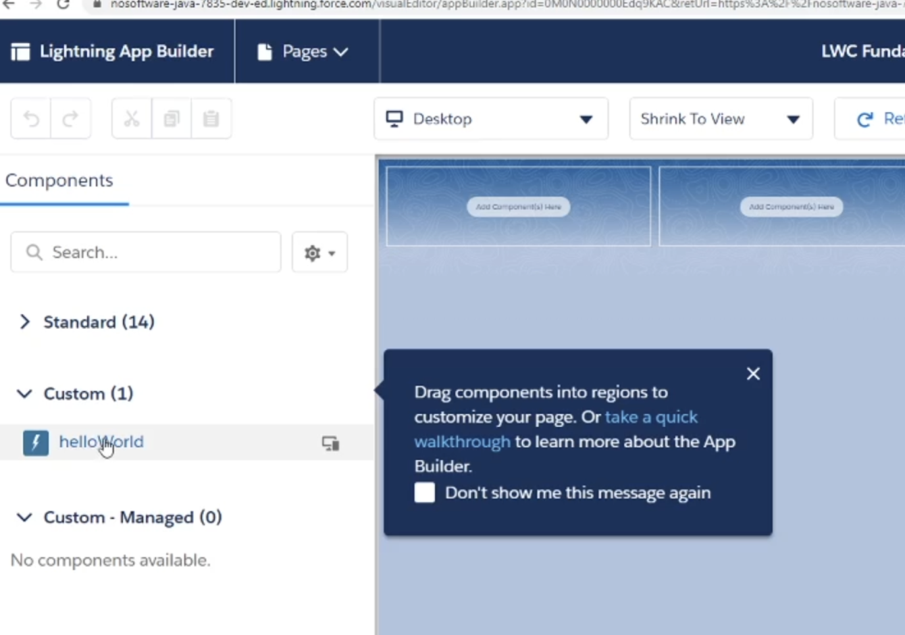
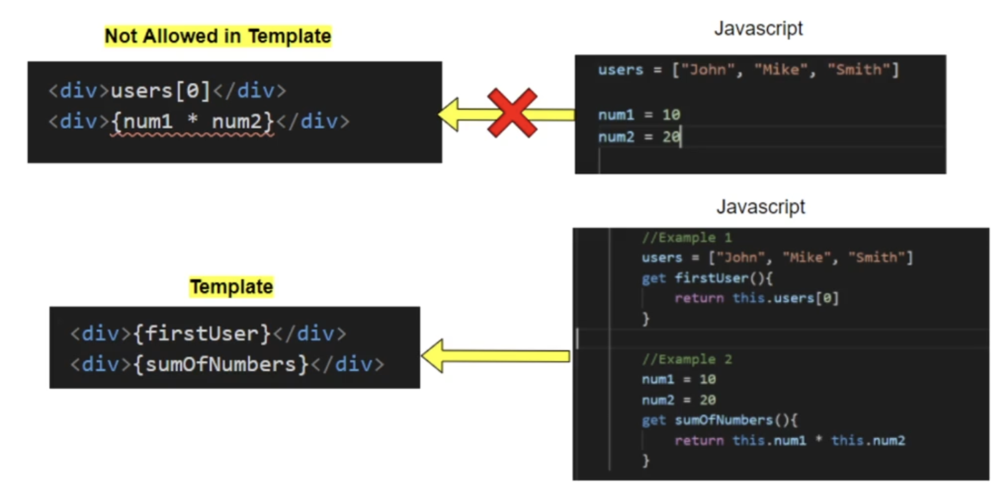

# Salesforce

## SF CLI

https://developer.salesforce.com/tools/salesforcecli 

**Commands:**

Install Copado:

```bash
sfdx plugins:install @copado/copado-cli
```


Create new Project

```bash
From VSCode -> SFDX: Create Project with Manifest
```

Authorize Org

```bash
From VSCode -> SFDX: Authorize a DevHub

sfdx force:auth:web:login -a igorromero -d

-a -> Alias -> nome da org do SF
-d -> Default para o projeto
-r -> instance url

sfdx force:auth:web:login -a CSPProd -r https://login.salesforce.com
sfdx force:auth:web:login -a merlindev2 -r https://ibmsf--merlindev2.sandbox.my.salesforce.com

old way
sfdx force:auth:web:login --alias igorromero --instance-url https://igorromero.my.salesforce.com
```

Logout:

```bash
sfdx force:auth:logout -u merlindev1
-u -> especifica o alias
```

List all orgs:

```bash
sfdx force:org:list

┌──┬────────────┬──────────────────────────────────┬────────────────────┬───────────┐
│  │ Alias      │ Username                         │ Org Id             │ Status    │
├──┼────────────┼──────────────────────────────────┼────────────────────┼───────────┤
│  │ cspprod    │ igor.romero1@ibmsf.com           │ 00D50000000c9MWEAY │ Connected │
│  │ merlindev2 │ igor.romero@ibmsf.com.merlindev1 │ 00DcU000001PtITUA0 │ Connected │
└──┴────────────┴──────────────────────────────────┴────────────────────┴───────────┘
```


Copado - Listar usuario ativo:

```bash
sfdx copado:auth:display
```

Copado - Setar o usuário/org ativa:

* Na criação de um projeto novo, como estamos apontando para PROD, iremos pegar o código atual de produção

```bash
sfdx copado:auth:set -a CSPProd
```


Create Scratch Org

```
from VSCode -> SFDX: Create a default Scratch Org

sf org create scratch -d -f config/project-scratch-def.json -y 30 -a recipes
-a → --alias
-s → --set-default
-d 30 → --duration-days 30
-f → --definition-file

or
sf org create scratch --set-default --alias lwcScratchOne --definition-file config/project-scratch-def.json --duration-days 30
```

Push Source

```
sf project deploy start
```

Delete Scratch

```
sf org delete scratch -p -o recipes
```

Assign Permission Set

```
sf org assign permset -n recipes
```

Import Data Tree

```
sf data import tree -p data/data-plan.json
```

Open Org

```
sf org open -p lightning/n/Hello
```

Run Apex Test

```
sf apex test run -c -r human -w 20
```


### DevHub vs Scratch Org

* **DevHub:** é a org principal do Salesforce - ali que se gerencia as scratch orgs
* **Scratch Org**: funciona como um repositório, onde cada dev pode ter a sua. Após o dev terminar, ele pode subir o código para o sandbox (cópia de production)


## LWC

LWC = Lightning Web Component

Library: https://developer.salesforce.com/docs/component-library/overview/components

Css Lib: https://www.lightningdesignsystem.com/2e1ef8501/p/51dd56-margin


### HelloWorld

Salesforce não possui um servidor local - é necessário subir em uma org (sandbox/dev).

1. Verificar os ambientes autenticados

```bash
sf org list
```

2. Setar o ambiente que será feito a change

```bash
sf config set target-org=merlindev2
```

3. Fazer a alteração no arquivo
4. Submeter a change

```bash
vscode -> Right click -> SFDX: Deploy This Source to Org

terminal:
sf deploy metadata --source-path force-app/main/default/lwc/meuComponente --target-org merlindev2
```

5. Abrir a org:

```bash
sf org open --target-org merlindev2
```


### Creating First Lightning App

Para criar um novo App:

1. Vá até o setup da sua org
2. App Manager  -> New Lightning App -> Add App Name
3. Save

Associar uma página ao app (WorkPriorization é uma página dentro do Salesforce)

1. Setup -> Lightning App Builder
2. New -> App Page -> Nome da Label -> Layout da Página (Three Regions eg)
3. Save / Activate
4. Lightning Experience tab -> Selecionar o App que usará essa página


### First Component

Com VSCode -> Command + P -> SFDX: Create Lightning web Component

No projeto (vscode), para permitir que o componente apareça na página inicial, precisamos declarar no arquivo `zzz.js-meta.xml` a página com o `isExposed` `true` , apontando o `targets` que ficaram disponíveis

```xml
<?xml version="1.0" encoding="UTF-8"?>
<LightningComponentBundle xmlns="http://soap.sforce.com/2006/04/metadata">
    <apiVersion>65.0</apiVersion>
    <isExposed>true</isExposed>
    <masterLabel>WP 2</masterLabel>    
    <targets>        
        <target>lightning__AppPage</target>        
        <target>lightning__RecordPage</target>        
        <target>lightning__HomePage</target>    
    </targets>
</LightningComponentBundle>
```

`isExposed` significa:

> **“Este componente pode ser selecionado como componente em páginas do Lightning App Builder.”**

Ou seja, **fica visível** quando você vai em:

- App Builder → Home Page
- App Builder → Record Page
- App Builder → App Page
- App Builder → Experience Cloud Builder
   …dependendo dos *targets*.


No Lightning App Builder, o componente agora poderá ser utilizado




### Local Property / Data Binding

LWC faz uso de javascript, portanto as variáveis são instanciadas como em qualquer arquivo `js`

```javascript
// wpUserProfile.js
export default class WpUserProfile extends LightningModal {
    name='igor'
    age=30
    user={
        name:'igor'
    }
    users=[{name:'igor'},{name:'igor2'}]
}
```

Para acessar essas propriedade no `template`, basta que utilizemos `{ }` - e quando for o objeto, acessar com `.`

```html
<!-- wpUserProfile.html -->
<template>
    <lightning-modal-header label="Change Profile"></lightning-modal-header>
    <lightning-modal-body>
        <template if:true={userName}>
            <p>Name: {name}</p>
            <p>Age: {age}</p>
            <p>Username: {user.name}</p>
          	<!-- array não funiconam! -->
            <p>Array: {user[0]}</p>
        </template>
        
    </lightning-modal-body>
    <lightning-modal-footer>
        <lightning-button label="Close" onclick={handleClose}></lightning-button>
    </lightning-modal-footer>
</template>

```


### Methods/ Two-way Data Binding

Assim como no Angular, podemos utilizar métodos no HTML ao acessa-los com `{ }`

```html
<template>
  <lightning-input type="text" onkeyup={changeTitle}></lightning-input>
  <p>{title}</p>
</template>
```

E no JS
```js
export default class WpUserProfile extends LightningModal {
 	title = 'Learning'
  
  changeTitle(event) {
    this.title = event.target.value
  }
}
```


### Class/style

LWC possui suas próprias tags de classes: https://www.lightningdesignsystem.com/2e1ef8501/p/51dd56-margin

Exemplo `slds-m-right_large` 

* Classes prefixed by `slds-**m**-` are used to add margins to an element. Classes prefixed by `slds-**p**-` are used to add [padding](https://www.lightningdesignsystem.com/2e1ef8501/p/93a8e1) to an element.
* Spacing class names use these direction indicators:`top`, `right`, `bottom`, and `left`.
* Use the `_xxx-small` through `_xx-large` scale to choose the spacing size needed.

```html
<lightning-input type="text" placeholder="title" class="slds-m-right_large"></lightning-input>

<div class="slds-m-right_none"></div>
<div class="slds-m-right_xxx-small"></div>
<div class="slds-m-right_xx-small"></div>
<div class="slds-m-right_x-small"></div>
<div class="slds-m-right_small"></div>
<div class="slds-m-right_medium"></div>
<div class="slds-m-right_large"></div>
<div class="slds-m-right_x-large"></div>
<div class="slds-m-right_xx-large"></div>
```


### @track

Quando queremos manipular uma variável `js` no HTML, podemos fazer o uso do `{}`, PORÉM, se tentarmos manipular uma **variável** **complexa**, como um **objeto ou array**, não irá funcionar!

```html
<template>
	<input type="text" onKeyUp={changeCity} />
  <p>    {title}  </p>
</template>
```

```js
import { LightningElement, track } from 'lwc';

export default class Test extends LightningElement {
 	user = {
    city: 'Sao Paulo'
  }
  
  changeCity(event) {
    this.user.city = event.target.value // NÃO IRÁ FUNCIONAR
  }
}
```

Isso acontece pq o LWC não consegue em real-time fazer a change! PORÉM, quando utilizamos **`@track`** , informamos ao LWC para fazer como um `watch` de elementos complexos!

```js
import { LightningElement, track } from 'lwc';

export default class Test extends LightningElement {
 	@track user = {
    city: 'Sao Paulo'
  }
  
  changeCity(event) {
    this.user.city = event.target.value // IRÁ FUNCIONAR
  }
}
```

O mesmo código pode funcionar sem o `@track` com o uso de **spread operators**

```js
import { LightningElement } from 'lwc';

export default class Test extends LightningElement {
 	user = {
    city: 'Sao Paulo'
  }
  
  changeCity(event) {
    this.user = {...this.user, city: event.target.value} // IRÁ FUNCIONAR TAMBÉM
  }
}
```


### Get/getters

`template` /html não renderiza arrays, e também não permite executar diretamente no template cálculos, para isso **usamos o `get`** !

* `get` -> exige que o método **retorne algo**

