# Salesforce

## SF CLI

https://developer.salesforce.com/tools/salesforcecli 

**Commands:**

Install Copado:

```bash
sfdx plugins:install @copado/copado-cli
```


Create new Project

```bash
From VSCode -> SFDX: Create Project with Manifest
```

Authorize Org

```bash
From VSCode -> SFDX: Authorize a DevHub

sfdx force:auth:web:login -a igorromero -d

-a -> Alias -> nome da org do SF
-d -> Default para o projeto
-r -> instance url

sfdx force:auth:web:login -a CSPProd -r https://login.salesforce.com
sfdx force:auth:web:login -a merlindev2 -r https://ibmsf--merlindev2.sandbox.my.salesforce.com

old way
sfdx force:auth:web:login --alias igorromero --instance-url https://igorromero.my.salesforce.com
```

Logout:

```bash
sfdx force:auth:logout -u merlindev1
-u -> especifica o alias
```

List all orgs:

```bash
sfdx force:org:list

┌──┬────────────┬──────────────────────────────────┬────────────────────┬───────────┐
│  │ Alias      │ Username                         │ Org Id             │ Status    │
├──┼────────────┼──────────────────────────────────┼────────────────────┼───────────┤
│  │ cspprod    │ igor.romero1@ibmsf.com           │ 00D50000000c9MWEAY │ Connected │
│  │ merlindev2 │ igor.romero@ibmsf.com.merlindev1 │ 00DcU000001PtITUA0 │ Connected │
└──┴────────────┴──────────────────────────────────┴────────────────────┴───────────┘
```


Copado - Listar usuario ativo:

```bash
sfdx copado:auth:display
```

Copado - Setar o usuário/org ativa:

* Na criação de um projeto novo, como estamos apontando para PROD, iremos pegar o código atual de produção

```bash
sfdx copado:auth:set -a CSPProd
```


Create Scratch Org

```
from VSCode -> SFDX: Create a default Scratch Org

sf org create scratch -d -f config/project-scratch-def.json -y 30 -a recipes
-a → --alias
-s → --set-default
-d 30 → --duration-days 30
-f → --definition-file

or
sf org create scratch --set-default --alias lwcScratchOne --definition-file config/project-scratch-def.json --duration-days 30
```

Push Source

```
sf project deploy start
```


Push Source with multiple selected files

```bash
sf project deploy start \
  --source-dir force-app/main/default/classes/WorkPrioritizationUserServices.cls \
  --source-dir force-app/main/default/classes/WorkPrioritizationUserServices.cls-meta.xml \
  --source-dir force-app/main/default/classes/WorkPrioritizationViewModels.cls \
  --source-dir force-app/main/default/classes/WorkPrioritizationViewModels.cls-meta.xml \
  --source-dir force-app/main/default/classes/WorkPrioritizationViewServices.cls \
  --source-dir force-app/main/default/classes/WorkPrioritizationViewServices.cls-meta.xml \
  --source-dir force-app/main/default/lwc/wpUserProfileModal
  
  
sf project deploy start \
  --source-dir force-app/main/default/lwc/wpApp \
  --source-dir force-app/main/default/lwc/wpViewBody \
  --source-dir force-app/main/default/lwc/wpViewPage \
  --source-dir force-app/main/default/lwc/wpViewTableBody \
  --source-dir force-app/main/default/lwc/wpViewTableHeader
```


Delete Scratch

```
sf org delete scratch -p -o recipes
```

Assign Permission Set

```
sf org assign permset -n recipes
```

Import Data Tree

```
sf data import tree -p data/data-plan.json
```

Open Org

```
sf org open -p lightning/n/Hello
```

Run Apex Test

```bash
sf apex test run -c -r human -w 20 // EXECUTES ALL TESTS FROM ALL CLASSES

sfdx force:apex:test:run --tests WorkPrioritizationUserServicesTest -c -r human --wait 10

sfdx force:apex:test:run --tests WorkPrioritizationUserServicesTest.testQueryAllCountries -c -r human --wait 10

sf apex run test --tests WorkPrioritizationUserServicesTest --code-coverage --detailed-coverage --result-format human

sf apex run test --tests WorkPrioritizationUserServicesTest.testQueryAllCountries --code-coverage --result-format human

sf apex run test --tests WorkPrioritizationUserServicesTest.testQueryAllCountries WorkPrioritizationUserServicesTest.testQueryAgentAvailableAccounts --code-coverage --result-format human
```


### DevHub vs Scratch Org

* **DevHub:** é a org principal do Salesforce - ali que se gerencia as scratch orgs
* **Scratch Org**: funciona como um repositório, onde cada dev pode ter a sua. Após o dev terminar, ele pode subir o código para o sandbox (cópia de production)


## Code Changes to Review before PR


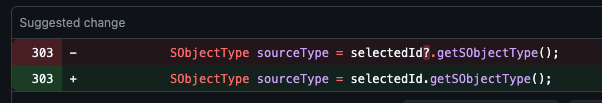

We should not have comments

* If you're going to add comments, try encapsulating the methods in a way that the comment is not needed

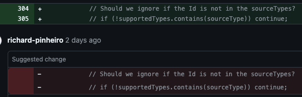

"Boolean parameter is a bad practice"

Private methods should not be used


FROM /WHERE/SELECT should be capitalized / break down in multiple lines when many fields are selected

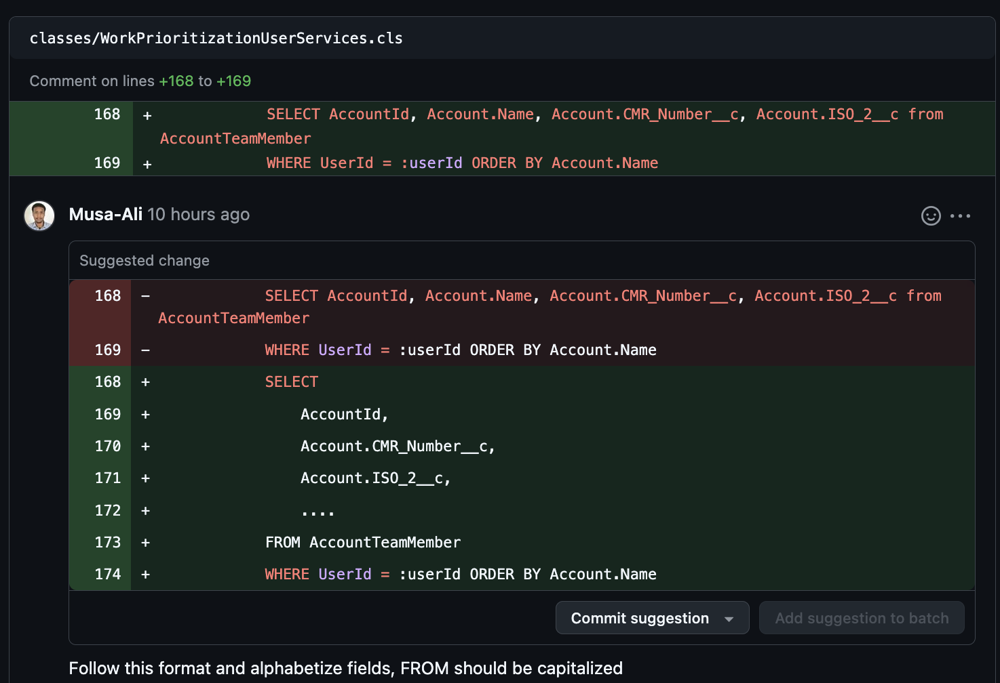

It's not necessary to SELECT `ID` - it comes for free/by default

Tests with insert/delete MUST use the `isInstanceOfType` - example:

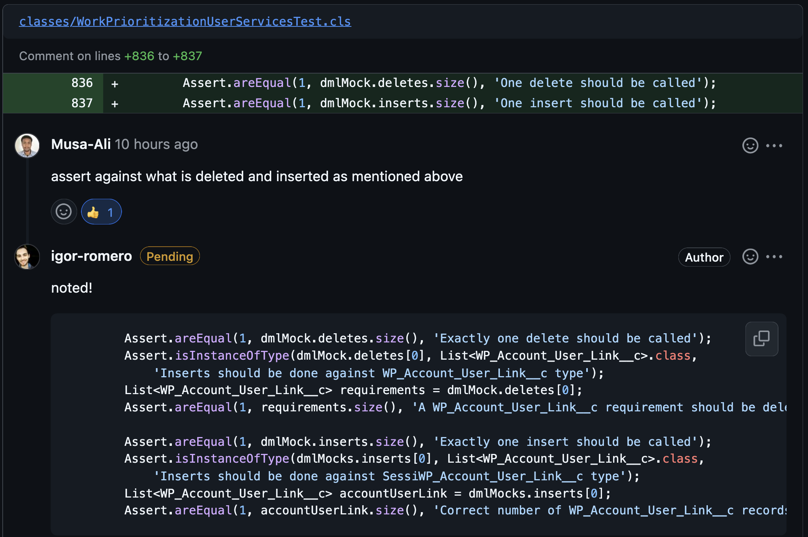

LWC we must use double quotes

Null safe operator with evaluate to truthy/falsy in the ternary, so no need to check agains null

```js
// wrong -> Account?.CMR_Number__c == null ? '' :  Account.CMR_Number__c
// correct -> Account?.CMR_Number__c ? "":  Account.CMR_Number__c
```


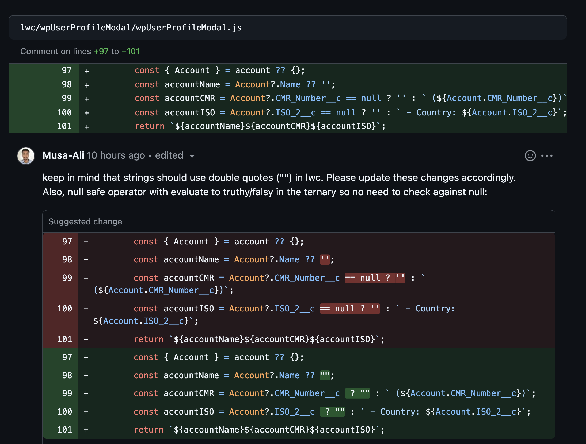

no need to use `event?.target?` only `event.target.value??` should be enough

Update all the apiversion of the files that were changed

Avoid abbreviations

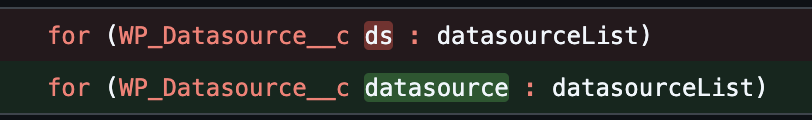

```javascript
// check if the list has also values
// if (datasourceList != null)
if (datasourceList != null && !datasourceList.isEmpty())
```


# LWC = Lightning Web Component

Library: https://developer.salesforce.com/docs/component-library/overview/components

Css Lib: https://www.lightningdesignsystem.com/2e1ef8501/p/51dd56-margin


### HelloWorld

Salesforce não possui um servidor local - é necessário subir em uma org (sandbox/dev).

1. Verificar os ambientes autenticados

```bash
sf org list
```

2. Setar o ambiente que será feito a change

```bash
sf config set target-org=merlindev2
```

3. Fazer a alteração no arquivo
4. Submeter a change

```bash
vscode -> Right click -> SFDX: Deploy This Source to Org

terminal:
sf deploy metadata --source-path force-app/main/default/lwc/meuComponente --target-org merlindev2
```

5. Abrir a org:

```bash
sf org open --target-org merlindev2
```


### Creating First Lightning App

Para criar um novo App:

1. Vá até o setup da sua org
2. App Manager  -> New Lightning App -> Add App Name
3. Save

Associar uma página ao app (WorkPriorization é uma página dentro do Salesforce)

1. Setup -> Lightning App Builder
2. New -> App Page -> Nome da Label -> Layout da Página (Three Regions eg)
3. Save / Activate
4. Lightning Experience tab -> Selecionar o App que usará essa página


### First Component

Com VSCode -> Command + P -> SFDX: Create Lightning web Component

No projeto (vscode), para permitir que o componente apareça na página inicial, precisamos declarar no arquivo `zzz.js-meta.xml` a página com o `isExposed` `true` , apontando o `targets` que ficaram disponíveis

```xml
<?xml version="1.0" encoding="UTF-8"?>
<LightningComponentBundle xmlns="http://soap.sforce.com/2006/04/metadata">
    <apiVersion>65.0</apiVersion>
    <isExposed>true</isExposed>
    <masterLabel>WP 2</masterLabel>    
    <targets>        
        <target>lightning__AppPage</target>        
        <target>lightning__RecordPage</target>        
        <target>lightning__HomePage</target>    
    </targets>
</LightningComponentBundle>
```

`isExposed` significa:

> **“Este componente pode ser selecionado como componente em páginas do Lightning App Builder.”**

Ou seja, **fica visível** quando você vai em:

- App Builder → Home Page
- App Builder → Record Page
- App Builder → App Page
- App Builder → Experience Cloud Builder
   …dependendo dos *targets*.


No Lightning App Builder, o componente agora poderá ser utilizado

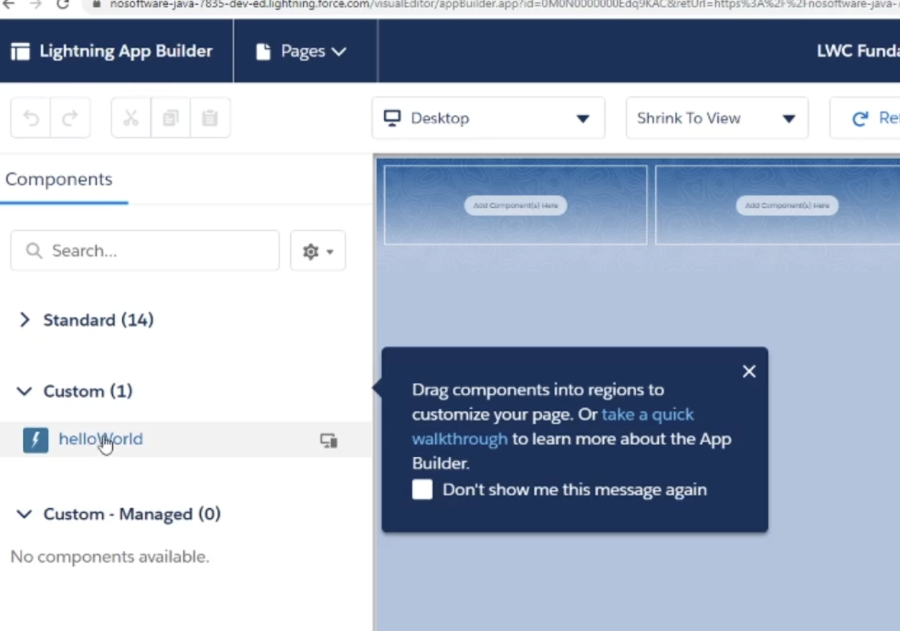


### Local Property / Data Binding

LWC faz uso de javascript, portanto as variáveis são instanciadas como em qualquer arquivo `js`

```javascript
// wpUserProfile.js
export default class WpUserProfile extends LightningModal {
    name='igor'
    age=30
    user={
        name:'igor'
    }
    users=[{name:'igor'},{name:'igor2'}]
}
```

Para acessar essas propriedade no `template`, basta que utilizemos `{ }` - e quando for o objeto, acessar com `.`

```html
<!-- wpUserProfile.html -->
<template>
    <lightning-modal-header label="Change Profile"></lightning-modal-header>
    <lightning-modal-body>
        <template if:true={userName}>
            <p>Name: {name}</p>
            <p>Age: {age}</p>
            <p>Username: {user.name}</p>
          	<!-- array não funiconam! -->
            <p>Array: {user[0]}</p>
        </template>
        
    </lightning-modal-body>
    <lightning-modal-footer>
        <lightning-button label="Close" onclick={handleClose}></lightning-button>
    </lightning-modal-footer>
</template>

```


### Methods/ Two-way Data Binding

Assim como no Angular, podemos utilizar métodos no HTML ao acessa-los com `{ }`

```html
<template>
  <lightning-input type="text" onkeyup={changeTitle}></lightning-input>
  <p>{title}</p>
</template>
```

E no JS
```js
export default class WpUserProfile extends LightningModal {
 	title = 'Learning'
  
  changeTitle(event) {
    this.title = event.target.value
  }
}
```


### Class/style

LWC possui suas próprias tags de classes: https://www.lightningdesignsystem.com/2e1ef8501/p/51dd56-margin

Exemplo `slds-m-right_large` 

* Classes prefixed by `slds-**m**-` are used to add margins to an element. Classes prefixed by `slds-**p**-` are used to add [padding](https://www.lightningdesignsystem.com/2e1ef8501/p/93a8e1) to an element.
* Spacing class names use these direction indicators:`top`, `right`, `bottom`, and `left`.
* Use the `_xxx-small` through `_xx-large` scale to choose the spacing size needed.

```html
<lightning-input type="text" placeholder="title" class="slds-m-right_large"></lightning-input>

<div class="slds-m-right_none"></div>
<div class="slds-m-right_xxx-small"></div>
<div class="slds-m-right_xx-small"></div>
<div class="slds-m-right_x-small"></div>
<div class="slds-m-right_small"></div>
<div class="slds-m-right_medium"></div>
<div class="slds-m-right_large"></div>
<div class="slds-m-right_x-large"></div>
<div class="slds-m-right_xx-large"></div>
```


## @track

Track serve para propriedades reativa / altera somente oq de fato foi mexido em uma lista por exemplo.


Quando queremos manipular uma variável `js` no HTML, podemos fazer o uso do `{}`, PORÉM, se tentarmos manipular uma **variável** **complexa**, como um **objeto ou array**, não irá funcionar!

```html
<template>
	<input type="text" onKeyUp={changeCity} />
  <p>    {title}  </p>
</template>
```

```js
import { LightningElement, track } from 'lwc';

export default class Test extends LightningElement {
 	user = {
    city: 'Sao Paulo'
  }
  
  changeCity(event) {
    this.user.city = event.target.value // NÃO IRÁ FUNCIONAR
  }
}
```

Isso acontece pq o LWC não consegue em real-time fazer a change! PORÉM, quando utilizamos **`@track`** , informamos ao LWC para fazer como um `watch` de elementos complexos!

```js
import { LightningElement, track } from 'lwc';

export default class Test extends LightningElement {
 	@track user = {
    city: 'Sao Paulo'
  }
  
  changeCity(event) {
    this.user.city = event.target.value // IRÁ FUNCIONAR
  }
}
```

O mesmo código pode funcionar sem o `@track` com o uso de **spread operators**

```js
import { LightningElement } from 'lwc';

export default class Test extends LightningElement {
 	user = {
    city: 'Sao Paulo'
  }
  
  changeCity(event) {
    this.user = {...this.user, city: event.target.value} // IRÁ FUNCIONAR TAMBÉM
  }
}
```


### Get/getters

`template` /html não renderiza arrays, e também não permite executar diretamente no template cálculos, para isso **usamos o `get`** !

* `get` -> exige que o método **retorne algo**

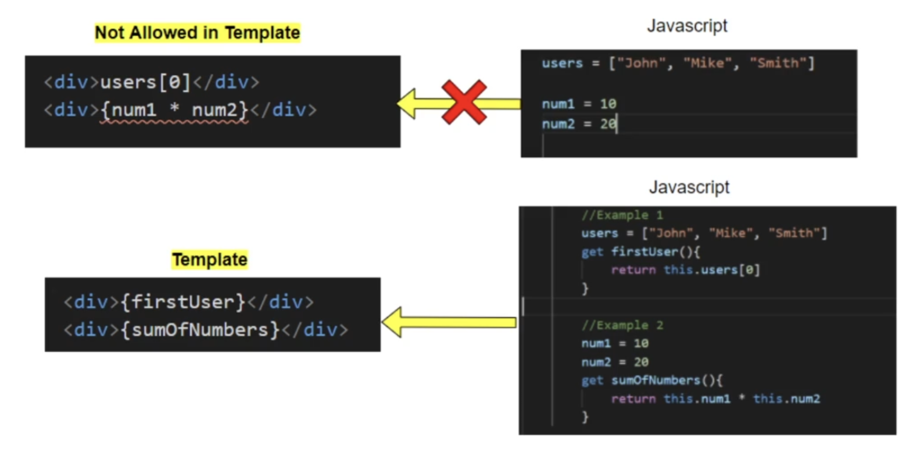


### Conditions

No LWC podemos renderizar um componente condicionalmente

```javascript
lwc:if
lwc:elseif
lwc:else
```

HTML:

```html
<template>
  <lightning-button
      variant="brand"
      label="Submit"
      onclick={handleButtn}>
  </lightning-button>
  <div lwc:if={isVisible}>
	  Show the code
  </div>
  
  <!-- example.html -->
  <template lwc:if={expression1}>
      Statement 1
  </template>
  <template lwc:elseif={expression2}>
      Statement 2
  </template>
  <template lwc:else>
      Statement 3
  </template>
</template>
```

JS:

```js
export default class Test extends LightningModal {
    isVisible = true;
    
    handleButtn() {
        this.isVisible = !this.isVisible
    }
}
```


### Looping

Para iterar uma lista podemos utilizar o `for:each={array} for:item="currentItem" for:index="index" `

JS:

```js
export default class Test extends LightningModal {
    @track carList = ["BMW", "Ferrari"];
}
```

HTML:

```html
  <lightning-card title="Looping Example">
      <div class="slds-var-m-around_medium">
          <ul class="slds-has-dividers_around-space">
              <template for:each={carList} for:item="car">
                  <li key={car} class="slds-item">{car}</li>
              </template>
          </ul>
      </div>
  </lightning-card>
```


### Component Composition

Composition = add um componente dentro de outro componente

```html
<!-- De dentro de um componente Pai-->

<!-- se o child chamar childComponentDemo -->
<c-child-component-demo></c-child-component-demo>

<!-- se o child chamar sampleDemoLWC -->
<c-sample-demo-l-w-c></c-sample-demo-l-w-c>
```


### Shadow Dom

É possível acessar elementos do HTML utilizando `this.template` + `querySelector`
```js
.querySelector 		-> para um único elemento
.querySelectorAll -> para arrays/multiplo elementos
```

E após acessar o elemento, é possível manipula-lo:

```html
<template>
  <h1>Olá</h1>
  <template for:each={users} for:item="user">
    <p class="userClass" key="{user}">{user}</p>
  </template>
  <lightning-button label="Change HTML with Shadow" onclick={handleClick}></lightning-button>
</template>
```

````js
export default class Test extends LightningModal {
	@track users = ["Igor", "Romero"];
  
  handleClick() {
    const elem = this.template.querySelector('h1')
    console.log(elem.innerText) // irá printar Olá
    
    const userElement = this.template.querySelectorAll('.name')
    Array.from(userElements).forEach(item => {
      console.log(item.innerText) // irá printar Igor/Romero
    })
  }
}
````


Outro cenário - controlar o elemento do checkbox

````html
<input
  class="multi-select-combobox__input"
  aria-controls="multi-pick-list-dropdown-items"
  role="textbox"
  type="text"
  value={selectedItems}
/>
````

```js
this.template
  .querySelector(".multi-select-combobox__input")
  .addEventListener("click", (event) => {
    this.handleClick(event.target);
    event.stopPropagation();
  });
```


Outro cenário para manipular o CSS

````html
  <div>
      <li class="createCaseProductListItem" onclick="{!c.choose}" aria-selected="false" >
````

```js
let allListItemElements = container.querySelectorAll("li, .createCaseProductListItem");
  if (keyCode == "40" || keyCode == "38") {
      for (let i = 0; i < allListItemElements.length; i++) {
          allListItemElements[i].setAttribute("aria-selected", "false");
          allListItemElements[i].classList.remove("grayBackground");
      }
  }
```


#### Toast Notification

É possível acessar um component child com o shadow down! como um **ToastNotification!**


````html
<template>    
    <template if:true={showToastBar}>   
         <div class="slds-notify_container">    
            <div class={outerClass} role="status">    
                <span class="slds-assistive-text">{type}</span>    
                <span class={innerClass} title={message}>    
                    <lightning-icon icon-name={getIconName} 
                        alternative-text="icon" 
                        styleclass="slds-icon slds-icon_small" 
                        variant="inverse" 
                        size="small">
                    </lightning-icon>    
                </span>    
                <div class="slds-notify__content">    
                    <h2 class="slds-text-heading_small">    
                        <lightning-formatted-rich-text value={message}></lightning-formatted-rich-text>    
                    </h2>    
                </div>       
                <div class="slds-notify__close">    
                    <lightning-button-icon icon-name="utility:close" 
                        size="small" 
                        variant="border-filled" 
                        class="slds-button slds-button_icon slds-button_icon-inverse" 
                        alternative-text="next" 
                        onclick={closeModal} >
                    </lightning-button-icon>    
                </div>    
            </div>    
        </div>    
    </template>   
</template>
````

```js
export default class candidatesSearchAdvancedToast extends LightningElement {
    type = 'error';
    icon = '';
    message = '';    
    showToastBar = false;
    
    @api autoCloseTime = 5000;
        
    @api
    showToast(type, message, icon, time) {
        this.type = type;
        this.message = message;
        this.icon = icon;
        this.autoCloseTime = time;
        this.showToastBar = true;
        if (time > 0 ) {
            setTimeout(() => {
                this.closeModal();
            }, this.autoCloseTime);    
        }
    }
    
    closeModal() {
        this.showToastBar = false;
        this.type = '';
        this.message = '';
    }
 
    get getIconName() {
        if(this.icon){
            return this.icon;
        }
        return 'utility:' + this.type;
    }
 
    get innerClass() {
        return 'slds-icon_container slds-icon-utility-' + this.type + ' slds-m-right_small slds-no-flex slds-align-top';
    }
 
    get outerClass() {
        return 'slds-notify slds-notify_toast slds-theme_' + this.type;
    }
}let allListItemElements = container.querySelectorAll("li, .createCaseProductListItem");
  if (keyCode == "40" || keyCode == "38") {
      for (let i = 0; i < allListItemElements.length; i++) {
          allListItemElements[i].setAttribute("aria-selected", "false");
          allListItemElements[i].classList.remove("grayBackground");
      }
  }
```

Acessando o child elemento de um parent com shadow dom:

```js
showErrorToast(errorMessage) {
    this.template.querySelector("c-candidates-search-advanced-toast")
      	.showToast("error",errorMessage, "utility:error", 10000);
}
```


# Style/CSS

SLDS -> Salesforce Lightning Design System

## Inline css

LWC possui suas próprias tags de classes: https://www.lightningdesignsystem.com/2e1ef8501/p/51dd56-margin

Exemplo `slds-m-right_large` 

* Classes prefixed by `slds-**m**-` are used to add margins to an element. Classes prefixed by `slds-**p**-` are used to add [padding](https://www.lightningdesignsystem.com/2e1ef8501/p/93a8e1) to an element.
* Spacing class names use these direction indicators:`top`, `right`, `bottom`, and `left`.
* Use the `_xxx-small` through `_xx-large` scale to choose the spacing size needed.

```html
<lightning-input type="text" placeholder="title" class="slds-m-right_large"></lightning-input>

<div class="slds-m-right_none"></div>
<div class="slds-m-right_xxx-small"></div>
<div class="slds-m-right_xx-small"></div>
<div class="slds-m-right_x-small"></div>
<div class="slds-m-right_small"></div>
<div class="slds-m-right_medium"></div>
<div class="slds-m-right_large"></div>
<div class="slds-m-right_x-large"></div>
<div class="slds-m-right_xx-large"></div>
```


MAS, também é possível utilizar `style` nos elementos:

```html
<div style="color:red; font-size:20px">
  Hi
</div>
```

## External css

ou `class` associando a um arquivo CSS!

```HTML
<!-- helloInLwc.html -->
<div class="hello">
  Hi
</div>
```

```css
/* helloInLwc.css -> o nome do arquivo tem q ser igual */
div {
  background-color: red
}

.hello {
  color: red
}

.hello:hover {
  color: blue
}
```


## SDLS Design Token

LWC fornece 'padrões' que podem ser usados no CSS, sem q seja necessário ficar buscando a cor exata usada no SF.

*The SLDS [design tokens](https://v1.lightningdesignsystem.com/design-tokens/) are still present and work normally in SLDS 1 themes, but aren't  included in SLDS 2 themes. SLDS 2 replaces design tokens with a system  of CSS custom variables called global styling hooks.*


## Shared CSS

Vamos pensar em um cenário onde +1 componente quer usar o mesmo CSS, e no LWC isso é possível com o `@import c/yourComponentCss`


1. É necessário criar um component LWC, porém com somente a classe css

```css
/* paragraphGlobal/paragraphGlobal.css */
p {
  font-size: 30px
}
```

2. Os Components que forem utilizar esse css irão **importa-los**

```css
@import 'c/paragraphGlobal';

.childCss{
  width:80%
}
```


## Dynamic CSS

O HTML também permite receber como `style` uma `prop` do component, q pode então ser manipulada no `js`

Exemplo: Alterar o tamanho da div

```html
<template>
	<lightning-card title="Dynamic CSS">
  	<div class="sfds-var-m-around_medium">
      <lightning-input type="number" value={percent} label="Percentage" onkeyup={changeHandler}>
      </lightning-input>
      
      <!-- here I'm getting the different percentage value -->
      <div style={percentage} />
    </div>
  </lightning-card>
</template>
```

```js
export default class DynamicCss extends LightningElement {
  percent = 10;
  changeHandler(e) {
    this.percent = event.target.value;
  }
  
  get percentage() {
    return `width:${this.percent}%` // <- retorna o style
  }
}
```

### Alterando CSS de um comp. LWC

Não é possível by default alterar o CSS de um component LWC

```html
<!-- não irá funcionar! -->
<lightning-button style="color:red"></lightning-button>

<!-- não irá funcionar! -->
<lightning-button class="myClass"></lightning-button>
```


Para manipular o CSS de um componente LWC é necessario manipular o DOM com o `renderedCallback`

```js
export default class ManipulatingDom extends LightningElement {

	isLoaded = false

  renderedCallback() {
      if(this.isLoaded) return
      const btn = this.template.querySelector('.userBtn');
      if (btn) {
          btn.style.backgroundColor = 'red';
      }
      this.isLoaded = true
  }
}
```

```html
<lightning-button class="userBtn"></lightning-button>
```


# Lifecycle Hooks

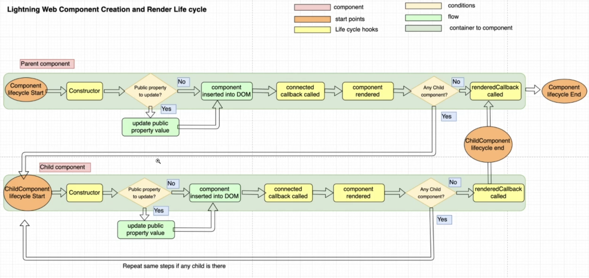

Hooks:

```javascript
constructor()

connectedCallback()

renderedCallback()

disconnetecCallback()

errorCallback()
```

| Hook                  | Quando roda                        | Para que usar                                  |
| --------------------- | ---------------------------------- | ---------------------------------------------- |
| `constructor()`       | Ao criar a instância do componente | Inicializar valores simples e estado           |
| `connectedCallback()` | Quando o componente entra no DOM   | Buscar dados, registrar listeners, chamar Apex |
| `renderedCallback()`  | Depois que o HTML é renderizado    | Acessar o DOM, libs externas, medir elementos  |


### constructor()

**Quando usar**

O `constructor` roda **antes do componente existir no DOM**.

Use para:

- Inicializar variáveis.
- Definir valores padrão.
- Fazer setup simples de estado.
- Nunca acessar DOM aqui.

**Exemplo**

```js
constructor() {
    super();
    this.count = 0;
    this.isLoading = true;
}
```

**Evite no constructor**

```js
this.template.querySelector(...)
```

➡️ Aqui ainda **não existe template renderizado**.


### connectedCallback() / disconnectedCallback

**Quando usar**

Quando o componente é inserido no DOM

Use para:

- Chamar classes/métodos do APEX.
  - Fazer fetch dos dados
- Registrar eventos (`window`, `message`, `pubsub`).

Exemplo

```js
connectedCallback() {
    this.loadData();
    window.addEventListener('resize', this.handleResize);
}
```

E o cleanup depois:

```js
disconnectedCallback() {
    window.removeEventListener('resize', this.handleResize);
}
```

* Pode rodar mais de uma vez se o componente for removido e inserido de novo.


Ou Exemplo

```js
interval = 0;
connectedCallback() {
	this.interval = window.setInterval()
}
```

E o cleanup depois:

```js
disconnectedCallback() {
	window.clearInterval(this.interval)
}
```


### renderedCallback()

**Quando usar**

Aqui todo conteúdo HTML já foi carregado, se for o parent, ele espera até mesmo todos os childs carregarem.

Use para:

- Acessar o DOM.
- Usar `this.template.querySelector`.
- Inicializar bibliotecas JS externas.
- Medir tamanho de elementos.
- Ajustar UI após render.

**Exemplo**:

```js
renderedCallback() {    
	const el = this.template.querySelector('.box');
	if (el) {
		el.focus();
	}
}
```

* ⚠️ Cuidado com loops no `renderedCallback`

Ele pode rodar **várias vezes**.

Se você alterar estado dentro dele, pode causar loop infinito:

```
renderedCallback() {
    this.visible = true; // ⚠️ pode rerender e chamar de novo
}
```

Proteção comum

```
renderedCallback() {
    if (this.hasRendered) return;
    this.hasRendered = true;

    // código seguro
}
```


### Exemplos

```js
import { LightningElement, track } from 'lwc';
import getAccounts from '@salesforce/apex/AccountController.getAccounts';

export default class AccountList extends LightningElement {
    @track accounts = [];
    isLoading = true;
    hasRendered = false;

    constructor() {
        super();
        this.isLoading = true;
    }

    connectedCallback() {
        this.loadAccounts();
    }

    async loadAccounts() {
        try {
            const result = await getAccounts();
            this.accounts = result;
        } catch (e) {
            console.error(e);
        } finally {
            this.isLoading = false;
        }
    }

    renderedCallback() {
        if (this.hasRendered) return;
        this.hasRendered = true;

        const searchInput = this.template.querySelector('.search');
        if (searchInput) {
            searchInput.focus();
        }
    }
}
```


**Caso 2 — Formulário com validação e máscara**

Situação real:
 Você tem um form de criação de Lead com máscara de telefone.

Onde usar

- `constructor` → inicializa objeto
- `connectedCallback` → carrega picklists
- `renderedCallback` → aplica máscara no input

```js
import { LightningElement } from 'lwc';
import getPicklists from '@salesforce/apex/LeadController.getPicklists';

export default class LeadForm extends LightningElement {
    lead = {};
    hasRendered = false;

    constructor() {
        super();
        this.lead = { Name: '', Phone: '' };
    }

    connectedCallback() {
        this.loadPicklists();
    }

    loadPicklists() {
        getPicklists()
            .then(result => {
                this.statusOptions = result;
            })
            .catch(console.error);
    }

    renderedCallback() {
        if (this.hasRendered) return;
        this.hasRendered = true;

        const phoneInput = this.template.querySelector('.phone');
        if (phoneInput) {
            phoneInput.addEventListener('input', e => {
                e.target.value = this.formatPhone(e.target.value);
            });
        }
    }

    formatPhone(value) {
        return value
            .replace(/\D/g, '')
            .replace(/(\d{2})(\d)/, '($1) $2')
            .replace(/(\d{5})(\d)/, '$1-$2');
    }
}
```

Utilizar biblioteca externa

```js
import { LightningElement } from 'lwc';
import { loadScript } from 'lightning/platformResourceLoader';
import chartJs from '@salesforce/resourceUrl/chartjs';
import getStats from '@salesforce/apex/StatsController.getStats';

export default class Dashboard extends LightningElement {
    chart;
    chartJsInitialized = false;

    connectedCallback() {
        this.loadStats();
    }

    async loadStats() {
        this.data = await getStats();
    }

    renderedCallback() {
        if (this.chartJsInitialized) return;
        this.chartJsInitialized = true;

        loadScript(this, chartJs)
            .then(() => {
                const ctx = this.template.querySelector('canvas');
                this.chart = new window.Chart(ctx, {
                    type: 'bar',
                    data: this.data
                });
            })
            .catch(console.error);
    }
}

```


# Communication between components

Existem alguns modos:

* Parent to child
* Child to Parent
* Sibling (using pubs)


## Parent to Child

É possível se comunicar:

* Passando dados primitivos/non-primitivos para o child
* Passando dados por uma **action do Parent**
* Chamando métodos do child pelo Parent


### @api

`@api` torna a **propriedade/method** publicos.

* propriedades 'public' são reativas, se for alterada o component é re-renders.


Para que o **Child** tenha acesso a propriedade, usamos o `@api` no **Parent**

```js
// Parent.js
import { LightningElement, api } from "lwc";

export default class Parent extends LightningElement {
  @api fullname
  @api cardHeading
}
```

```html
<!-- Parent.html -->
<template>
	<c-child-component>
  	fullname="Adding text from Parent"
    card-heading="Title of the card from Parent"
  </c-child-component>
</template>


<!-- ChildComponent.html -->
<template>
	<lightning-card title={cardHeading}>
  	{fullname}
  </lightning-card>
</template>
```


**PORÉM**, se o Parent quer passar **dados complexos (array/objects)** o `@api` deve então ficar no child e não no Parent

```js
// Parent.js
import { LightningElement, api } from "lwc";

export default class Parent extends LightningElement {
  carsData = [
    {
      name: 'mercedes',
      model: 'amg'
    },
    {
      name: 'mercedes',
      model: 'formula1'
    }
  ]
}

// Child.js -> AQUI IRÁ VIR O @API
export default class ChildComponent extends LightningElement {
  @api carDetails
}
```

```html
<!-- Parent.html -->
<template>
  
  <!-- property do CHILD é chamado DENTRO do component -->
	<c-child-component car-details={carsData}> </c-child-component>
</template>


<!-- ChildComponent.html -->
<template>
	<lightning-card title={cardHeading}>
  	<template for:each{carDetails} for:item="item">
      <p>
        {item.name} - {item.model}
      </p>
    </template>
  </lightning-card>
</template>
```


### On Action from Parent


E se quisermos que a change de um **input do Parent** reflita no comportamento do child?

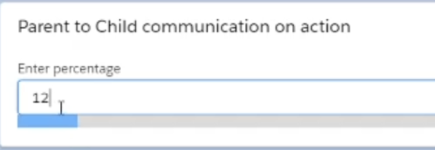

Exemplo: *Input no Parent altere o progress-bar do child*

```js
// Parent.js
import { LightningElement, api } from "lwc";

export default class Parent extends LightningElement {
  parentPercentage=10
  
  changehandler(event) {
    this.parentPercentage = event.target.value
  }
}

// Child.js -> AQUI IRÁ VIR O @API
export default class ChildComponent extends LightningElement {
  @api percentageChild
}
```

```html
<!-- Parent.html -->
<template>

  <lightning-input type="number" label="Change progress" onkeyup={changehandler}></lightning-input>

  <!-- property do CHILD é motificada por uma property do Parent -->
	<c-progress-bar>
  	percentage-child={parentPercentage}  
  </c-child-component>
</template>
u


<!-- ProgressBar.html -->
<template>
	<lightning-progress-bar value={percentageChild} size="large"></lightning-progress-bar>
</template>
```


### Calling Child method from Parent


E se quisermos chamar o método de um Child através de um Parent?

* Com o uso do `this.template.queryselector` podemos invocar o método do child!
* Método do Child precisa também ter a anotação `@api`


```js
// Child.js
export default class ChildComponent extends LightningElement {
  sliderValue = 20
  
  sliderHandler(event) {
    this.sliderValue = event.target.value
  }
  
  // O método precisa ser anotado com @api
  @api resetSlider() {
    this.sliderValue = 50
  }
}

// Parent.js
import { LightningElement, api } from "lwc";

export default class Parent extends LightningElement { 
  
  // do Parent, com o querySelector, conseguimos acessar o component e chamar o método
  // o component child precisar estar no HTML do parent!
  onClickHandler(event) {
		this.template.queryselector('c-child-slider-component').resetSlider()
  }
}
```

* **PORÉM**, se o componente o Parent precisa se comunicar com grandchilds **é necessário usar o Bubble!**


👉 **Dados descem via @api**
 👉 **Eventos sobem via CustomEvent**

Nunca tente acessar property do bisneto direto tipo:

```
this.template.querySelector('c-wp-view-page')
    .template.querySelector('c-wp-view-body')
    .template.querySelector('c-wp-view-table-header')
```

Isso é anti-pattern e quebra encapsulamento!


### Set/Setter

Quando queremos modificar um dado que vêm do Parent em um component Child, podemos fazer o uso do `set`

* `set` sempre precisa ser acompanhado de um `@api get`
* `set` e `get` precisam ter o mesmo nome
* `set` não pode modificar diretamente o dado, é preciso fazer um `shadown DOM` do elemento antes de modifica-lo


Vamos imaginar que queremos manipular o valor do Parent no Child

Exemplo:

* Altere a idade do usuário através do Child

```js
export default class Parent extends LightningElement {
  userDetails: {
    name: 'Igor',
    age: 29
  }
}


export default class Child extends LightningElement {
  
  userFromChild = {}
  
  @api
  get userFromParent() {
		return this.userFromChild
  }
  
  set userFromParent(data) {
    const newAge = data.age * 2
    this.userFromChild = {...data, age: newAge} // shadown copy
  }
}
```

No HTML iremos passar o q está no `get`  como uma `prop` dentro do Child element

```html
<!-- PARENT -->
<template>
  <c-child user-from-parent={userDetails}></c-child>
</template>
```


## Between Siblings

E se componentes 'irmãos' precisem conversar entre eles?

* `wpTableHeader` possui property `selectedTabIndex` (que é o index da tab)
* `wpTableBody` precisa alterar o conteúdo baseado nesse `id`
* `wpView` importa os dois componentes (parent)

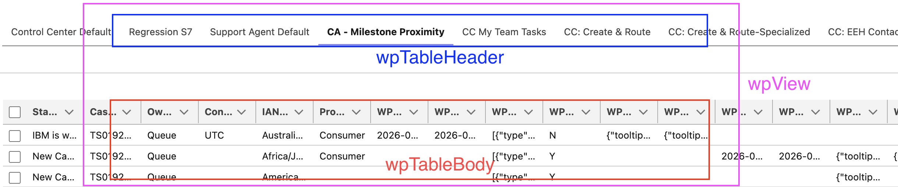


```html
<!-- wpView -->
<template>
    <c-wp-view-table-header
        refresh-token={refreshToken}
        onviewchange={handleViewChange}>
    </c-wp-view-table-header>
    <c-wp-view-table-body
        lwc:if={selectedViewId}
        selected-view-id={selectedViewId}
        refresh-token={refreshToken}>
    </c-wp-view-table-body>
</template>

<!-- wpTableHeader -->
<lightning-tabset active-tab-value={activeTabId}>
    <template for:each={viewDefinitions} for:item="view">
        <lightning-tab
            label={view.Title__c}
            value={view.Id}
            key={view.Id}
            onactive={handleTabChange}>
        </lightning-tab>
    </template>
</lightning-tabset>

<!-- wpTableBody -->
<lightning-datatable
    lwc:if={hasRecords}
    key-field="Id"
    columns={columns}
    data={rows}>
</lightning-datatable>
```


Quando houver uma change no `selectedViewId` feita no `wpHeader` o `wpBody` precisa **escutar** e performar uma ação

* Com o uso de `@get/set` isso é possível!

```js
// wpView - irá escutar as changes disparadas pelo Header -onviewchange={handleViewChange}
//					e irá modificar o selectedViewId q irá ser escutado pelo Body
handleViewChange(event) {
    this.selectedViewId = event.detail.viewId;
    this._refreshToken = event.detail.refreshToken;
}

// wpHeader - disparada o evento com o valor da viewId
handleTabChange(event) {
    this.activeTabId = event.target.value;
    this.dispatchViewChange(this.activeTabId);
}

dispatchViewChange(viewId) {
    if (!viewId) return;
    this.dispatchEvent(new CustomEvent('viewchange', {
        detail: { viewId, refreshToken: this._refreshToken },
        bubbles: true,
        composed: true
    }));
}

// wpBody - irá receber via getter/setter os valores da viewId - quando viewId for setada, API é executada
@api
get selectedViewId() {
    return this._selectedViewId;
}

set selectedViewId(id) {
    this._selectedViewId = id;
    this._getView(id);
}
```


## Child to Parent

### new CustomEvent()


Se quisermos chamar uma ação do Parent a partir de um Child, podemos fazer uso do `CustomEvent()` 

* O valor que colocarmos no `CustomEvent` irá refletir no parent com a palavra `on` no início

```js
const event = new CustomEvent("close") // no Parent será "onclose"
this.dispatchEvent(event)
```


Exemplo:

* Child -> Modal
* Parent importa o Modal, porém a ação de abrir e fechar via no Parent, ou seja, o click de submit do Modal deverá chamar uma ação do Parent para fechar o Modal


```html
<!-- Parent.html -->
<template>

  <lightning-button label="Open Modal" onclick={openModalHandler}></lightning-input>

  <!-- O evento do Child irá ser usado com 'on' aqui -->
	<c-child-modal>
  	onclose={closeModalParentHandler}  
  </c-child-modal>
</template>


<!-- ChildModal.html -->
<template>
	... Modal HTML attributes
  <lightning-button label="Close Modal" onclick={childClickHandler}></lightning-input>
</template>
```


```js
// Child.js -> Aqui irá o new CustomEvent 
export default class ChildComponent extends LightningElement {

  childClickHandler() {
    const event = new CustomEvent("close")
		this.dispatchEvent(event)
  }
}


// Parent.js
import { LightningElement, api } from "lwc";

export default class Parent extends LightningElement {
	showModal = false;
  
  openModalHandler() {
    this.showModal = true
  }
  
  closeModalParentHandler() {
    this.showModal = false
  }
}

```


#### Bubble

**Quando usar bubbles + composed?**

Sempre que:

- O evento precisa subir múltiplos níveis
- Você quer capturar no root
- Está atravessando componentes customizados


Imagine que você precisa acessar uma property de um componente BISNETO, ou seja, ter q navegar entre vários outros componentes só para acessar um valor pode dar muito trabalho via `property binding`, e para isso existe o meio **Bubble** 

Exemplo:

* Quero disabilitar um botão q está no parent, baseado em uma action do child

```html
<!-- PARENT -->
<lightning-layout-item padding="around-small" size="3" class="slds-text-align_right">
    <lightning-button-group>
            <lightning-button-icon
                icon-name="utility:loop"
               	onclick={reloadCurrentView}
                title="Reload Current View"
                disabled={isViewLoading}> <!-- AQUI IREMOS VERIFICAR LOADING -->
             </lightning-button-icon>
    </lightning-button-group>
</lightning-layout-item>

<template >
    <c-wp-view-page 
              refresh-token={refreshToken}
            	onloadingchange={handleLoadingChange}> <!-- AQUI RECEBER VIA BOOBLE: onloadingchange-->
  </c-wp-view-page>
</template>


<!-- CHILD - WPVIEWPAGE (recebe onloadingchange mas não exibe) -->
<template>
    <c-wp-view-body refresh-token={refreshToken}></c-wp-view-body>
</template>


<!-- GRANDCHILD - WPVIEWPAGEBODY (recebe onloadingchange mas não exibe) -->
<template>
    <c-wp-view-table-body
        lwc:if={selectedViewId}
        selected-view-id={selectedViewId}
        refresh-token={bodyRefreshToken}>
    </c-wp-view-table-body>
</template>


<!-- GRANDGRANDCHILD - WPVIEWTABLEBODY (EXPÕE O BUBBLE)! -->
<template>
    <c-wp-view-table-body
        lwc:if={selectedViewId}
        selected-view-id={selectedViewId}
        refresh-token={bodyRefreshToken}>
    </c-wp-view-table-body>
</template>
```


```js
// grandgrandchild - wpViewTableBody é oq irá emitir o bubble
export default class WpViewTableBody extends LightningElement {
  isLoading = true;

  // onde emitimos o evento com bubble!
  _setLoading(value) {
      this.isLoading = value;
      this.dispatchEvent(new CustomEvent('loadingchange', { // será lido como onloadingchange
          detail: { isLoading: value },
          bubbles: true,
          composed: true
      }));
  }
  
  // outras funções
  
  // onde o setLoading é feito
  async _getView(viewId) {
      try {
          this._setLoading(true);
          const records = await getView({ viewId });
          const { rows, keySet } = this._getTableRows(records);
          this.columns = this._getTableColumns(keySet);
          this.rows = rows;
      } catch (error) {
          handleError("Error getting view records", error);
      } finally {
          this._setLoading(false);
      }
  }

}
```


### Event with Data

É possível passar dados também ao `CustomEvent` 


```js
// Child.js
export default class ChildComponent extends LightningElement {

  childClickHandler() {
    const event = new CustomEvent("close", {
      detail: "Modal Closed Successfully"
    })
		this.dispatchEvent(event)
  }
}


// Parent.js
import { LightningElement, api } from "lwc";

export default class Parent extends LightningElement {
	showModal = false;
  detailFromChild = "";
  
  openModalHandler() {
    this.showModal = true
  }
  
  closeModalParentHandler(event) {
    this.detailFromChild = event.detail // AQUI, acessamos o valor passado pelo Child
    this.showModal = false
  }
}
```


## Slots

LWC também nós dá a habilidade de inserir **elemento HTML dentro de outro component**, com o uso de **`<slot />`** 

* Unnamed Slots
* Named Slots


Quando o componente possuí somente **1 único slot**, é possível usar o **_unnamed slot_**, PORÉM, se possuir +1 é necessário dar um `name`, caso contrário o conteúdo será duplicado!

```html
<!-- PARENT -->
<template>
	<c-child-component>
  	<p> unnamed slot test </p> <!-- ENVIANDO UM CONTEÚDO HTML -->
  </c-child-component>
</template>


<!-- CHILD -->
<template>
		<h1>Child Component</h1>
  
	  <!-- O que o Parent enviar, aparecerá aqui -->
  	<slot></slot>
</template>
```


Named Slot

```html
<!-- PARENT -->
<template>
	<c-child-component>
  	<p slot="first"> First Slot </p>
  	<p slot="second"> Second Slot </p>    
  </c-child-component>
</template>


<!-- CHILD -->
<template>
		<h1>Child Component</h1>
  	<slot name="first"></slot>
  	
  	<h2>Second Slot</h2>
    <slot name="second"></slot>
</template>
```


# Others

## Static Resources

E se quisermos incluir uma imagem dentro do SF?

* Vá até "Setup"
* Quick find: Static Resources
* New -> Coloque um `name` que deve ser único (e será usado no LWC)

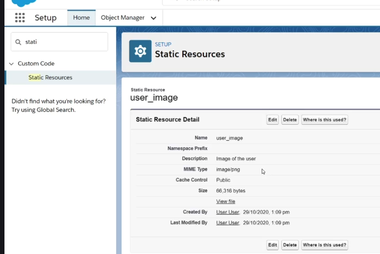


No LWC:

```js
// imagens vão como UpperCase
// o name dado no resource irá no final
import USER_IMAGE from '@salesforce/resourceUrl/user_image'

export default class TestStaticResource extends LightningElement {
  userImage = USER_IMAGE
}
```

```html
<template>
	<lightning-card title="Static Image Demo">
  	
  </lightning-card>
</template>
```


## 3rd JS lib / loadScript

E se quisermos usar libs como o `moment, datepicker, carbon design`?  De forma similar com o que é feito no `resourceUrl` para importar ***static images*** , podemos também importar libraries!

* Vá até "Setup"
* Quick find: Static Resources
* New -> Coloque um `name` que deve ser único (e será usado no LWC)
* Adicione o file `.zip` 


No LWC/JS, iremos utilizar o `loadScript` para fazer a leitura do file

* A leitura do file deve acontecer no ` renderedCallback` (só queremos que o script execute uma ação quando tudo for terminado)
* Não queremos que o script fique sendo executado a todo momento, então criamos uma variável de controle (`isLoaded`)
* `Promise` deve ser usado pq o carregamento do file é async

```js
import { loadScript } from 'lightning/platformResourceLoader';
import flatpick from '@salesforce/resourceUrl/flatpick'
import moment from '@salesforce/resourceUrl/moment' 

export default class TestStaticResource extends LightningElement {

  isLibLoaded = false
  currentDate = ''
  
  renderedCallback () {
    if (this.isLibLoaded)
      return

    Promise.all([
        loadScript(this, flatpick + '/4.6.6/flatpickr.js'),
        loadScript(this, flatpick + '/4.6.6/flatpickr.js'),
      ])
        .then(() => {
          this.intializeDatepicker(); // iremos chamar as funções quando elas forem executadas
      		this.setCurrentDate();
        })
        .catch((error) => {
          console.log({ message: 'Error onloading', error });
        });
    
    this.isLibLoaded = true
  }
  
  setCurrentDate() {
    this.currentDate = moment().format('LLLL');
  }
  
  intializeDatepicker() {
    const calendarInput = this.template.querySelector(
      '.bx--date-picker__input'
    );
    this.flatpickrElement = window.flatpickr(calendarInput, {
      dateFormat: 'm/d/Y',
      nextArrow: `<svg width="16px" height="16px" viewBox="0 0 16 16" fill="currentColor" xmlns="http://www.w3.org/2000/svg">
        <path fill-rule="evenodd" d="M4.646 1.646a.5.5 0 0 1 .708 0l6 6a.5.5 0 0 1 0 .708l-6 6a.5.5 0 0 1-.708-.708L10.293 8 4.646 2.354a.5.5 0 0 1 0-.708z"/>
      </svg>`,
      prevArrow: `<svg width="16px" height="16px" viewBox="0 0 16 16" fill="currentColor" xmlns="http://www.w3.org/2000/svg">
        <path fill-rule="evenodd" d="M11.354 1.646a.5.5 0 0 1 0 .708L5.707 8l5.647 5.646a.5.5 0 0 1-.708.708l-6-6a.5.5 0 0 1 0-.708l6-6a.5.5 0 0 1 .708 0z"/>
      </svg>`
    });
    this.dispatchEvent(new CustomEvent('load'));
  }
}
```


## 3rd CSS lib / loadStyle

Da mesma forma que importamos os outros static resources, faremos para o CSS

* Vá até "Setup"
* Quick find: Static Resources
* New -> Coloque um `name` que deve ser único (e será usado no LWC)
* Adicione o file `.zip` 


```js
import { loadstyle } from 'lightning/platformResourceLoader';
import ANIMATE from '@salesforce/resourceUrl/flatpick'

export default class TestStaticResource extends LightningElement {
  isLibLoaded = false
  
  renderedCallback () {
    if (this.isLibLoaded)
      return

    Promise.all([
      loadstyle(this, ANIMATE + 'animate/animate.min.css')
    ])
    
    this.isLibLoaded = true
}
```


# Database

No LWC existem `3 meios de comunicação` com o Banco de Dados

* LDS -> Lightning Data Service

  * Está em Record Page.

    É CRUD simples.

    1 registro.

    Não precisa de lógica.

* LDS Wire 

  * Quer reatividade.

    Parâmetros mudam.

    Pode cachear.

    Lista simples.

* Apex Services

  * Usuário dispara ação.

    Tem filtros dinâmicos.

    Regras complexas.

    DML pesado.

    Fluxo controlado.

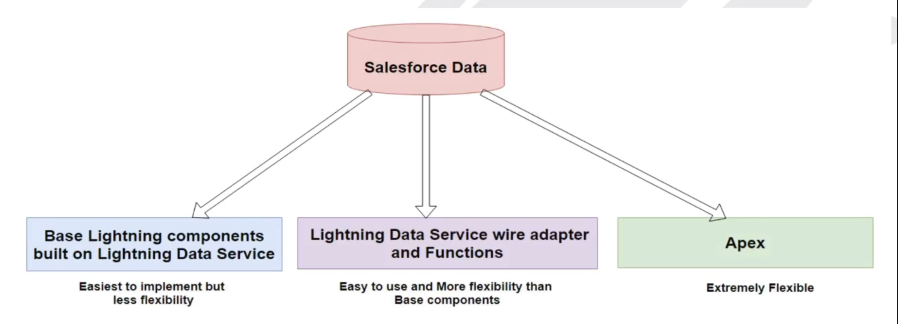


| Critério       | LDS        | Wire            | Apex Imperativo |
| -------------- | ---------- | --------------- | --------------- |
| Tipo           | UI API     | Reativo         | Controlado      |
| Cache          | Automático | Automático      | Não             |
| FLS / Sharing  | Automático | Depende do Apex | Depende do Apex |
| Quando executa | Automático | Automático      | Manual          |
| Complexidade   | Baixa      | Média           | Alta            |
| Uso comum      | 1 registro | Listas simples  | Lógica complexa |
| Reatividade    | Sim        | Sim             | Não automático  |
| Performance    | Alta       | Alta            | Depende         |

**Regra mental rápida**

> **Tela automática? → wire**
>  **CRUD simples? → LDS**
>  **Usuário clicou? → Apex imperativo**

Combine:

- LDS para o record principal.
- Wire para listas.
- Apex imperativo para ações.


### LDS

É a forma **nativa da Salesforce** para ler/escrever registros sem Apex.

Você usa APIs como:

- `getRecord`
- `getFieldValue`
- `updateRecord`
- `createRecord`
- `deleteRecord`

**Quando usar**

- Trabalhar com **1 registro**.
- Precisa respeitar **FLS / Sharing automaticamente**.
- Quer **cache automático**.
- Quer simplicidade.
- Não precisa de lógica complexa.

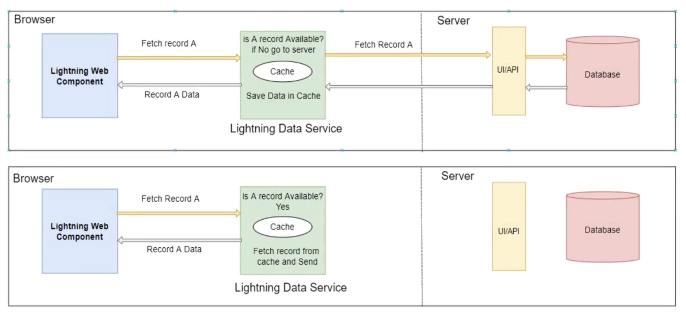


#### Como utilizar LDS

| Componente                   | Serve para         |
| ---------------------------- | ------------------ |
| `lightning-record-form`      | View + Edit rápido |
| `lightning-record-view-form` | Apenas leitura     |
| `lightning-record-edit-form` | Apenas edição      |


#### **lightning-record-form**

No Exemplo abaixo iremos criar um formulário para ler `Account` object

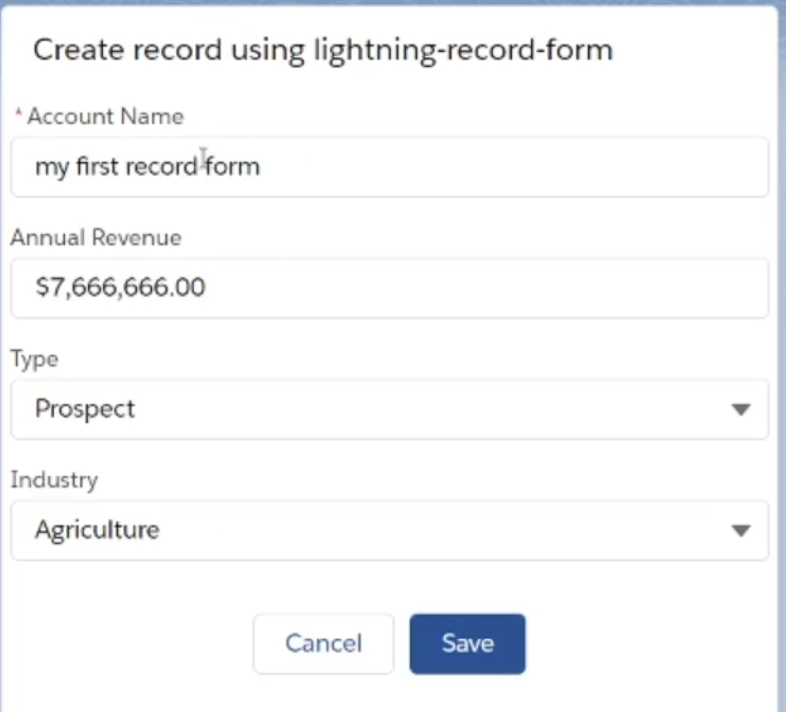

Use quando:

- Quer CRUD rápido.
- Não precisa de layout custom.
- Quer respeitar layout padrão.
- Não precisa lógica extra no submit.

O que faz:

- Exibe registro.
- Permite editar.
- Salva.
- Usa layout Salesforce.
- Zero Apex.

Fields:

* `object-api-name`: Account/Case and etc :warning: (mandatório)
* `record-id` : somente quando esta no `edit` (id do Account por exempo)
* `fields`: é o array de elementos q será exibido :warning: (mandatório)
* `layout-type`: full/compact
* `modes`: edit/view/readonly (default é edit/view)
* `columns`: para definir o tamanho
* `onsuccess`: chama um método quando há sucesso

```html
<lightning-record-form
    record-id={recordId}
    object-api-name="Account"
    layout-type="Full"
    mode="view">
</lightning-record-form>
```


Para utilizar o `object-api-name` e o `fields` é necessário referencia as classes do `@salesforce/schema`

```js
import ACCOUNT_OBJECT from '@salesforce/schema/Account' // necessario sempre dar um alias ao object

// importar os fields do Account
import ACCOUNT_NAME from '@salesforce/schema/Account.Name' // precisar seguir como esta no API_NAME
import ANNUAL_REVENUE_FIELD from '@salesforce/schema/Account.AnnualReveneue'

export default TestLDS extends LightningElement {
  objectName = ACCOUNT_NAME
  fieldList = [ACCOUNT_NAME, ANNUAL_REVENUE_FIELD]
}
```

```html
<lightning-record-form
    object-api-name={objectName}
		fields={fieldList}
    layout-type="Full">
</lightning-record-form>
```

Dessa forma um CREATE será possível de uma maneira simples!


Para exibir um record é necessario popular o `record-id`

```html
<lightning-record-form
    object-api-name={objectName}
		fields={fieldList}
    record-id="0010000002niCSZAAM"
    layout-type="Full">
</lightning-record-form>
```


#### ToastNotification

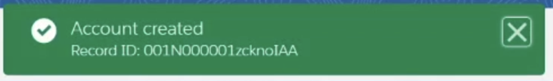


Para exibir uma msg para o usuário como um 'ToastNotification' podemos utilizar do salesforce tbm + `onsuccess` do próprio form

```html
<template>
  <lightning-record-form
    object-api-name={objectName}
		fields={fieldList}
    layout-type="Full"
		onsucess={successHandler}>
	</lightning-record-form>
</template>
```

```js
import {showToastEvent} from 'lightning/platformShowToastEvent';

export default TestLDS extends LightningElement {
  objectName = ACCOUNT_NAME
  fieldList = [ACCOUNT_NAME, ANNUAL_REVENUE_FIELD]
  
  successHandler(event) {
    const toast = new showToastEvent({
      title: "Account created",
      message: "Record ID: " + event.detail.id,
      variant: "success
    })
    this.dispatchEvent(toast)
  }
}
```


#### @api

Uma outra forma de acessar o `recordId` ou o `objectName` é utilizando o `@api` do salesfoce, que permite dinamicamente acessar o valor
```js
import { api } from 'lwc';

//import ACCOUNT_OBJECT from '@salesforce/schema/Account'

export default TestLDS extends LightningElement {
  @api recordId
  @api objectApiName
  // objectName = ACCOUNT_NAME
}
```

```html
<template>
  <lightning-record-form
		record-id={recordId}
    object-api-name={objectApiName}>
	</lightning-record-form>
</template>
```


#### lightning-record-view-form

Use quando:

- Quer layout custom.
- Só exibição.
- Quer usar LDS.
- Não quer Apex.

Exemplo

```html
<lightning-record-view-form
    record-id={recordId}
    object-api-name="Account">
    
    <lightning-output-field field-name="Name"></lightning-output-field>
    <lightning-output-field field-name="Industry"></lightning-output-field>

</lightning-record-view-form>
```


#### lightning-record-edit-form

Funciona de forma parecida

```html
<lightning-record-edit-form
    record-id={recordId}
    object-api-name="Account"
    onsuccess={handleSuccess}
    onsubmit={handleSubmit}>

    <lightning-input-field field-name="Name"></lightning-input-field>
    <lightning-input-field field-name="Industry"></lightning-input-field>

    <lightning-button type="submit" label="Salvar"></lightning-button>

</lightning-record-edit-form>
```

```js
handleSubmit(event) {
    event.preventDefault();
    const fields = event.detail.fields;
    fields.Custom__c = 'Valor';
    this.template.querySelector('lightning-record-edit-form').submit(fields);
}
```


Ou podemos fazer de forma customizada sem usar `handleSubmit`:

```js
import CONTACT_OBJECT from '@salesforce/schema/Contact'

import CONTACT_NAME from '@salesforce/schema/Contact.Name'
import CONTACT_TITLE from '@salesforce/schema/Contact.Title'

export default TestLDS extends LightningElement {
  objectName = CONTACT_OBJECT
  fields={
    name: CONTACT_NAME,
    title: CONTACT_TITLE
  }
  
  successHandler(event) {
    const toast = new showToastEvent({
      title: "Account created",
      message: "Record ID: " + event.detail.id,
      variant: "success
    })
    this.dispatchEvent(toast)
  }
}
```

```html
<lightning-record-edit-form
    object-api-name={objectName}
    onsuccess={handleSuccess}>

  	<!-- TO SHOW MESSAGE -->
  	<lightning-messages></lightning-messages>
  
    <lightning-input-field field-name={fields.name}></lightning-input-field>
    <lightning-input-field field-name={fields.title}></lightning-input-field>

    <lightning-button class="slds-m-around_xx-small" label="Cancel"></lightning-button>
    <lightning-button class="slds-m-around_xx-small" variant="brand" type="submit" label="Save"></lightning-button>

</lightning-record-edit-form>
```


#### Reset Buttons

Para limpar o conteúdo dos botões podemos utilizar novamente do `this.template.querySelector` e iterando para cada `lightning-input-field`

```html
<lightning-record-edit-form    object-api-name={objectName}    onsuccess={handleSuccess}>

  	<lightning-messages></lightning-messages>
  
    <lightning-input-field field-name={fields.name}></lightning-input-field>
    <lightning-input-field field-name={fields.title}></lightning-input-field>

  	<!-- apply the logic to reset the button  -->
    <lightning-button onclick={resetButton} class="slds-m-around_xx-small" label="Cancel"></lightning-button>
  
  
    <lightning-button class="slds-m-around_xx-small" variant="brand" type="submit" label="Save"></lightning-button>

</lightning-record-edit-form>
```

Resetando:

```js
export default TestLDS extends LightningElement {
	// ....
  
  resetButton() {
    const inputFields = this.template.querySelector('lightning-input-field');
    if (!inputFields)
      return;

    const inputFieldsArr = Array.from(inputFields);
    inputFieldArr.forEach(field => {
      field.reset();
    })
  }
}
```


#### Hidden Label

Por padrão quando usamos o `lightning-input-field` o `field-name` irá pegar a Label do próprio campo, ou seja, se a label for **email**, no input irá aparecer email, mas se quisermos algo como **digite seu email**, precisaremos utilizar o `variant=label-hidden`

```html
<label class="slds-p-left_x-small">Digite seu Email</label>
<lightning-input-field variant="label-hidden" field-name={fields.email}></lightning-input-field>
```


### @Wire


### Apex

Os services criados com Apex (files  `.cls`) precisam ser `public/static/global` e devem estar anotados com `@AutraEnabled` para que o LWC consiga chama-los.

Exemplo:

```java
public with sharing class AccountController {
	
  @AuraEnabled(cacheable=true)
	public static List<Account> getAccountList() {
		return [SELECT Id, Name, Type, Industry from Account];
	}
}
```


#### @AuraEnabled

Permite que os métodos criados no Apex possam ser chamados pelo LWC
```java
// CountryService.cls

public with sharing class CountryService
{

  @AuraEnabled
  public static List<Country__c> queryAllCountries()
  {
      return Query.records([
          SELECT Id, Name from Country__c where ISO_2__c != :null
      ]);
  }
}
```

No LWC:

```js
// UserCountryModal.js

import queryAllCountries from "@salesforce/apex/WorkPrioritizationUserServices.queryAllCountries";

export default class UserCountryModal extends LightningModal {

    async connectedCallback() { // when the component is rendenred in DOM
        this.loadProfilePreferences();
    }

    async loadProfilePreferences() {
        this.isLoading = true;
        try {
            await Promise.all([
                this.loadCountriesPreferences()
            ]);
        } catch (error) {
            handleError("Error loading profile preferences", error);
        } finally {
            this.isLoading = false;
        }
    }
  
    loadCountriesPreferences() {
        return queryAllCountries()
            .then(countries => {
                const selected = this.getUserSelectedCountries();
                const options = this.mapRecordsToOptions(countries);
                this.setCountryOptions(options);
                this.setInitialSelectedCountries(selected);
            });
    }
```


# Metadata Types

